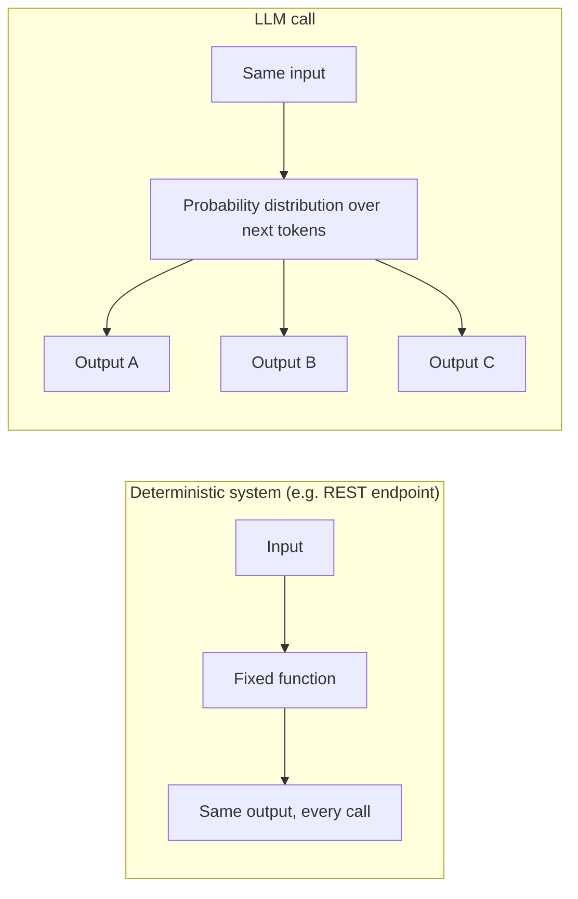
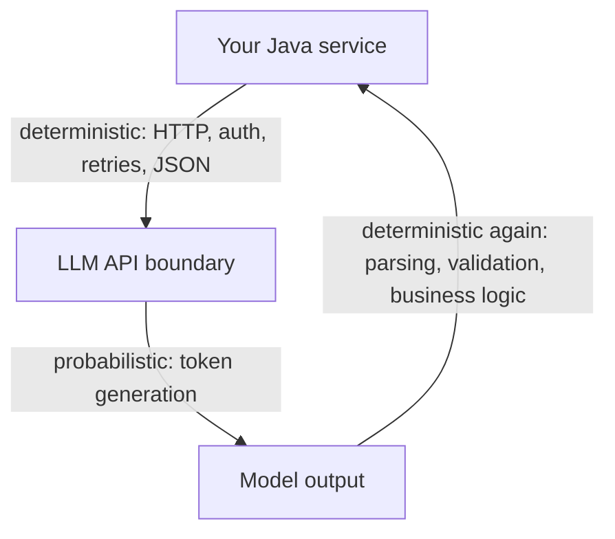

# Deterministic vs. Probabilistic Systems

## Why this exists

If you ship a Spring Boot service and a customer reports "I called the same endpoint twice and got two different answers," that's a P1 incident. You'd check for a race condition, a caching bug, a load-balancer routing to two service versions — something is *wrong*, and your job is to find it.

If you ship an AI agent and the same thing happens, it might be completely correct behavior. That single difference in what counts as "working as intended" changes how you design, test, and monitor everything downstream. This file exists to make that difference concrete before you write a line of code against an LLM.

## What "deterministic" actually means in your existing systems

A deterministic system has a property you rely on constantly, usually without naming it: **same input, same output, every time**, given the same system state. Your unit tests exploit this directly — `assertEquals(expected, actual)` only works as a testing strategy because you trust the function to behave the same way on every run. Your caching layers exploit it too: you can only cache a response because you're confident recomputing it would give the same answer.

Even the "non-deterministic" parts of distributed systems you already handle — race conditions, network timing, eventual consistency — are non-determinism you engineer *around*, treating it as noise to be contained (idempotency keys, retries, locks) rather than as the actual value the system is producing.

## What changes with an LLM

An LLM, by design, can return a different response to the identical prompt on two separate calls — not because something failed, but because generation is a sampling process over a probability distribution, not a lookup or a fixed computation. (The *why* of this — tokens, attention, sampling — is Phase 01. Here, you just need to accept it as a starting fact.)

This means a few things that will feel uncomfortable at first, coming from backend work:

- **A single failing test run doesn't prove a bug.** Where you'd normally treat one red test as evidence of a regression, with an LLM-backed system you often need to run the same case several times to see whether a failure is a pattern or a sample of expected variance.
- **"It worked when I tried it" doesn't prove it will always work.** The inverse problem: a demo succeeding once is much weaker evidence than a demo succeeding once in a traditional system, because you haven't sampled the distribution of possible outputs at all.
- **Caching changes meaning.** Caching an LLM response isn't "avoid recomputing the same deterministic answer" — it's a deliberate choice to *pin* one sample from a distribution and treat it as the answer going forward, which is a different tradeoff (you're trading response diversity/freshness for consistency and cost).
- **"Correct" becomes a spectrum, not a boolean.** A traditional function either returns the right value or it doesn't. An LLM response can be partially right, right but oddly phrased, right but with one hallucinated detail — which is exactly why Phase 10 (Evaluation) has to exist as its own discipline, with dedicated tooling, rather than being a rider on Phase 02.

## What doesn't change

It's tempting to overcorrect and treat the whole system as unpredictable chaos. It isn't. The *transport* around the model — the HTTP call, the JSON payload, retries, auth, rate limiting — is exactly as deterministic and engineerable as any other API integration you've built. Only the model's actual text generation is probabilistic. Keeping that boundary clear is what makes Phase 02 possible: everything about *calling* the model reliably is ordinary backend engineering; only what the model *says* is the new kind of problem.

## Trade-offs and when this matters most

- **Low-stakes, exploratory tasks** (drafting, summarizing, brainstorming) tolerate variance well — a slightly different phrasing each time is often fine or even desirable.
- **High-stakes, structured tasks** (an agent deciding whether to refund a customer, restart a production pod, or extract a dollar amount from an invoice) tolerate variance poorly, which is exactly why Phases 05 and 06 exist: to constrain a probabilistic system enough that its output can be trusted like a deterministic one, at the boundary where it matters.
- Don't over-invest in eliminating variance where it doesn't cost you anything — setting `temperature` to 0 everywhere just to feel deterministic again often costs you the model's usefulness for open-ended tasks, with no real risk being mitigated in exchange.

## Why this matters next

Right now you know *that* LLMs are probabilistic — you don't yet know *why*, in a way that lets you predict or control it. That's the entire subject of Phase 01: tokens, attention, and sampling explain exactly which knob (`temperature`, `top_p`, prompt structure) controls how much of this variance you're going to see, and why.