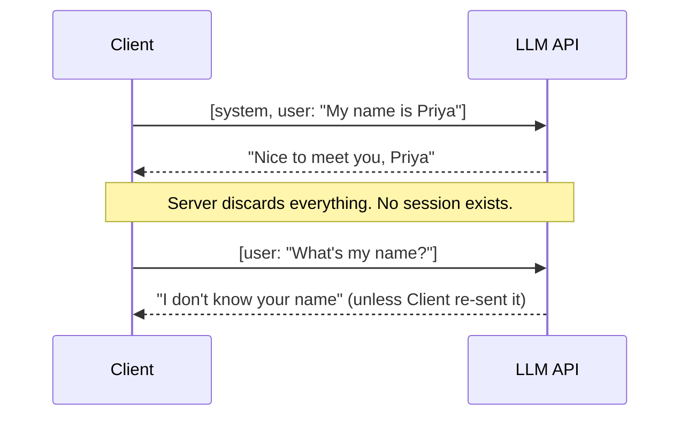

# Why LLMs Are Not Traditional APIs (and Where They Actually Are)

## Why this exists

The previous file established that LLM *output* is probabilistic. It's tempting to conclude from that alone that "everything about working with LLMs is different from what I know." That conclusion is wrong, and believing it will slow you down — you'll re-derive things you already know (retry logic, auth patterns, resource modeling) instead of reusing them, and you won't notice the handful of places that genuinely are new.

This file draws the line precisely: here's what's ordinary REST engineering, and here's the short list of what isn't.

## What's exactly the same as any REST API you've integrated

- **Transport**: HTTPS, JSON request/response bodies, standard status codes.
- **Authentication**: bearer tokens or API keys in headers — the same secret-management discipline you already apply to any third-party integration applies unchanged.
- **Client-side resilience**: timeouts, retries with backoff, circuit breakers for a flaky or overloaded upstream — the same patterns you'd use calling any external service.
- **Idempotency concerns at the infrastructure level**: if your network call fails partway through, "did the request actually get processed" is the same class of problem it always was.

If you've built a resilient client for a third-party payments API or a flaky internal service, you already have most of the muscle memory Phase 02 needs — it's applying that muscle memory, not replacing it.

## What's genuinely different

**1. The "resource" isn't a noun, it's a conversation.**
A typical REST resource is something like `/orders/123` — a thing with an identity that persists on the server. An LLM API has no persistent resource representing "your conversation." Every single call is stateless: you send the *entire* conversation history as input every time, and the server has no memory of your last call at all. This one fact is the reason "memory" has to be engineered explicitly (Phase 04) rather than being free, the way a database row would be.

**2. The response can stream token-by-token, and the shape of "done" is different.**
A normal REST call returns once, with a complete body. An LLM API commonly streams partial output as Server-Sent Events, and your client has to reassemble a sequence of chunks into one logical response — closer to consuming a Kafka stream than parsing a single HTTP response body.

**3. The model can ask *you* to do something mid-response — function/tool calling.**
This has no real analogue in a typical CRUD API. The server can return "please call this function with these arguments and tell me what it returned" as part of a normal response, and your client is expected to execute that and send the result back in a follow-up call. This is the seed of everything "agentic" — Phase 05 covers it properly.

**4. Failure modes include "succeeded, but wrong," not just HTTP error codes.**
A 500 or a timeout is a failure you already know how to handle. An LLM call can return `200 OK` with a body that is fluent, well-formed, and factually incorrect, or JSON that's almost-but-not-quite valid against your schema. Neither of these trips any HTTP-level alarm. Phase 06 exists specifically because "it returned 200" stops being sufficient evidence that the call succeeded.

**5. Cost and latency are driven by content length, not endpoint.**
In a typical API, cost is usually about request volume — calls per month, tier limits. Here, cost and latency scale with how much text goes in and comes out of a *single* call, which means the size of your prompt and conversation history is itself a cost and performance variable you actively manage, not a fixed property of "which endpoint you hit." Phase 01 explains the mechanism (tokens); Phase 11 covers managing it at production scale (caching, cost dashboards).

## Summary table

| Concern | Same as a normal REST API? |
|---|---|
| Transport, auth, JSON | Yes |
| Retries, backoff, circuit breakers | Yes |
| Resource has server-side persistent state | No — fully stateless, memory is your job |
| Response arrives as one complete body | Often no — commonly streamed |
| Server can request client-side execution mid-call | No — function/tool calling is new |
| `200 OK` implies correct output | No — content can be wrong or malformed despite success |
| Cost driven by endpoint/request count | No — driven by token volume of content |

## Why this matters next

You now know precisely which of your existing skills transfer directly (Phase 02 will lean on them heavily) and which specific new mechanics you need to learn (statelessness, streaming, tool-calling, content-based cost). Phase 01 goes one level deeper than either of the last two files: it explains the actual mechanism — tokens, attention, sampling — that *produces* the probabilistic behavior from file 01 and the token-driven cost model from this file. Once you have that mechanism, both of these files stop being things you take on faith and become things you can derive.