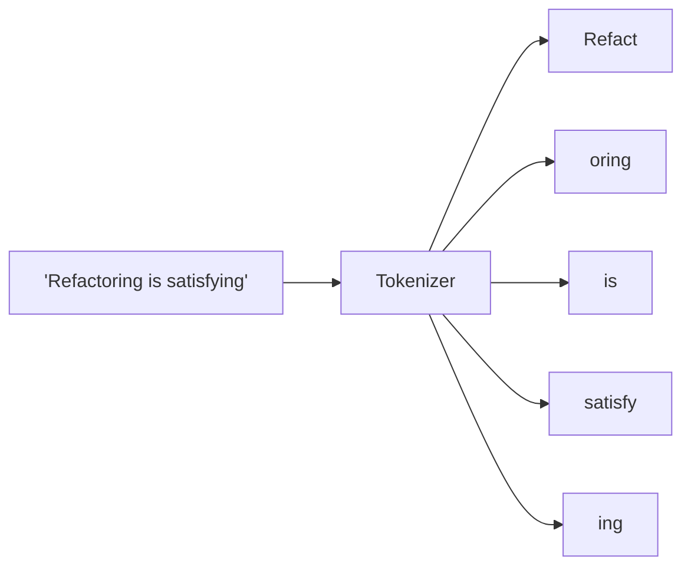

# Tokens and Tokenization

## Why this exists

Every limit and every dollar figure you'll deal with in this handbook — context window size, API pricing, truncation errors, rate limits — is denominated in a unit called a **token**, not in characters, words, or requests. If you estimate cost or capacity in words the way you might casually estimate a string's length in Java, your numbers will be wrong by a meaningful margin, and you won't know why a call that "looked short" got truncated or cost more than expected. Tokens are the first mechanical fact everything else in this phase builds on.

## What a token actually is

A token is a chunk of text — not necessarily a whole word, not necessarily a single character. A tokenizer breaks input text into a sequence of these chunks using a fixed vocabulary the model was trained with. As a rough working estimate for English text: **1 token ≈ 4 characters ≈ ¾ of a word.** Common short words are often a single token; longer or rarer words get split into multiple sub-word pieces; whitespace and punctuation are typically their own tokens.



Notice `"Refactoring"` split into two pieces while `"is"` stayed whole — common words tend to be single tokens because they appeared often enough in training to earn their own vocabulary entry; rarer or compound words get built from smaller, more frequent pieces. This is directly analogous to a dictionary-compression scheme you'd recognize from Java's own string interning or from something like Huffman coding: frequent patterns get short, dedicated representations, and rare ones get built up from smaller reusable parts.

## Why this matters for limits

Every model has a maximum **context window** measured in tokens — for example, a limit like 200,000 tokens covers the *combined* size of everything you send in (system prompt, conversation history, retrieved documents) plus everything the model generates back. This isn't a soft guideline; exceed it and your request is rejected or silently truncated depending on the provider and client. If you're estimating capacity in "how many words can I fit," you'll consistently overestimate, because you're not accounting for punctuation tokens, whitespace tokens, and the sub-word splitting of technical terms, code, and non-English text — code and technical documentation in particular tend to tokenize *less* efficiently than plain English prose, often closer to 1 token per 3 characters, because identifiers, symbols, and indentation don't compress into common sub-word patterns the way natural language does.

## Why this matters for cost

API pricing is quoted per token (typically per million tokens), and — as you'll see precisely in `06-cost-and-latency-mechanics.md` — input tokens and output tokens are usually priced *differently*, with output tokens costing more per unit than input tokens on most providers. A conversation history that grows every turn (because you're re-sending the whole thing — a direct consequence of the statelessness covered in Phase 00) means your *input* token cost grows every single turn of a conversation, even if the user's new message is short. This is the mechanical reason "just keep appending to conversation history forever" is a cost anti-pattern, which is exactly why Phase 04 (Memory) exists as a real engineering discipline rather than "store everything."

## Practical estimation without a library

You don't need an exact tokenizer running locally to make good engineering decisions. A workable heuristic for English prose:

```
estimated_tokens ≈ character_count / 4
```

For code or structured data (JSON, logs), tighten that to roughly:

```
estimated_tokens ≈ character_count / 3
```

These are estimates for planning and defensive coding — deciding whether to chunk a document before sending it, or budgeting how much conversation history you can retain — not for billing-accuracy calculations, which should come from the provider's own token-counting endpoint or official tokenizer library when precision actually matters (e.g., right before you hit a hard limit).

## Trade-offs and when this matters most

- For short, single-turn requests, precise token counting is rarely worth the engineering effort — the heuristic above is enough.
- For anything with growing conversation history, retrieved documents, or large tool outputs being fed back into context, under-counting tokens is exactly how you get a production incident where a request that worked in testing (short history) starts failing in the field (long history) — worth instrumenting real token counts, not just estimates, once you reach Phase 11's cost dashboards.
- Don't over-index on shaving small numbers of tokens off a prompt for its own sake — the token cost of a poorly-structured prompt is usually dwarfed by the cost of a wrong answer that has to be re-run.

## Why this matters next

Tokens are the *unit* the model operates on, but not yet the *meaning*. The next file, `02-embeddings-and-vector-space.md`, explains how each of these token chunks gets turned into something the model can reason about semantically — a vector of numbers — which is the mechanism underneath both text generation and, later, retrieval in Phase 03.