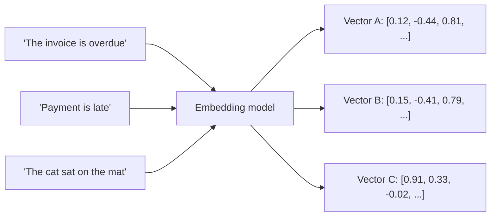

# Embeddings and Vector Space

## Why this exists

You now know text gets broken into tokens. But "token" is still just a chunk of characters — nothing about it yet lets a model reason about *meaning*, e.g. that "car" and "automobile" are related while "car" and "cardigan" aren't, despite the latter pair sharing more characters. Embeddings are the mechanism that turns a token (or a whole piece of text) into something a computer can compare for meaning rather than spelling. This is the single most important concept for everything in Phase 03 (Retrieval) and Phase 04 (Memory) — both of those phases are, mechanically, applications of embeddings.

## What an embedding actually is

An embedding is a fixed-length list of numbers — a vector — that represents a piece of text's meaning as a point in a high-dimensional space. A typical embedding model might represent a sentence as a vector of 768 or 1536 floating-point numbers. You don't need to interpret what any individual number means (nobody does, including the model's authors) — what matters is a single property: **texts with similar meaning end up as vectors that are close together in that space, and texts with different meaning end up far apart.**

Here, Vector A and Vector B would land close together in the space (similar meaning, different wording), while Vector C would land far from both (unrelated meaning) — even though, character-for-character, "invoice" and "cat" aren't obviously more or less similar than any other pair of words. This is the core reason embeddings matter for engineering: they let you compare *meaning* with a numeric operation (distance or similarity between vectors) instead of string matching, regex, or keyword search.

## The Java-relevant analogy

If you've ever used a `HashMap` and relied on `hashCode()`/`equals()` to determine that two different object instances represent "the same" logical entity, you already understand the shape of this idea: a complex object gets reduced to something simpler and comparable. An embedding is that same idea applied to meaning instead of identity — instead of "are these two objects equal," the question becomes "how close are these two meanings," and the answer is a number instead of a boolean. The next file will cover the actual distance calculation (cosine similarity) in Phase 03; here, just internalize that "meaning" has been made into "a point in space you can measure distance between."

## Where embeddings actually get used

- **Retrieval (Phase 03):** embed a user's question and embed your document chunks; find document chunks whose vectors are closest to the question's vector; those are the chunks most likely to be relevant. This is the entire mechanical basis of RAG — not a LangChain4j or Spring AI invention, just vector math those frameworks package for you.
- **Memory (Phase 04):** embed and store past conversation turns or facts about a user; later, embed the current query and retrieve the most relevant past turns by vector closeness, rather than replaying the entire history.
- **Inside the model itself:** every token the model processes is converted into an embedding-like vector internally, before the attention mechanism (next file) operates on it. The embeddings you generate via an API for retrieval are a *separate*, purpose-built model output — usually a smaller, cheaper, specialized model distinct from the large generative model you chat with — but the underlying concept (text → meaningful vector) is the same idea in both places.

## Trade-offs and when this matters most

- Embedding models vary in dimensionality, cost, and the type of text they were tuned on (general prose vs. code vs. multilingual text) — picking a mismatched embedding model (e.g., a general-prose model over a codebase) degrades retrieval quality in ways that are hard to debug later if you don't know this is a variable at all.
- Embeddings capture semantic similarity, not factual correctness or recency — two vectors being close means the *topics* are related, not that one is a verified answer to the other. This becomes important in Phase 03 when you evaluate retrieval quality: "the retrieved chunk is topically related" and "the retrieved chunk actually answers the question" are different claims.
- Don't reach for embeddings/vector search when simple keyword or structured lookup would do the job more cheaply and more precisely — e.g., looking up an order by its exact ID is a database query, not a retrieval problem, even though it's tempting to route everything through "the AI way" once you have the tooling in place.

## Why this matters next

Embeddings explain how meaning becomes comparable, but not yet how a model uses *many* pieces of text together to decide what to generate next — a conversation, a system prompt, retrieved context, and the response-so-far, all at once. That's the job of attention and the context window, covered next.