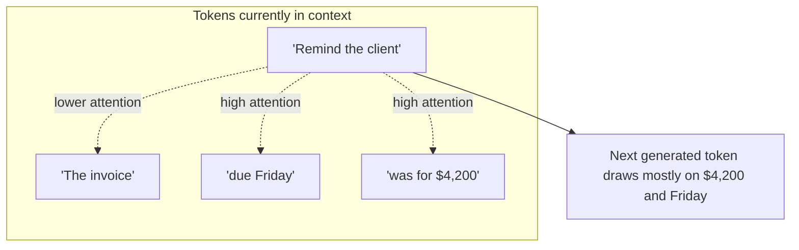
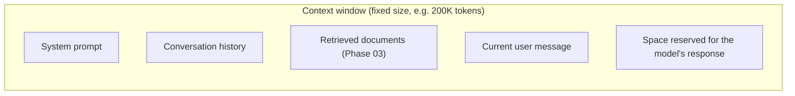

# Attention and Context Window

## Why this exists

You know text becomes tokens, and tokens (and larger spans of text) can be represented as meaning-bearing vectors. But a conversation isn't one token — it's thousands, and the model has to decide, for every single token it generates, which of all the prior tokens actually matter right now. That mechanism is called **attention**, and the hard limit on how much prior text it can operate over at all is the **context window**. Together, these explain two things you'll hit constantly: why models sometimes seem to "forget" something you told them earlier in a long conversation, and why context window size is quoted as a headline spec, the same way you'd quote a database's max connection pool size or a queue's max message size.

## What attention actually does, conceptually

For every token the model is about to generate, attention computes how much "weight" or relevance every other token in the current context should get in influencing that next token. It's not reading left to right and forgetting earlier lines the way a naive character stream would — it's more like each new token gets to look back over the *entire* available context and decide, dynamically, which earlier pieces matter most for this specific next step.

The practical implication: attention is what lets a model correctly connect "the client" mentioned in message 1 to a pronoun used in message 12 of a long conversation — *as long as message 1 is still inside the context window at all*. That "as long as" is the crucial caveat the rest of this file is about.

## What the context window actually limits

The context window is the maximum number of tokens (input plus output combined) the model can attend over in a single call. It is not a soft, gradually-degrading limit the way, say, a slow database query gets a little slower under load — it is a hard ceiling. Once your combined input and expected output exceeds it, the request either gets rejected outright or, depending on how a client library handles it, silently truncates older content, typically from the beginning of the conversation.

This is a direct, practical consequence you can reason about the way you'd reason about a fixed-size buffer or a bounded queue in Java: every category of content sharing that window (system prompt, history, retrieved context, current input, *and* the space the response itself will need) is competing for the same finite budget. A system prompt bloated with instructions, or a conversation history that's never trimmed or summarized (Phase 04), directly reduces how much room is left for the retrieved context that might actually contain the answer (Phase 03) — and if there isn't enough room reserved for the response itself, generation gets cut off mid-answer.

## Why "the model forgot" is often a context-window problem, not a memory problem

A common confusing symptom: a long conversation where the model correctly used a fact you gave it early on, then later seems to have "forgotten" it, even though nothing about the model changed mid-conversation. Two common causes, both explainable now:

1. The early message fell outside the context window because the conversation grew past the limit and older turns were truncated — it isn't in the input at all anymore, so there's nothing for attention to draw on.
2. The fact is still technically within the window, but it's buried under a large volume of less relevant text, and — while attention *can* in principle find it — very long, noisy contexts empirically make it less reliable at consistently weighting a single early detail correctly, especially the further back and more diluted by intervening content it is.

Both of these point at the same engineering conclusion: a bigger context window is not a substitute for deliberately managing what's actually inside it — which is precisely why Phase 04 treats memory as an active engineering decision (what to keep, summarize, or retrieve) rather than "just send everything, the window is big enough."

## Trade-offs and when this matters most

- Larger context windows reduce how often you hit hard truncation, but they don't fix the "buried fact" reliability problem, and they increase cost and latency directly, since cost scales with total tokens processed (established in the previous file, quantified precisely in `06-cost-and-latency-mechanics.md`).
- For agents with long-running tasks (Phase 07 onward), context window management becomes an active runtime concern, not a one-time design choice — an agent looping through many tool calls can fill its own context window with tool outputs long before a human conversation ever would.
- Don't treat "just use the model with the biggest context window available" as a default strategy — it's frequently cheaper and more reliable to retrieve the right small slice of information (Phase 03) than to stuff a huge amount of raw material into a bigger window and hope attention sorts it out.

## Why this matters next

You now know what's inside the window and how the model weighs it — but not yet *how* the model actually turns that weighted context into the next word, one piece at a time, or why running it twice on the same input can produce different text. That's the subject of the next file: autoregressive generation and sampling.