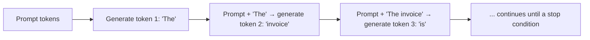
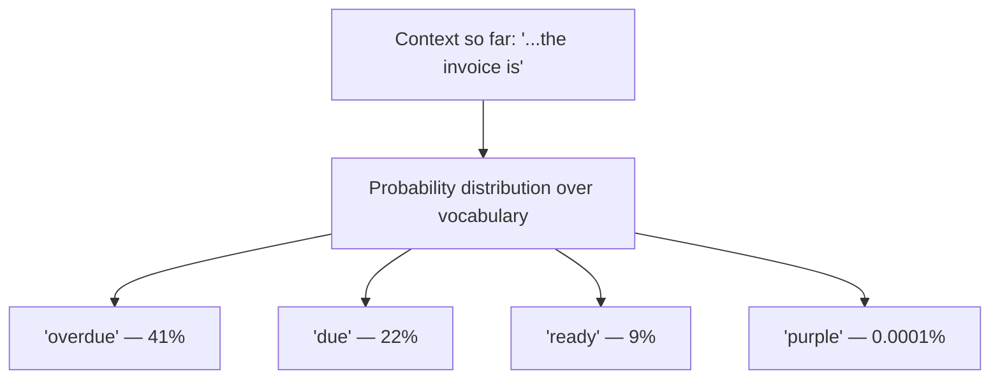
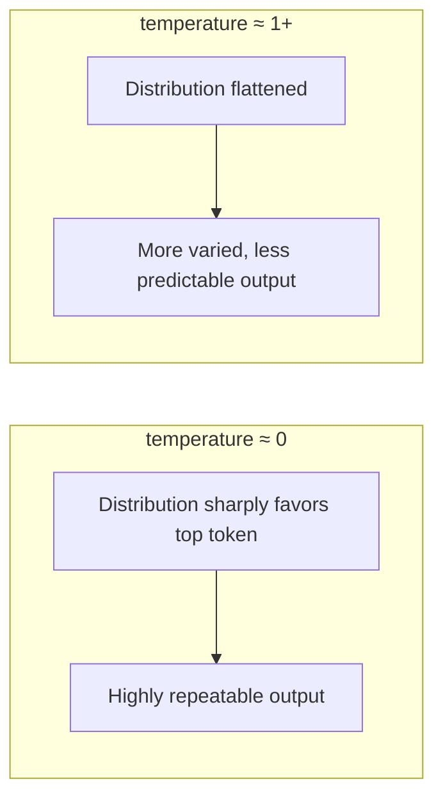

# Autoregressive Generation and Sampling

## Why this exists

Phase 00 asserted that LLM output is probabilistic and asked you to accept that as a starting fact. This file is where that assertion stops being something you take on faith and becomes something you can derive from the actual generation mechanism — and, more usefully, where you learn exactly which request parameters (`temperature`, `top_p`, `max_tokens`) control how much of that variance you see, so "probabilistic" stops meaning "unpredictable" and starts meaning "tunable."

## What "autoregressive" means

The model does not produce a full response in one shot the way a function returns a complete object. It generates **one token at a time**, and — critically — every new token is generated by looking at the *entire* sequence so far, including tokens it just generated itself moments ago.

This is why streaming (which you'll implement in Phase 02) isn't just a UX nicety — it's a direct reflection of how the model actually works. The response is genuinely produced incrementally; streaming exposes that real process to the client instead of making the client wait for it to finish and then pretending it arrived all at once. It's the mechanical reason a model can occasionally "paint itself into a corner" — start a sentence in a way that becomes awkward or contradictory three tokens later, because token 3 was chosen without full knowledge of how the sentence would need to end.

## Where the probability comes in

At each step, the model doesn't compute one single "correct" next token. It computes a probability distribution over its *entire* vocabulary — for every possible next token, a likelihood score. Generating text means repeatedly picking one token from that distribution, then repeating the process for the next position.

If the model always picked the single highest-probability token (called *greedy decoding*), output would be far more repetitive and deterministic — but still not perfectly deterministic across different hardware/batching conditions, and notably worse quality for many tasks, because always taking the "safest" next word tends to produce duller, more repetitive text. Instead, real generation typically *samples* from that distribution, meaning a lower-probability token can still get picked sometimes — which is the direct mechanical source of the response-to-response variance you accepted as fact back in Phase 00.

## The parameters that control this — and why they exist

**`temperature`** reshapes the probability distribution before sampling. Low temperature sharpens the distribution toward the highest-probability tokens (more repeatable, more "safe" output); high temperature flattens it, giving lower-probability tokens a more meaningful chance of being picked (more varied, more creative, but also more error-prone output). This is why you'll see `temperature` set low (even 0) for tasks like structured data extraction (Phase 06) where you want the most probable, most "expected" answer every time, and set higher for brainstorming or creative writing tasks where variety is the point, not a defect.

**`top_p`** (nucleus sampling) restricts sampling to the smallest set of tokens whose cumulative probability reaches a threshold (e.g., 0.9), discarding the long tail of very unlikely tokens entirely before sampling from what's left. This is a different lever from temperature — it changes *how many* candidates are eligible at all, rather than reshaping the relative odds among all of them.

**`max_tokens`** simply caps how many tokens the model is allowed to generate before being cut off — a direct, blunt limit, functioning like a configured timeout or a max-response-size setting you'd set on any API client, except here it can truncate a logically incomplete response (a JSON object missing its closing brace, a sentence cut off mid-word) rather than just closing a connection.

## Trade-offs and when this matters most

- Setting `temperature` to 0 does **not** guarantee perfectly identical output across repeated calls — it gets you close to greedy decoding, but provider-side factors (model updates, batching, hardware nondeterminism) mean you should still design agents to tolerate minor variance even at temperature 0, rather than relying on byte-for-byte reproducibility.
- Low temperature is the right default for anything downstream that needs to parse the output reliably (Phase 06) — structured extraction, tool-call argument generation, classification decisions.
- Higher temperature is appropriate where the *goal* is variety — content generation, ideation — and is actively counterproductive where it isn't, since it increases the chance of a plausible-sounding but wrong token being sampled at exactly the point where correctness mattered most.
- `max_tokens` should always be set deliberately, not left at a large default — an agent that unexpectedly generates a very long response burns cost and latency it didn't need to, and a response cut off exactly at the limit can silently produce truncated, invalid structured output that Phase 06's parsers need to detect rather than assume never happens.

## Why this matters next

You now have the full mechanical picture: tokens are the unit, embeddings represent meaning, attention decides what matters within the context window, and sampling is what turns a probability distribution into one specific, sometimes-varying response. That same sampling process — picking a plausible next token rather than a verified-true one — is also the direct root cause of hallucination, which the next file explains as a structural consequence of everything covered so far, not a separate defect layered on top.