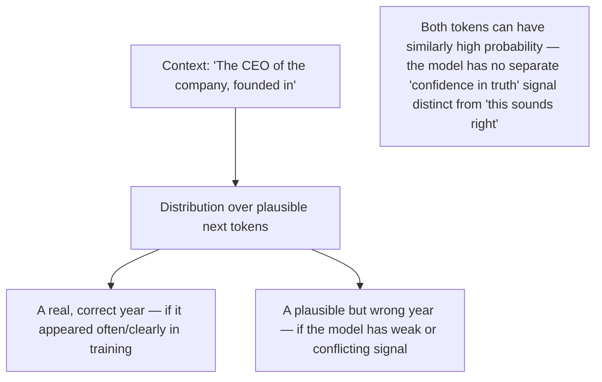

# Why Hallucination Happens

## Why this exists

"The model hallucinated" is often discussed as if it were a bug report — something that will get patched in the next model version, the way you'd expect a null-pointer exception to get fixed. Given everything in this phase so far, you're now in a position to understand why that framing is misleading: hallucination is a direct, structural consequence of autoregressive sampling over a probability distribution (the previous file), not a separate malfunction bolted onto otherwise-correct behavior. Understanding it this way changes what you build to manage it — you don't wait for a model that "doesn't hallucinate," you engineer systems that assume it will and catch it.

## The mechanical explanation

At every generation step, the model picks the next token based on what's *statistically plausible* given the context so far — not based on a verified lookup against a source of truth. Nothing in the generation process (as covered in the previous file) distinguishes "I am confident this fact is correct" from "this is a highly plausible-sounding continuation." Both cases look identical from the model's perspective: a token with high probability given the preceding context.

This is why hallucinations are often the most confident-*sounding* parts of a response, not the most hedged — the model isn't lying or guessing nervously, it's producing the most statistically plausible continuation, and plausible continuations are, by construction, fluent and assertive. There is no internal "I don't actually know this" flag that reliably fires before an ungrounded token gets generated.

## Two distinct causes worth separating

1. **Knowledge gaps**: the model was never trained on the fact in question, or saw it rarely/inconsistently, so the "plausible continuation" for that context is a guess dressed as an answer. This is the case retrieval (Phase 03) directly addresses — give the model the actual fact in context, so generating the correct answer becomes the *most* plausible continuation instead of a guess.
2. **Context misweighting**: the correct fact *is* available in context (Phase 01's attention/context-window file), but the model fails to weight it properly among competing tokens — more likely with long, cluttered, or contradictory context. This is the case Phase 04 (deliberate memory management) and careful context construction address, rather than retrieval alone.

Knowing which of these two you're dealing with changes your fix: "the model doesn't know this" needs retrieval or fine-tuning; "the model has it but ignored it" needs better context structuring, not more data.

## Why this isn't going away, and why that's fine

Because hallucination is structural, not a defect awaiting a patch, the correct engineering posture is the same one you already apply to any unreliable dependency in a distributed system: don't trust a single call's output as ground truth for anything consequential — validate it. This is precisely why:

- Phase 03 exists (ground responses in retrieved, verifiable source material rather than the model's memorized "plausible" knowledge)
- Phase 06 exists (validate structured output against a schema rather than trusting it blindly)
- Phase 10 exists (evaluate agent output systematically, including checking for hallucinated claims, rather than trusting good demo runs)

None of these are optional hardening for exotic edge cases — they're the standard response to a known, permanent property of the system, the same way you'd never skip input validation on a REST endpoint just because most requests are well-formed.

## Trade-offs and when this matters most

- Hallucination risk is highest exactly where the task requires specific, verifiable facts (dates, names, numbers, API behavior) and lowest where the task is genuinely generative (brainstorming, style rewriting) — calibrate how much verification effort you invest based on which kind of task you're building for.
- Lowering `temperature` (previous file) reduces variance but does **not** eliminate hallucination — a low-temperature model can still confidently and consistently generate the same wrong fact every time, which can be more dangerous than high-variance wrongness because it looks more trustworthy through repeated testing.
- Don't solve hallucination by simply instructing the model to "not make things up" in the system prompt — that's a prompt-engineering-layer patch on a generation-layer problem, and while it can help marginally, it's not a substitute for retrieval and validation.

## Why this matters next

You now understand the *content* risk (the model may state something ungrounded) as a structural fact. The next file turns to a different structural fact — that every token generated, correct or not, has a real dollar and millisecond cost — and shows exactly how tokens (file 1), context (file 3), and generation (file 4) combine into the cost and latency numbers you'll actually have to budget for and monitor in production.