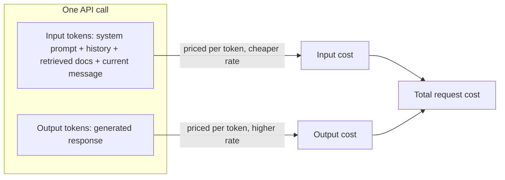
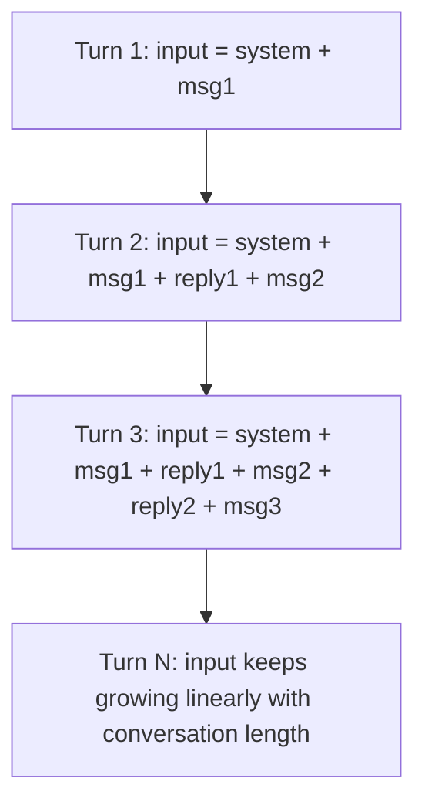
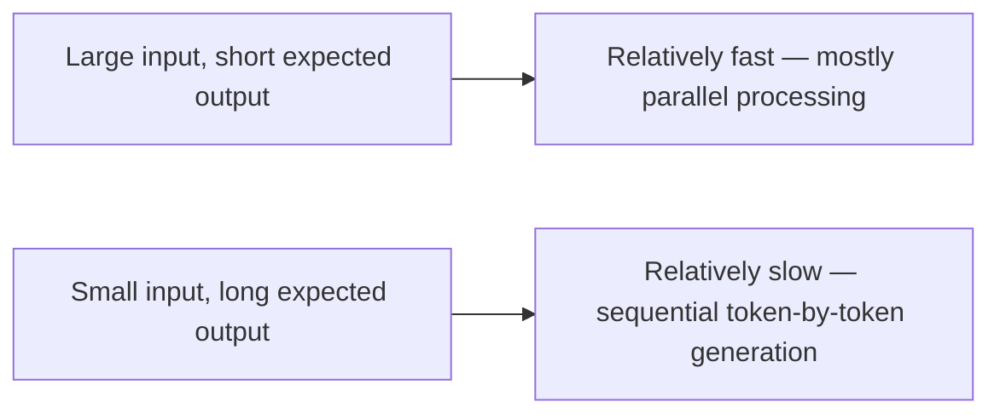

# Cost and Latency Mechanics

## Why this exists

Everything so far in this phase has been conceptual. This file turns tokens, context windows, and autoregressive generation into the two numbers that actually show up in a production incident or a monthly bill: **dollars and milliseconds**. If you've ever had to explain a cloud bill spike or a p99 latency regression to a team, you already have the right instincts for this file — it's the same kind of reasoning, applied to a new cost driver.

## The two-part pricing model

Nearly every LLM provider prices a request in two separate components:

- **Input tokens** — everything you send: system prompt, conversation history, retrieved documents, the current message.
- **Output tokens** — everything the model generates back.

These are priced *differently* per token, and output tokens are typically several times more expensive per token than input tokens. This asymmetry exists because generating each output token requires a full forward pass through the model (the autoregressive process from file 4), while processing input tokens can be done more efficiently in a single batched pass — conceptually similar to why, in a database, a bulk read of existing rows is cheaper than computing and writing the same number of new rows one at a time.



## Why cost compounds across a conversation

Because the API is stateless (Phase 00) and the model has no memory of prior calls, every turn of a multi-turn conversation re-sends the *entire* prior history as input tokens. Turn 1 might be small; turn 10 is paying input-token cost for turns 1 through 9 as well, every single time.



This is precisely the mechanical justification for Phase 04's existence: summarization memory, sliding-window truncation, or vector-retrieved relevant history all exist specifically to stop this linear growth, the same way you'd introduce pagination or a bounded cache instead of loading an ever-growing result set into memory on every request.

## Why latency scales the way it does

Because generation is autoregressive (file 4) — one token produced after another, each depending on the last — output length is the dominant driver of response latency, far more than input length. Processing a long input (context stuffed with retrieved documents) is comparatively fast because it happens in parallel; generating a long output is comparatively slow because each token waits on the one before it. This is why setting a sensible `max_tokens` (previous file) is a latency control, not just a cost control — and why streaming (which you'll implement in Phase 02) matters so much for perceived responsiveness: it doesn't reduce total generation time, but it lets the user see the first tokens immediately instead of waiting for the entire, inherently sequential process to finish.



## Turning this into an engineering budget

The practical exercise, and the one the project at the end of this phase implements in Java: given a prompt, an estimated response length, and a provider's per-million-token input/output rates, compute an estimated cost per call — then multiply by expected call volume to get a real monthly figure, the same way you'd estimate infrastructure cost from a request-rate projection before choosing an instance size.

```
estimated_cost = (input_tokens / 1,000,000 × input_rate)
               + (output_tokens / 1,000,000 × output_rate)
```

Doing this *before* building an agent — not after the first bill arrives — is what lets you catch a design that would be prohibitively expensive at real scale (e.g., an agent that re-sends a large retrieved document on every single tool-call iteration of a loop) while it's still a cheap architectural change instead of a costly one.

## Trade-offs and when this matters most

- For low-volume, exploratory use, precise cost modeling is overkill — build the thing first.
- For anything hitting production traffic, or any agent design involving loops (Phase 07) that call the model multiple times per user request, cost modeling before launch is not optional — a loop that calls the model 5 times per user action multiplies your per-request cost by 5, and that multiplier is easy to miss if you're only thinking about "one call, one cost."
- Latency budgets matter more for interactive/chat use cases than for background/batch agent work — an agent processing a queue overnight can tolerate token-by-token generation latency that a live chat UI cannot, which should inform choices like `max_tokens` limits and whether streaming is worth the added client complexity.

## Why this matters next

You now have the complete conceptual toolkit for Phase 01: tokens as the unit, embeddings as meaning, attention/context window as the working memory, sampling as the generation mechanism, hallucination as its structural risk, and cost/latency as its real-world budget. The project file that follows asks you to prove this understanding concretely: build a small Java CLI that estimates token count and cost for a given prompt, without calling any API at all — using nothing but the mechanics from this phase.