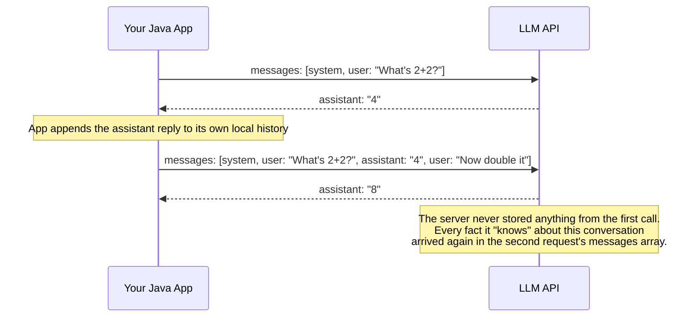

# Message Roles and Statelessness

## Why this exists

Phase 00 told you, at a conceptual level, that the server remembers nothing between calls. This file makes that fact concrete: it shows you exactly what you have to construct and send, on literally every single call, to simulate a "conversation" that the server itself has no notion of. Getting this wrong is the single most common source of "why does my chatbot seem amnesiac" bugs in a first implementation.

## The three (or four) roles, and what each one actually represents

- **`system`** — not a message in the conversational sense, but standing instructions that shape the assistant's behavior for the entire call: persona, constraints, output format expectations. Sent once per request (often as a dedicated field, per file 1, rather than inside the `messages` array itself, depending on provider).
- **`user`** — something a human (or, in an agent context, your application acting on a human's behalf) said.
- **`assistant`** — something the model said in a prior turn. Crucially, *you* are the one responsible for placing the model's own prior response back into this array on the next call — the server does not do this for you.
- **`tool`** (covered fully in file 5) — the result of a tool/function call your code executed on the model's request, fed back in as its own role so the model can see what happened and continue.



## What "stateless" means at the level of actual bytes on the wire

This is the concrete version of the abstract claim from Phase 00: there is no session token, no conversation ID that persists meaningful server-side state about content, no server-side memory of anything you said a moment ago. If you drop the `assistant: "4"` entry from the second call above, the model has no way to know it ever answered "4" — from its perspective, that request is the entire universe of information it has to work with. This is meaningfully different from, say, an HTTP session backed by a server-side session store, where dropping a client-side token still leaves data intact on the server; here, dropping a message from the array means that information simply never existed as far as this call is concerned.

## The direct consequence for your Java code

Your application is responsible for maintaining conversation state — typically as a simple ordered list — and re-sending the *entire relevant history* on every call:

```java
public class ConversationState {
    private final List<Message> history = new ArrayList<>();

    public void addUserMessage(String content) {
        history.add(new Message("user", content));
    }

    public void addAssistantMessage(String content) {
        history.add(new Message("assistant", content));
    }

    public List<Message> currentHistory() {
        return List.copyOf(history);
    }
}
```

Every call to the API sends `conversationState.currentHistory()` in full. There is no shortcut, no "just send the delta" option, at the protocol level — this is precisely why Phase 01's token-cost mechanics showed input tokens (and therefore cost) growing linearly with conversation length, and precisely why Phase 04 exists as a dedicated discipline: trimming, summarizing, or selectively retrieving from this ever-growing history instead of blindly appending to it forever.

## A subtlety: what belongs in `messages` versus what belongs in `system`

A common design mistake is putting everything — instructions and conversation alike — into the `messages` array as a sequence of `user` turns. This works, technically, but conflates two different kinds of information that should be kept separate:

- Standing instructions ("always respond in JSON," "you are a support agent for Acme Corp," "never reveal internal pricing") belong in `system`, sent once per call, not repeated as if they were something the user said in this turn.
- Actual conversational content — what was actually said, by whom, in what order — belongs in `messages`.

Mixing these is directly analogous to putting per-request configuration values inside the request body's data payload instead of in dedicated config/header fields — it works, but it makes the two kinds of information harder to reason about, test, and change independently. A well-structured agent should be able to swap its `system` instructions without touching the accumulated `messages` history at all, and vice versa.

## Trade-offs and when this matters most

- For short-lived, single-turn interactions, statelessness barely matters in practice — you send one user message, get one response, done.
- For any multi-turn interaction, mismanaging this — forgetting to append the assistant's own reply, forgetting to preserve message order, accidentally truncating from the wrong end of the list — produces bugs that look exactly like "the model is being inconsistent" when the actual bug is in your own history management, not the model's behavior. Always suspect your own state management first when a multi-turn conversation seems to lose context, before assuming it's a model limitation.
- Don't conflate "stateless API" with "you must always send the full unabridged history" — Phase 04 exists precisely because sending the full history forever is a valid *default* but not the only, or always correct, strategy.

## Why this matters next

You now know exactly what has to be constructed and sent on every call. Before you write the code that sends it, you need to know how that call proves who's making it — which is the subject of the next file: authentication and secrets management.