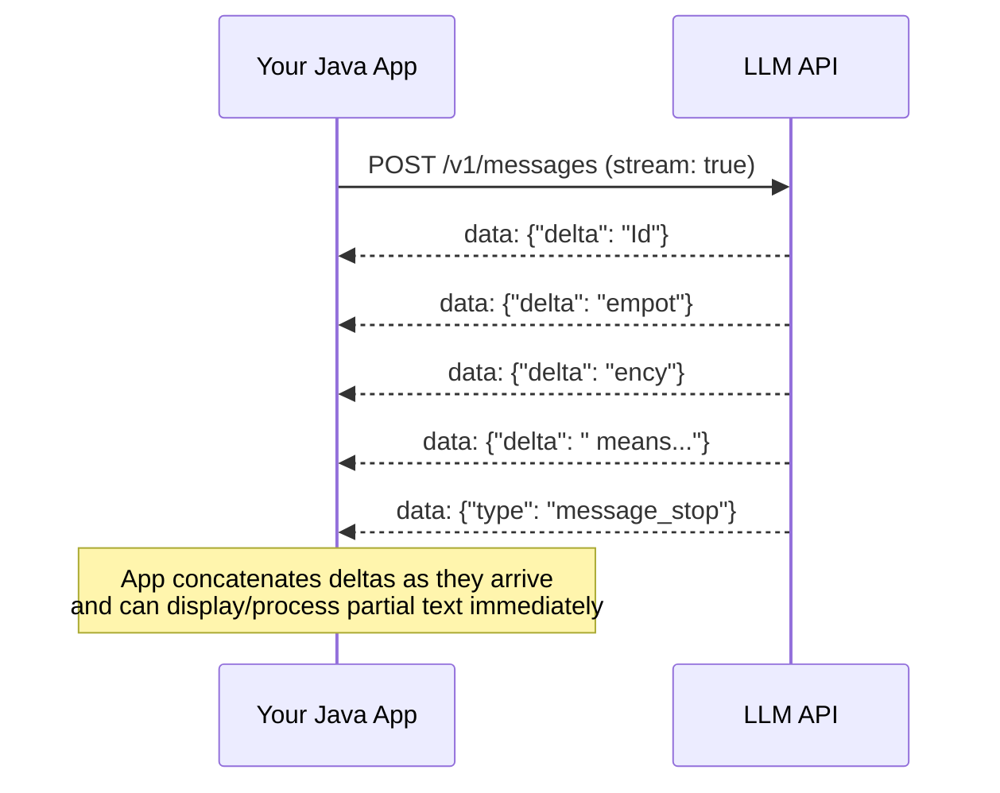

# Streaming with Server-Sent Events (SSE)

## Why this exists

Phase 01 established that generation is autoregressive — one token produced after another, in sequence, with no way to know the whole response in advance. Streaming is the direct wire-level expression of that fact: instead of your client waiting for the entire, inherently sequential generation process to finish before receiving anything, the server pushes each piece as it's produced. This file covers what SSE actually is, why it's the right transport for this specific problem, and how to consume it correctly in Java.

## What SSE actually is, mechanically

Server-Sent Events is a simple, text-based streaming protocol built on top of a single, long-lived HTTP response. Instead of one JSON body returned all at once, the server keeps the HTTP connection open and sends a sequence of small, newline-delimited `data:` events over time:

```
data: {"type":"content_block_delta","delta":{"text":"Id"}}

data: {"type":"content_block_delta","delta":{"text":"empot"}}

data: {"type":"content_block_delta","delta":{"text":"ency"}}

data: {"type":"content_block_delta","delta":{"text":" means"}}

data: {"type":"message_stop"}

```

Each `data:` line is its own small JSON event, and the client is responsible for reading them one at a time and reassembling them into the full response. This is deliberately simpler than something like WebSockets — it's unidirectional (server to client only), works over plain HTTP, and requires no special upgrade handshake, which is part of why it was a natural fit for this use case: the client isn't sending anything mid-stream, it's just consuming a sequence of chunks of one growing response.



## Why this matters beyond "a nicer chat UI"

It's tempting to file streaming under "front-end polish" and skip it for backend or agent work. Two reasons that's a mistake:

1. **Perceived latency, not total latency, is what streaming actually improves.** The total time to generate a full response is unchanged — what changes is that the user (or your downstream system) sees the first meaningful content much sooner, instead of a long silent wait followed by everything arriving at once. For any user-facing agent, this is often the difference between a system that feels responsive and one that feels broken, even though the underlying model performance is identical.
2. **Agent loops (Phase 07) sometimes need to react to partial output**, not just display it — for example, detecting early in a stream that the model has started producing something it shouldn't (caught by a guardrail, Phase 11) and aborting the connection before paying for tokens you don't want generated at all. Streaming is what makes early-termination-on-partial-output possible; a fully buffered, single-shot response gives you no opportunity to act until it's already complete (and fully billed).

## Consuming SSE in Java

The JDK's `HttpClient` supports this cleanly via `BodyHandlers.ofLines()`, which gives you the raw response as a stream of lines you process as they arrive, rather than one enormous concatenated string handed to you only after the entire response completes:

```java
HttpRequest request = HttpRequest.newBuilder()
    .uri(URI.create(baseUrl + "/v1/messages"))
    .header("x-api-key", apiKey)
    .header("Content-Type", "application/json")
    .header("Accept", "text/event-stream")
    .POST(HttpRequest.BodyPublishers.ofString(requestJson))
    .build();

HttpResponse<Stream<String>> response = httpClient.send(
    request, HttpResponse.BodyHandlers.ofLines()
);

StringBuilder fullText = new StringBuilder();

response.body()
    .filter(line -> line.startsWith("data: "))
    .map(line -> line.substring("data: ".length()))
    .forEach(json -> {
        if (json.equals("[DONE]")) {
            return;
        }
        String deltaText = extractDeltaText(json); // parse the small JSON event
        if (deltaText != null) {
            fullText.append(deltaText);
            System.out.print(deltaText); // display incrementally as it arrives
        }
    });

String completeResponse = fullText.toString();
```

A few details worth calling out explicitly, because they're easy to get subtly wrong:

- **You must accumulate the full text yourself.** The server never sends you "the whole response so far" — only the incremental delta at each event. If you need the complete response for downstream processing (parsing structured output in Phase 06, for instance), you build it by concatenating deltas as they arrive, exactly as shown above.
- **Different event types carry different meanings**, not just plain text deltas — a `message_stop` event, a `content_block_start` (relevant once tool calls, file 5, are involved), and plain text deltas are all distinct JSON shapes multiplexed onto the same stream; your parser needs to branch on the event's `type` field rather than assuming every event is a text delta.
- **The underlying HTTP connection stays open for the entire generation.** This has real implications for connection pooling and timeout configuration — a naive fixed read-timeout tuned for typical fast REST calls will incorrectly kill a long-running stream; timeouts for this kind of call need to be tuned around expected generation length, not typical request/response latency.

## Trade-offs and when this matters most

- For short, structured-output-only calls where you're going to parse the complete JSON at the end anyway (Phase 06), non-streaming is simpler and entirely appropriate — there's no user waiting to see partial output, and buffering the whole thing costs you nothing meaningful.
- For any user-facing chat interaction, or any agent step where early termination on undesired output matters, streaming is close to mandatory, both for perceived responsiveness and for the option to abort early.
- Don't build your own SSE parser more complex than it needs to be — the format is deliberately simple (newline-delimited `data:` lines); resist the urge to add speculative handling for exotic edge cases the specific provider's API doesn't actually produce.

## Why this matters next

Streaming showed you that a response can carry more than one *kind* of event — plain text deltas versus completion markers. The next file goes deeper into the most important of those "other kinds": the exact JSON contract used when the model, mid-response, asks your code to execute a function on its behalf. That's the wire-level foundation every "agent" capability in this handbook builds on.