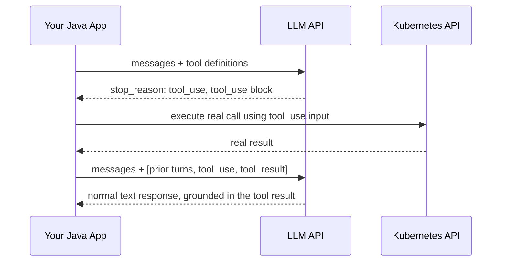

# Function Calling Wire Protocol

## Why this exists

Everything covered so far in this phase describes a model that talks *to* you. This file describes the mechanism that lets a model ask you to *do* something — query a database, call an internal service, restart a pod — and then continue reasoning based on what happened. This is not a separate "agent API"; it's the same `/v1/messages` endpoint and the same JSON envelope from file 1, with one addition: a way for the model to emit a structured request for code execution instead of (or alongside) plain text. Every agentic behavior in Phase 05 through Phase 09 is built on top of exactly this protocol — nothing more exotic than what's in this file.

## Step 1 — you tell the model what tools exist

You describe available tools as part of the request, using a JSON Schema-shaped definition — the same schema format you may already know from OpenAPI/Swagger tooling:

```json
{
  "model": "some-model-name",
  "max_tokens": 1024,
  "tools": [
    {
      "name": "get_pod_status",
      "description": "Returns the current status of a Kubernetes pod by name and namespace.",
      "input_schema": {
        "type": "object",
        "properties": {
          "pod_name": { "type": "string" },
          "namespace": { "type": "string" }
        },
        "required": ["pod_name", "namespace"]
      }
    }
  ],
  "messages": [
    { "role": "user", "content": "Is the payments-service pod healthy in the prod namespace?" }
  ]
}
```

This `description` field matters more than it looks like it should — the model decides *whether* and *how* to call a tool based substantially on how clearly its purpose and parameters are described, in the same way clear, well-named methods and parameters make a Java API easier for another engineer to use correctly. A vague description ("does pod stuff") produces unreliable tool selection; a precise one produces reliable tool selection. Writing good tool descriptions is a real, learnable engineering skill — Phase 05 covers it in depth.

## Step 2 — the model responds asking you to call a tool, instead of answering directly

```json
{
  "id": "msg_01XyZ...",
  "role": "assistant",
  "content": [
    {
      "type": "tool_use",
      "id": "toolu_01AbC...",
      "name": "get_pod_status",
      "input": {
        "pod_name": "payments-service",
        "namespace": "prod"
      }
    }
  ],
  "stop_reason": "tool_use"
}
```

Notice `stop_reason: "tool_use"` — this is why file 1 insisted `stop_reason` is not optional to check. Code that only looks at `content[0].text` will find nothing useful here at all; the response is not text, it's a structured request for your code to act.

## Step 3 — your code actually executes the tool, in plain Java

Nothing here is AI-specific. It's a JSON-to-method-call dispatch, precisely the same shape as deserializing a request body into a DTO and invoking a service method with it:

```java
public record PodStatusInput(String podName, String namespace) {}

public String getPodStatus(PodStatusInput input) {
    // real implementation: call the Kubernetes API, a REST endpoint, etc.
    return kubernetesClient.getPodStatus(input.namespace(), input.podName());
}

// Dispatch, after parsing the tool_use block's "input" into PodStatusInput:
String toolResult = getPodStatus(parsedInput);
```

## Step 4 — you send the tool's result back, as a new message, in a follow-up call

The model does not execute anything itself and does not wait around for your result — the conversation simply continues with a new call, where you append the tool call *and* its result to the message history (tying directly back to file 2's statelessness lesson: nothing here is remembered by the server, you resend everything):

```json
{
  "model": "some-model-name",
  "max_tokens": 1024,
  "tools": [ /* same tool definitions as before */ ],
  "messages": [
    { "role": "user", "content": "Is the payments-service pod healthy in the prod namespace?" },
    {
      "role": "assistant",
      "content": [
        {
          "type": "tool_use",
          "id": "toolu_01AbC...",
          "name": "get_pod_status",
          "input": { "pod_name": "payments-service", "namespace": "prod" }
        }
      ]
    },
    {
      "role": "user",
      "content": [
        {
          "type": "tool_result",
          "tool_use_id": "toolu_01AbC...",
          "content": "Running, 1/1 ready, no restarts in 6h"
        }
      ]
    }
  ]
}
```

The model then produces a normal text response ("Yes, the payments-service pod in prod is healthy...") based on that tool result, exactly as it would based on anything else in its context — from the model's perspective, a tool result is just more context to attend over (Phase 01, file 3), not a fundamentally different kind of input.



## The critical safety point: the model requesting a call is not permission to execute it blindly

The model can request arguments that are malformed, nonsensical, or — in a more consequential case — technically well-formed but dangerous (e.g., a `delete_pod` tool called against a production namespace when the user only asked a diagnostic question). The wire protocol gives you a *request*; whether to execute it, and with what safeguards, is entirely your code's decision, not something the protocol enforces for you. This is precisely why Phase 05 dedicates entire files to validating tool arguments and gating irreversible actions behind human confirmation — nothing at the protocol level stops a model from asking for something it shouldn't get.

## Trade-offs and when this matters most

- Tool definitions cost tokens too — every tool description and schema in the `tools` array is sent, and counted, on *every single call*, whether or not the model ends up using any of them. A large library of rarely-used tools defined on every request is a real, ongoing cost (Phase 01, file 6) worth pruning to what's actually relevant for a given context.
- The round trip shown above — request, tool call, your execution, follow-up request — means a single user-facing interaction that needs one tool call is at minimum *two* full API calls, each with its own latency and cost; an agent that chains several tool calls (Phase 07) multiplies this further, which is exactly the kind of compounding cost Phase 01 warned you to model before committing to a design.
- Don't design tools with overly broad, catch-all responsibilities ("run_any_kubectl_command") purely to reduce the number of tools defined — narrow, well-described, single-purpose tools produce more reliable model behavior and a much smaller, easier-to-reason-about blast radius than one powerful tool the model might misuse in ways you didn't anticipate.

## Why this matters next

You now know the complete request/response contract, including the two richest content types (`tool_use` and `tool_result`). One more content-shaping capability remains before you've seen the full protocol surface: constraining the model's *plain text* output to conform to a specific schema, even when no tool call is involved at all — covered next.