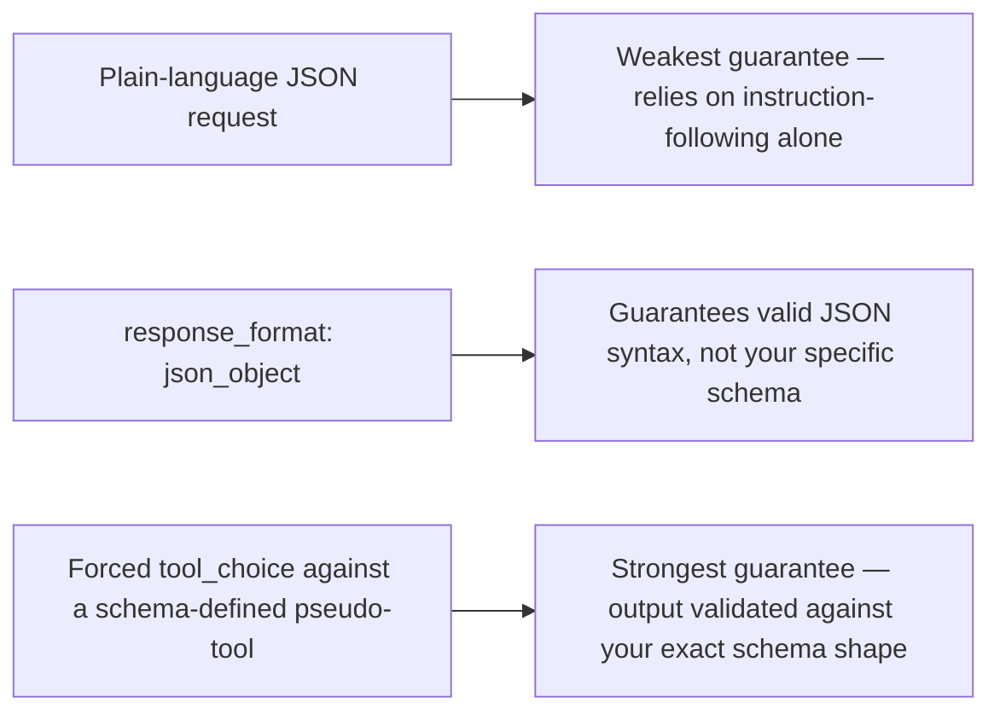

# Structured Output and JSON Mode

## Why this exists

Tool calling (previous file) is one way to get structured, machine-parseable data out of a model — but only when the goal is "have the model request an action." Very often, you want structured data as the *final answer itself* — extract an invoice's total and due date as a JSON object, classify a support ticket into one of five fixed categories, produce a list of action items with typed fields. This file covers the protocol-level mechanisms for constraining plain output to a schema, which is the wire-level foundation Phase 06 builds its entire reliability discipline on top of.

## The naive approach, and why it's unreliable on its own

The simplest approach is to just ask, in plain language: "respond only with JSON matching this shape." This works often enough to be tempting, and fails often enough to be a real production risk — the model can wrap the JSON in explanatory prose despite being told not to, use inconsistent field names, produce almost-valid JSON with a trailing comma or unescaped quote, or omit a field it decided wasn't relevant. None of this trips any HTTP-level error (Phase 00's "succeeded, but wrong" failure mode) — you get a `200 OK` with unparseable or subtly wrong content.

## The protocol-level mechanism: schema-constrained generation

Rather than relying purely on instructions, most providers offer an actual request-level mechanism to constrain output. Two common shapes:

**1. A dedicated "JSON mode" flag**, which constrains the model to emit only syntactically valid JSON (though not necessarily matching *your* specific schema):

```json
{
  "model": "some-model-name",
  "response_format": { "type": "json_object" },
  "messages": [
    { "role": "user", "content": "Extract the invoice total and due date from: ..." }
  ]
}
```

**2. A tool-call trick, reusing the exact mechanism from the previous file** — defining a "tool" whose *only* purpose is to receive the structured data as its arguments, and forcing the model to call it. This is a deliberate reuse of the tool-calling wire protocol as a structured-output mechanism, not a coincidence:

```json
{
  "model": "some-model-name",
  "tools": [
    {
      "name": "record_invoice_data",
      "description": "Records extracted invoice fields.",
      "input_schema": {
        "type": "object",
        "properties": {
          "total_amount": { "type": "number" },
          "due_date": { "type": "string", "format": "date" },
          "vendor_name": { "type": "string" }
        },
        "required": ["total_amount", "due_date", "vendor_name"]
      }
    }
  ],
  "tool_choice": { "type": "tool", "name": "record_invoice_data" },
  "messages": [
    { "role": "user", "content": "Extract invoice fields from: ..." }
  ]
}
```

The `tool_choice` field forcing a specific tool is the key mechanism here — instead of the model deciding *whether* to call a tool (previous file's normal use case), you're compelling it to always "call" this pseudo-tool, and its `input` block (validated against `input_schema`, the same JSON Schema mechanism from tool calling) becomes your structured output, arriving in exactly the same `tool_use` content block shape you already know how to parse.



## Mapping the extracted data onto Java

Once you have a schema-constrained `tool_use.input` block (or a JSON-mode response body), deserializing it is completely ordinary Jackson work — no different from parsing any other JSON payload into a typed object:

```java
public record InvoiceData(
    double totalAmount,
    String dueDate,
    String vendorName
) {}

ObjectMapper mapper = new ObjectMapper();
InvoiceData invoice = mapper.readValue(toolUseInputJson, InvoiceData.class);
```

The interesting engineering work isn't the deserialization itself — it's what you do when deserialization *fails* despite the schema constraint (still possible, since these constraints reduce but don't eliminate malformed output entirely). That failure-handling discipline — validate, and have a defined retry or fallback path rather than letting a `JsonProcessingException` propagate as an unhandled crash — is exactly what Phase 06 is dedicated to; this file has only given you the protocol-level tools to make failures *less frequent*, not a guarantee they can't happen.

## Trade-offs and when this matters most

- Plain-language JSON requests are fine for low-stakes, human-reviewed output (a draft summary a person will glance at before using) and a poor choice for anything an agent will parse and act on automatically without a human in the loop.
- The forced-tool-call approach gives the strongest schema guarantee but costs a full tool-calling round trip's worth of token overhead (previous file) for what might conceptually be a "simple" extraction task — worth it when correctness matters more than the marginal cost, which is most of the time these fields feed downstream automation.
- Don't assume schema-constrained generation makes hallucination (Phase 01) impossible — it constrains the *shape* of the output, not its factual correctness. A schema-valid JSON object can still contain a hallucinated total amount that's perfectly formatted and completely wrong; shape validation and correctness validation are different concerns, both needed, covered together in Phase 06.

## Why this matters next

You've now seen the complete request/response protocol surface: plain messages, streaming, tool calls, and schema-constrained output. Before writing the actual Java client, one more thing needs covering — this entire phase has been described as if there's one universal standard, but in reality, providers diverge in real, code-affecting ways. The next file makes those differences explicit so your client design doesn't accidentally assume false portability.