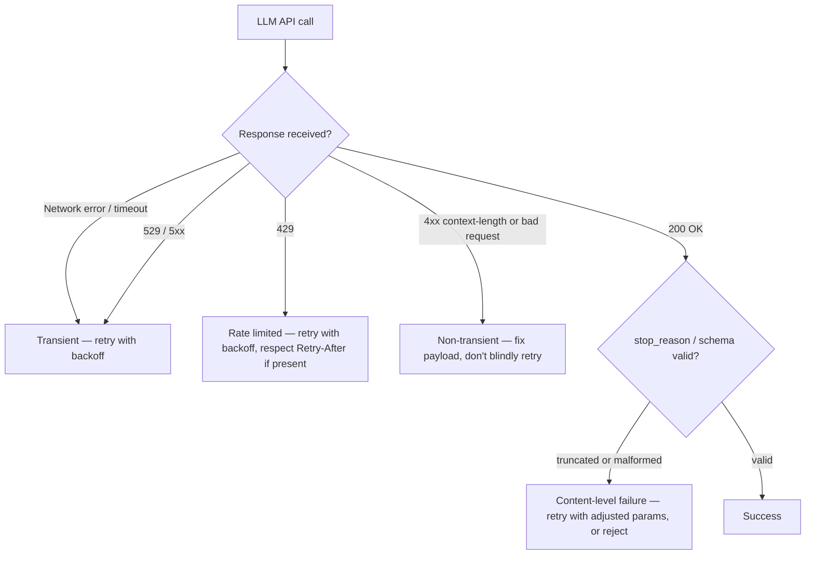

# Resilience: Retries, Backoff, and Circuit Breakers

## Why this exists

You already know how to build resilient clients against unreliable upstream services — this isn't new territory conceptually. What's new is the *specific* set of failure modes an LLM API produces, some of which are genuinely different from a typical REST dependency's failure surface, and which of your existing patterns (retry, backoff, circuit breaking) apply directly versus need adjustment.

## The failure modes specific to this kind of API

**Rate limiting (`429`).** Common to many APIs, but worth noting the limits here are often expressed in *both* requests-per-minute and tokens-per-minute — meaning you can be rate-limited even with a low request count, if your payloads (conversation history, retrieved documents) are large. This ties directly back to Phase 01: token volume, not just call count, is a rate-limiting dimension you need to account for.

**Overload (`529` or similar 5xx-class responses).** The provider's own infrastructure is temporarily over capacity — conceptually identical to any backend service returning `503 Service Unavailable` under load, and handled the same way: back off and retry, don't hammer it.

**Context length exceeded.** A request that's too large for the model's context window (Phase 01, file 3) is typically rejected with a `4xx`-class error — this is not a transient failure and retrying without first reducing the payload will simply fail again identically; this failure mode needs a *different* handling from your business logic (truncate, summarize, or reject the request) than transient rate-limit or overload errors need.

**Malformed or truncated output despite a `200 OK`.** Covered conceptually already in this phase (file 1's `stop_reason`, file 6's schema constraints) — this is a *content-level* failure, not an HTTP-level one, and needs its own detection and retry logic layered on top of, not instead of, ordinary HTTP resilience.



## Retry with exponential backoff, in Java

This is standard practice, not AI-specific — the only AI-specific detail is *which* status codes are worth retrying at all:

```java
public class ResilientLlmClient {

    private final AnthropicLlmClient delegate;
    private final int maxRetries;

    public ResilientLlmClient(AnthropicLlmClient delegate, int maxRetries) {
        this.delegate = delegate;
        this.maxRetries = maxRetries;
    }

    public ChatResponse send(ChatRequest request) throws Exception {
        int attempt = 0;
        while (true) {
            try {
                return delegate.send(request);
            } catch (LlmApiException e) {
                attempt++;
                if (!isRetryable(e.statusCode()) || attempt > maxRetries) {
                    throw e;
                }
                long backoffMillis = (long) (Math.pow(2, attempt) * 500);
                Thread.sleep(backoffMillis);
            }
        }
    }

    private boolean isRetryable(int statusCode) {
        return statusCode == 429 || statusCode == 529 || statusCode >= 500;
    }
}
```

Notice `isRetryable` deliberately excludes ordinary `4xx` errors other than `429` — a `400 Bad Request` caused by an oversized context (previous section) will fail identically on every retry; blindly retrying it just burns time and, if the error response still consumed input-token processing before rejecting, potentially cost, for a request that was never going to succeed.

## Respecting `Retry-After`, when the provider sends it

Some `429` responses include a `Retry-After` header telling you exactly how long to wait — when present, this is more accurate than a generic exponential backoff guess, and should take precedence:

```java
Optional<String> retryAfter = httpResponse.headers().firstValue("Retry-After");
long waitMillis = retryAfter
    .map(value -> Long.parseLong(value) * 1000)
    .orElse((long) (Math.pow(2, attempt) * 500));
```

## Circuit breaking, and why it matters more here than it might first appear

If the provider is degraded for an extended period, retrying every single incoming request — each with its own backoff sequence — still means every user-facing request eventually gets attempted, each one waiting through its own retry delays before failing, which multiplies both latency and the number of billed-but-failed attempts across your whole system. A circuit breaker (using a library like Resilience4j, which you may already have used for other unreliable dependencies) trips after a threshold of consecutive failures and fails fast for a cooldown period, rather than letting every request individually rediscover the outage:

```java
CircuitBreakerConfig config = CircuitBreakerConfig.custom()
    .failureRateThreshold(50)
    .waitDurationInOpenState(Duration.ofSeconds(30))
    .slidingWindowSize(10)
    .build();

CircuitBreaker circuitBreaker = CircuitBreaker.of("llmApi", config);

Supplier<ChatResponse> decorated = CircuitBreaker
    .decorateSupplier(circuitBreaker, () -> resilientClient.send(request));
```

This is exactly the pattern you'd already apply in front of any flaky downstream dependency in a microservices architecture — nothing about the LLM API changes the pattern itself, only confirms that it's worth applying here too, given that a degraded provider affects every agent and every user session simultaneously rather than one isolated call.

## Handling content-level failures (the genuinely new category)

Retrying an HTTP-successful-but-malformed response needs a distinct code path from HTTP-level retry — usually, re-sending the same request with adjusted parameters (a lower `temperature` for more consistent output, an explicit re-prompt asking the model to fix its own formatting) rather than a blind identical retry, since an identical request at the same `temperature` can plausibly produce the same malformed shape again. This is the seed of Phase 06's "retry-on-malformed-output" pattern — this file only establishes that it's a *distinct* failure category from HTTP failures, deserving its own handling, not that it should be handled identically to a `429`.

## Trade-offs and when this matters most

- For low-volume personal tools, simple retry-with-backoff (no circuit breaker) is entirely sufficient — the added complexity of a circuit breaker isn't justified until you have enough concurrent traffic for a provider outage to meaningfully compound.
- For any production agent system, especially one with multiple agents or loops (Phase 07, 09) each independently calling the API, a shared circuit breaker per provider is worth the setup cost — it protects your own system's latency and cost during a provider incident, not just the provider's infrastructure.
- Don't retry non-transient errors (bad request shape, context length exceeded) under any backoff strategy — recognize the difference explicitly in code, as shown above, rather than treating "any non-2xx" as uniformly retryable.

## Why this matters next

You now have a complete, resilient, dependency-free Java client: correct request/response shape, statelessness handled via explicit conversation state, secure authentication, streaming, tool-calling, structured output, provider-difference awareness, and now resilience against this API's specific failure modes. The final file in this phase asks you to assemble all of it into one real, working command-line chat client — the first genuinely complete artifact in this handbook.