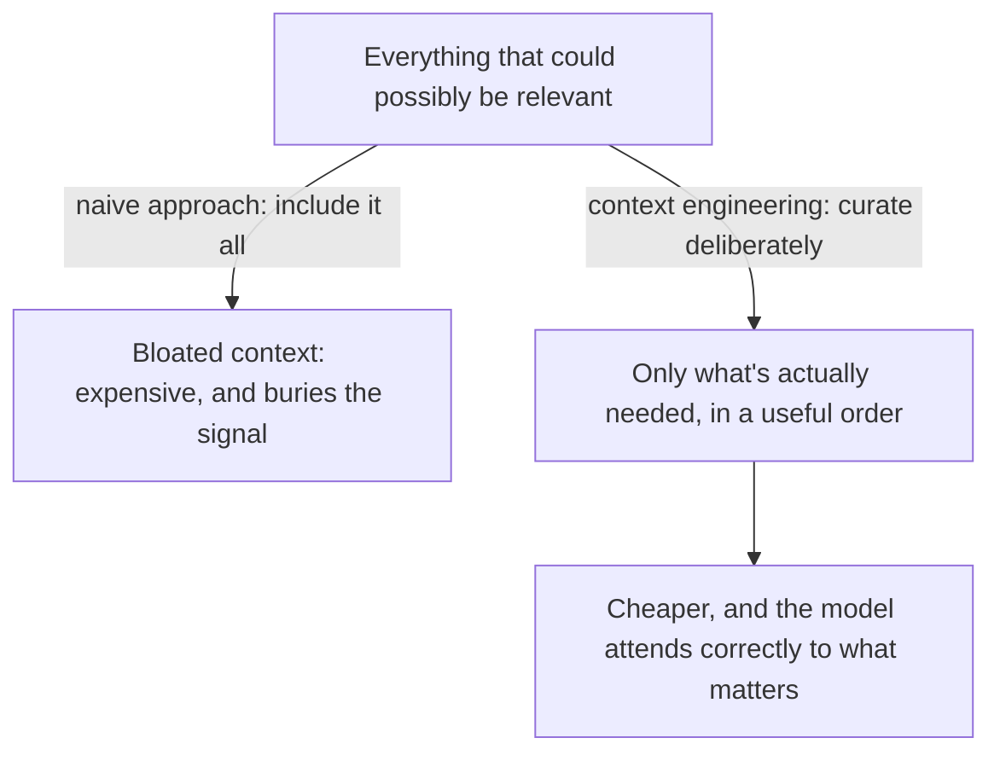

# Context Engineering as a Discipline

## Why this exists

Before diving into vector math and chunking strategies, it's worth stepping back and naming the actual discipline this entire phase belongs to, because it reframes everything that follows from "here's a RAG tutorial" into "here's a general skill you'll use constantly." The industry has settled on the term **context engineering**: the deliberate practice of deciding what information occupies a model's limited context window, in what form, and in what order — of which retrieval (RAG) is one specific technique, not the entire discipline.

## The context window as a scarce, shared resource

Phase 01 established the context window as a hard token ceiling shared by the system prompt, conversation history, retrieved material, and the space reserved for the response itself. The natural engineering instinct — trained into you by years of working with resources that are cheap to over-provision, like adding another field to a DTO — is to just include everything that might be relevant. That instinct is wrong here, for two compounding reasons already established in earlier phases: more tokens cost more (Phase 01, file 6) and, less obviously, a context cluttered with marginally-relevant material actively degrades the model's ability to correctly weight the *one* fact that matters (Phase 01, file 3's "buried fact" problem). Context engineering is the practice of fighting both of these failure modes at once — not just "can I fit this in," but "does including this make the response better or worse."

## The four levers you actually have

Every context-engineering technique in this handbook — and there are several across different phases — is one of these four levers, applied to a different situation:

1. **Instruction shaping** — what you put in the `system` field (Phase 02, file 2). Already covered; this phase doesn't repeat it.
2. **Retrieval** — fetching specific, relevant external material and inserting it, instead of relying on the model's memorized (and potentially hallucinated, per Phase 01 file 5) knowledge. This is the primary subject of this phase.
3. **Memory management** — deciding which *past conversation* content to keep, summarize, or drop, as conversation length grows. This is Phase 04's subject, and it's worth previewing here: memory and retrieval are the same lever (selective inclusion) applied to two different sources (prior conversation vs. external documents).
4. **Structuring/ordering** — how information is arranged within the context, not just whether it's included at all; models can weight information differently depending on where it sits relative to the current query (a direct consequence of the attention mechanism in Phase 01, file 3), which is why retrieved context is often placed close to the actual question rather than buried at the very start of a long prompt.

## Retrieval, specifically, as the lever this phase is about

Retrieval answers a very specific version of the context-engineering question: **"of everything in some large external corpus (docs, tickets, code, policies), which small subset is actually relevant to this specific query right now?"** The naive alternative — stuff the entire corpus into context — fails immediately on cost and context-window grounds for anything beyond a handful of pages. The naive alternative to *that* — keyword search — fails on meaning: a user asking "how do I get my money back" won't match a document titled "Refund Policy" via exact keyword overlap alone. Vector similarity (next file) is the mechanism that closes this gap, by comparing *meaning* rather than *spelling*.

## Why this is not "just prompt engineering"

If you already have a dedicated prompt-engineering background (as you've indicated you do), it's worth being precise about the boundary: prompt engineering is about *how you phrase* the instructions and query within a single, fixed context. Context engineering, as covered in this phase, is about *what content populates that context in the first place*, often computed dynamically per-request based on retrieval, before any prompt phrasing is even applied. A perfectly worded prompt referencing a fact that was never retrieved into context will not produce a correct, grounded answer — no amount of phrasing skill substitutes for the fact simply not being present. This is exactly why this phase exists as its own discipline in this handbook rather than being folded into your existing prompt-engineering knowledge.

## Trade-offs and when this matters most

- For tasks entirely within the model's general, stable knowledge (explaining a well-known algorithm, general coding help), context engineering beyond ordinary prompt phrasing adds little — there's nothing external to retrieve.
- For anything involving your own proprietary, frequently-changing, or simply too-large-to-memorize information (internal docs, current ticket data, a specific customer's history), context engineering — specifically retrieval — is the difference between a system that's reliably grounded and one that's confidently guessing.
- Don't treat "add more context" as a universal fix when a response is wrong — per the buried-fact problem above, adding more undifferentiated context can make things worse; the fix is usually *better-targeted* retrieval, not *more* retrieval volume.

## Why this matters next

You now have the conceptual frame: retrieval is one lever of context engineering, and its job is finding the right small subset of a larger corpus by meaning rather than exact match. The next file gets concrete about exactly how "by meaning" is computed — the actual vector similarity math underneath every retrieval system, worked through by hand before any library does it for you.