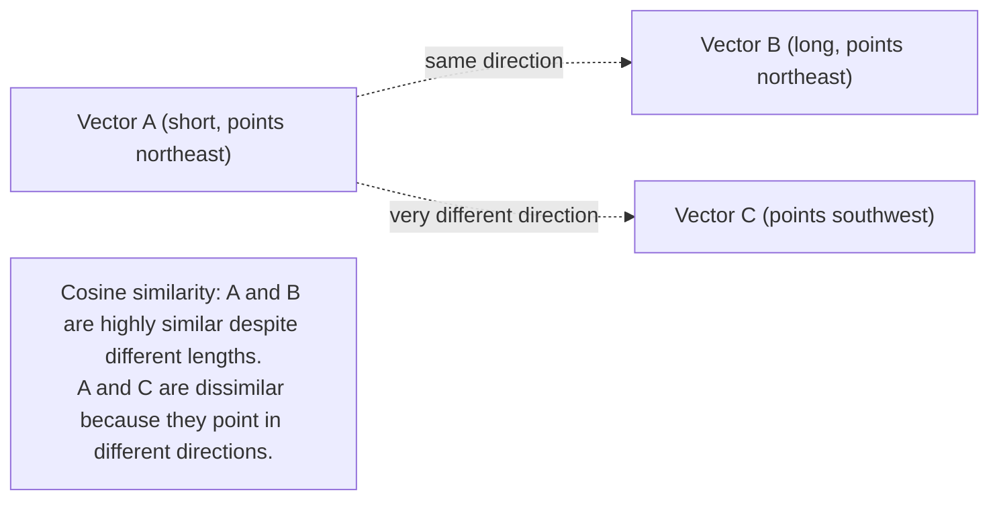

# Vector Similarity From First Principles

## Why this exists

Phase 01 told you that embeddings turn text into vectors such that similar meaning lands close together in space. This file makes "close together" mathematically precise and shows you the actual computation, in plain Java, with no library involved — because every retrieval system in this phase, and every framework abstraction in files 6 and 7, is ultimately just this computation running at scale.

## Why cosine similarity, specifically, and not plain distance

You might expect "how close are two points" to mean ordinary Euclidean distance — the straight-line distance formula you'd remember from geometry. Embedding comparison almost universally uses **cosine similarity** instead, which measures the *angle* between two vectors rather than the distance between their endpoints. The reason is specific to how these embeddings behave: what matters for meaning is the *direction* a vector points in the high-dimensional space, not how long the vector happens to be — two vectors pointing in nearly the same direction represent very similar meaning even if one has a larger magnitude than the other, and Euclidean distance would be misled by that magnitude difference in a way cosine similarity isn't.



## The formula, and what each part means

For two vectors **A** and **B**, cosine similarity is:

```
cosine_similarity(A, B) = (A · B) / (||A|| × ||B||)
```

Where:
- `A · B` (the **dot product**) is the sum of each corresponding pair of components multiplied together.
- `||A||` and `||B||` (the **magnitudes**, or Euclidean norms) are, for each vector, the square root of the sum of its squared components.

The result is always a number between -1 and 1: **1** means the vectors point in exactly the same direction (maximally similar meaning), **0** means they're unrelated (orthogonal), and **-1** means they point in exactly opposite directions (in practice, embedding vectors rarely land near -1 for genuinely opposite meanings — most real comparisons fall somewhere in the 0-to-1 range, with higher meaning more related).

## Computing it in plain Java, with no library

This is deliberately simple enough to write from scratch — there is no hidden complexity here that justifies reaching for a library before you've seen it work with your own eyes:

```java
public class CosineSimilarity {

    public static double compute(double[] vectorA, double[] vectorB) {
        if (vectorA.length != vectorB.length) {
            throw new IllegalArgumentException("Vectors must be the same dimension");
        }

        double dotProduct = 0.0;
        double magnitudeA = 0.0;
        double magnitudeB = 0.0;

        for (int i = 0; i < vectorA.length; i++) {
            dotProduct += vectorA[i] * vectorB[i];
            magnitudeA += vectorA[i] * vectorA[i];
            magnitudeB += vectorB[i] * vectorB[i];
        }

        double denominator = Math.sqrt(magnitudeA) * Math.sqrt(magnitudeB);
        if (denominator == 0.0) {
            return 0.0; // one of the vectors is all zeros — treat as no similarity
        }

        return dotProduct / denominator;
    }
}
```

A concrete, tiny example to build intuition (using toy 3-dimensional vectors rather than real 768- or 1536-dimensional embeddings, purely so the arithmetic is checkable by hand):

```java
double[] invoiceOverdue = {0.8, 0.1, 0.2};
double[] paymentLate    = {0.75, 0.15, 0.25}; // similar meaning, similar direction
double[] catOnMat       = {-0.1, 0.9, -0.3};  // unrelated meaning, different direction

System.out.println(CosineSimilarity.compute(invoiceOverdue, paymentLate)); // high, e.g. ~0.99
System.out.println(CosineSimilarity.compute(invoiceOverdue, catOnMat));   // low, e.g. ~-0.1
```

## From "similarity between two vectors" to "retrieval"

Retrieval is this exact computation, repeated: embed the incoming query into a vector, then compute cosine similarity between that query vector and *every* candidate document chunk's pre-computed vector, and return the chunks with the highest scores.

```java
public record ScoredChunk(String text, double score) {}

public List<ScoredChunk> retrieveTopK(
    double[] queryVector,
    List<EmbeddedChunk> corpus,
    int k
) {
    return corpus.stream()
        .map(chunk -> new ScoredChunk(
            chunk.text(),
            CosineSimilarity.compute(queryVector, chunk.vector())
        ))
        .sorted(Comparator.comparingDouble(ScoredChunk::score).reversed())
        .limit(k)
        .toList();
}
```

This naive linear scan — compute similarity against every single stored vector — is exactly what a real vector database optimizes away using indexing structures (covered at a practical level in file 4), but the *result* it's approximating is precisely this brute-force computation. Understanding the brute-force version first is what lets you reason sensibly about what a vector database's index is actually doing for you, rather than treating it as an unexplained performance trick.

## Trade-offs and when this matters most

- For small corpora (a few hundred to low thousands of chunks), the brute-force linear scan above is entirely practical and requires no specialized infrastructure at all — don't reach for a vector database prematurely if a simple in-memory list and a loop genuinely solves your current scale.
- For larger corpora, the linear scan's cost grows directly with corpus size, which is exactly why approximate nearest-neighbor indexing exists in real vector stores (file 4) — the trade-off there is a small amount of retrieval accuracy for a large gain in speed at scale.
- Cosine similarity measures *semantic relatedness*, not correctness or recency, as already flagged in Phase 01 — a high similarity score tells you a chunk is topically related to the query, not that it's the right or current answer; this distinction becomes central in file 5's discussion of retrieval evaluation.

## Why this matters next

You now understand the exact computation that finds "similar" text. But similarity is only useful if you're comparing the query against the *right-sized* pieces of a document in the first place — comparing against an entire 50-page PDF as one vector, versus comparing against one well-chosen paragraph, produces very different retrieval quality. The next file covers exactly how you decide what a "chunk" should be.