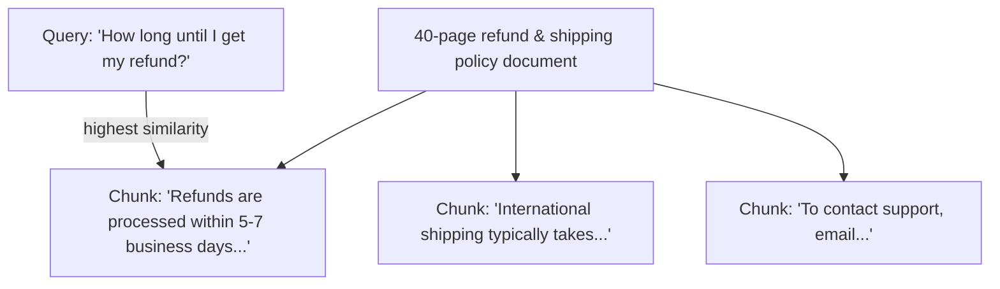

# Chunking Strategies

## Why this exists

The previous file assumed you already had a corpus of "document chunks," each with a pre-computed vector, ready to compare against a query. This file is about the decision that produces those chunks in the first place — and it's a decision that, in practice, affects retrieval quality more than which embedding model you choose. A poorly chunked corpus will retrieve badly no matter how good your embedding model or similarity math is; this is usually the first thing worth revisiting when a RAG pipeline "isn't finding the right answer."

## Why you can't just embed whole documents

You might reasonably ask: why not skip chunking entirely and embed each whole document as a single vector? Two compounding problems:

1. **Dilution of meaning.** An embedding model compresses a piece of text into one fixed-size vector. A single paragraph about refund timelines embeds into a vector that closely represents that specific meaning. A 40-page policy document embedded as one vector represents an *average* of everything in that document — refunds, shipping, warranties, contact info — diluted together, so its similarity score against a specific query about refunds is weaker and less discriminating than a tightly-scoped chunk's would be.
2. **Context window cost.** Even if whole-document embedding worked well for retrieval, you'd still be inserting the *entire* matched document into your prompt when it's found relevant — most of which is irrelevant to the specific question, burning tokens and context-window space (Phase 01) on material that doesn't help and, per the buried-fact problem, can actively hurt.

Chunking solves both: split documents into smaller, semantically coherent pieces, embed each piece separately, and only pull the specific pieces that match into context.



## The core tension: chunk size

- **Chunks too large** reintroduce the dilution problem from above, just at a smaller scale than whole-document embedding — a chunk covering three unrelated topics still averages them together.
- **Chunks too small** lose necessary context — a chunk that's just the sentence "It takes 5-7 business days" with no surrounding text loses the information that this sentence was specifically about refunds rather than shipping or password resets, which matters if the chunk gets retrieved and inserted into a prompt in isolation.

There's no universal correct chunk size — it depends on the source material's structure and the kind of question the corpus needs to answer. As a starting point worth testing rather than trusting blindly: a few hundred tokens per chunk (roughly a few paragraphs) is a common, reasonable default for prose documentation, with adjustment based on the evaluation techniques in file 5.

## Fixed-size vs. structure-aware chunking

**Fixed-size chunking** splits text every N tokens or characters, regardless of sentence or paragraph boundaries. Simple to implement, but risks cutting a chunk mid-sentence or mid-thought, splitting a single coherent idea across two separate vectors that individually represent neither idea well.

```java
public List<String> fixedSizeChunk(String text, int chunkSizeChars, int overlapChars) {
    List<String> chunks = new ArrayList<>();
    int start = 0;
    while (start < text.length()) {
        int end = Math.min(start + chunkSizeChars, text.length());
        chunks.add(text.substring(start, end));
        start += (chunkSizeChars - overlapChars); // overlap preserves boundary context
    }
    return chunks;
}
```

**Structure-aware chunking** splits along natural document boundaries — paragraphs, headings, sentences — so each chunk is more likely to represent one coherent idea:

```java
public List<String> paragraphChunk(String text, int maxCharsPerChunk) {
    String[] paragraphs = text.split("\\n\\s*\\n");
    List<String> chunks = new ArrayList<>();
    StringBuilder current = new StringBuilder();

    for (String paragraph : paragraphs) {
        if (current.length() + paragraph.length() > maxCharsPerChunk && current.length() > 0) {
            chunks.add(current.toString().trim());
            current = new StringBuilder();
        }
        current.append(paragraph).append("\n\n");
    }
    if (current.length() > 0) {
        chunks.add(current.toString().trim());
    }
    return chunks;
}
```

Structure-aware chunking is usually the better default for prose documentation, since it respects the author's own logical divisions rather than an arbitrary character count. Fixed-size chunking is more appropriate for unstructured or unusually formatted text where paragraph boundaries don't reliably align with meaning (raw logs, transcripts without clear paragraph breaks).

## Overlap: why chunks often share a bit of text with their neighbors

Notice the `overlapChars` parameter above. Without overlap, a fact that happens to sit right at a chunk boundary can end up split awkwardly — the sentence containing the actual answer might start at the very end of one chunk and finish at the very start of the next, meaning neither chunk fully contains it. A modest overlap (a sentence or two repeated between adjacent chunks) reduces the chance that a boundary falls exactly where the important information does, at a small, usually worthwhile cost in redundant storage and slightly increased corpus size.

## Trade-offs and when this matters most

- For small, well-structured documents (a single clear FAQ page), simple paragraph-based chunking with no tuning is often good enough — don't over-engineer chunking for a corpus you could nearly fit in context anyway.
- For large, heterogeneous corpora (a mix of long-form docs, code, and structured tables), a single chunking strategy applied uniformly to everything often underperforms a strategy tailored per content type — code, for instance, usually chunks better along function/class boundaries than fixed character counts or prose paragraph breaks.
- Chunk size interacts directly with the "how many chunks do we retrieve per query" decision (file 5) — smaller chunks mean you typically need to retrieve more of them to cover the same amount of ground, which affects both cost and the buried-fact risk from Phase 01 if you retrieve too many.
- Don't treat chunking as a one-time decision made at ingestion time and never revisited — if evaluation (file 5) shows poor retrieval quality, chunk size and strategy are usually the first thing worth changing, before reaching for a different or more expensive embedding model.

## Why this matters next

You now have well-formed chunks. The next file covers what actually turns each chunk into the vector this whole phase has been computing similarity over — practical embedding model choice — and what a "vector store" really is once you move past a naive in-memory list.