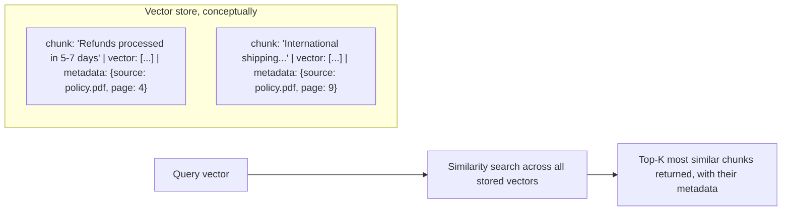

# Embedding Models and Stores

## Why this exists

You now know how to chunk documents and how to compare vectors once you have them. This file covers the two remaining practical pieces: which model actually produces those vectors, and where you put a large number of them so retrieval stays fast as your corpus grows past what a simple in-memory list and linear scan (file 2) can handle comfortably.

## Embedding models: a separate, smaller model from the one you chat with

It's a common point of confusion: the model you send conversational prompts to (Phase 02's `/v1/messages`-style endpoint) and the model that produces embeddings are typically *different* models, often from different endpoints entirely, even from the same provider. Embedding models are usually smaller, cheaper, and purpose-built for one job — turning text into a fixed-length vector — rather than generating conversational text at all. Calling an embedding endpoint looks like this, structurally similar to the chat request you already know from Phase 02:

```json
POST /v1/embeddings
{
  "model": "some-embedding-model",
  "input": "Refunds are processed within 5-7 business days of approval."
}
```

```json
{
  "data": [
    { "embedding": [0.0123, -0.0451, 0.0872, ...], "index": 0 }
  ],
  "usage": { "input_tokens": 14 }
}
```

Notice this still costs tokens (Phase 01) and still needs the same client discipline from Phase 02 — auth, resilience, error handling — even though it's a much simpler request/response shape than a chat completion, with no streaming, no conversation history, and no tool calling involved at all.

## What actually differs between embedding models, and why it matters

- **Dimensionality** — the length of the output vector (commonly a few hundred to a couple thousand numbers). Higher dimensionality can capture more nuance but costs more to store and compare; this is a genuine trade-off, not a "bigger is strictly better" situation.
- **Training domain** — a model trained primarily on general web/book text will perform noticeably worse on code, legal text, or highly technical documentation than one specifically tuned for that domain, since the geometric relationships it learned (which texts are "close" to which) reflect the data it was trained on. If your corpus is largely source code or API documentation, this is worth checking explicitly rather than assuming a general-purpose embedding model will perform equally well.
- **Consistency requirement**: whatever embedding model you use to embed your document corpus, you *must* use the identical model to embed incoming queries — comparing vectors produced by two different embedding models is meaningless, since each model's vector space has its own arbitrary geometry; a vector from model A and a vector from model B aren't directionally comparable even if both happen to be, say, 768-dimensional.

## What a "vector store" actually is

At its simplest — and this is worth internalizing before treating a vector database as a mysterious specialized product — a vector store is nothing more than a place to persist `(chunk text, vector, metadata)` tuples, plus an efficient way to answer "which stored vectors are most similar to this query vector." The brute-force version from file 2 (loop over every vector, compute cosine similarity, sort) *is* a valid, if unoptimized, vector store implementation for small corpora.



**Why real vector databases exist beyond this naive version:** as corpus size grows into the hundreds of thousands or millions of chunks, a brute-force linear scan against every stored vector becomes too slow for interactive use. Real vector stores (whether a dedicated product or a vector-search feature bolted onto a database you already use) implement approximate nearest-neighbor indexing — data structures that let you find "probably the closest matches" far faster than checking every single vector, trading a small amount of retrieval accuracy for a large gain in query speed. This is directly analogous to a B-tree index trading a small amount of write overhead for a large gain in read speed on a traditional database — same shape of trade-off, applied to similarity search instead of exact/range lookups.

**Metadata matters as much as the vector itself.** Storing where a chunk came from (source document, page number, section) alongside its vector isn't optional bookkeeping — it's what lets you cite sources back to the user, filter retrieval to a specific document set (e.g., "only search this customer's own contract, not everyone's"), and debug retrieval quality by tracing a bad answer back to the specific chunk and source it came from.

## A minimal in-memory Java implementation, before reaching for a real vector database

```java
public record EmbeddedChunk(String text, double[] vector, Map<String, String> metadata) {}

public class InMemoryVectorStore {

    private final List<EmbeddedChunk> chunks = new ArrayList<>();

    public void add(EmbeddedChunk chunk) {
        chunks.add(chunk);
    }

    public List<EmbeddedChunk> findTopK(double[] queryVector, int k) {
        return chunks.stream()
            .sorted(Comparator.comparingDouble(
                (EmbeddedChunk c) -> CosineSimilarity.compute(queryVector, c.vector())
            ).reversed())
            .limit(k)
            .toList();
    }
}
```

This is genuinely production-viable for corpora in the low thousands of chunks — many internal tools never need more than this. Reach for a dedicated vector database only once you've confirmed, empirically, that this naive approach's query latency has become a real problem at your actual corpus size — not preemptively, on the assumption that a "real" system needs a "real" vector database from day one.

## Trade-offs and when this matters most

- Small, static corpora (an internal FAQ, a single product's documentation): the in-memory approach above, re-embedded on startup or on a scheduled refresh, is simple, cheap, and entirely sufficient.
- Large or frequently-updated corpora, or anything needing metadata filtering at scale, multi-tenant isolation, or high query throughput: a dedicated vector database (or a vector-search extension on a database you already operate) becomes worth the added operational complexity.
- Don't pick an embedding model based purely on benchmark leaderboard rankings without checking it against your actual domain (code vs. prose vs. legal text) — a model that scores well on general benchmarks can still underperform a domain-tuned alternative on your specific corpus, and the only way to know is the evaluation techniques in the next file.

## Why this matters next

You now have every mechanical piece: chunking, embedding, similarity, and storage. What you don't yet have is a way to know whether any of it is actually working well for your specific corpus and queries — "the demo looked fine" is not evaluation. The next file covers exactly how to measure retrieval quality properly.