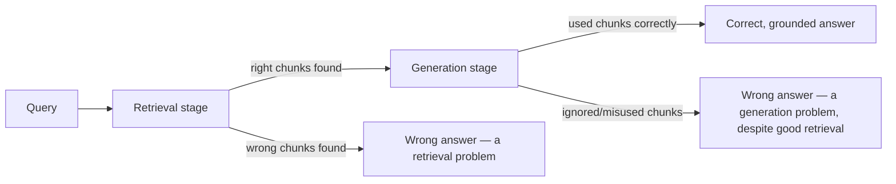

# Retrieval Quality and Evaluation

## Why this exists

Every file so far in this phase has given you a way to *build* a retrieval pipeline. None of them tell you whether the one you built is actually good. "I asked it a few questions and the answers looked reasonable" is not evaluation — it's the RAG equivalent of shipping code because it worked once on your machine. This file gives you the vocabulary and the concrete techniques to actually measure retrieval quality, which is a prerequisite for the systematic evaluation discipline Phase 10 builds out fully for entire agent systems.

## Separate the two things that can independently go wrong

A RAG pipeline has two distinct stages, and when the final answer is wrong, you need to know which stage failed before you know what to fix:

1. **Retrieval**: did the pipeline find the right chunk(s) at all?
2. **Generation**: given the right chunk(s), did the model actually use them correctly to produce a correct answer?



Debugging generation problems when the actual issue is retrieval (or vice versa) wastes real effort — if retrieval is silently failing, no amount of prompt tuning on the generation side will fix a wrong answer, because the model was never given the right material to work with in the first place.

## Precision and recall, applied to retrieved chunks

These are standard information-retrieval metrics, and they map directly onto concepts you already know from testing and monitoring — think of them as the retrieval-stage equivalent of false positive/false negative rates:

- **Precision**: of the chunks you retrieved, what fraction were actually relevant? Low precision means you're pulling in irrelevant material alongside the good stuff — costing tokens and risking the buried-fact problem from Phase 01.
- **Recall**: of all the chunks that *were* actually relevant somewhere in the corpus, what fraction did you actually retrieve? Low recall means the right answer exists in your corpus but your retrieval step never surfaced it at all — a strictly worse failure than low precision, since no amount of good generation can recover from the model simply never seeing the needed material.

```java
public record RetrievalEvalResult(double precision, double recall) {}

public RetrievalEvalResult evaluate(
    List<String> retrievedChunkIds,
    Set<String> knownRelevantChunkIds
) {
    long truePositives = retrievedChunkIds.stream()
        .filter(knownRelevantChunkIds::contains)
        .count();

    double precision = retrievedChunkIds.isEmpty()
        ? 0.0
        : (double) truePositives / retrievedChunkIds.size();

    double recall = knownRelevantChunkIds.isEmpty()
        ? 0.0
        : (double) truePositives / knownRelevantChunkIds.size();

    return new RetrievalEvalResult(precision, recall);
}
```

## Building a small "golden set" to actually run this against

This computation is only useful if you have `knownRelevantChunkIds` to compare against — which means building a small, hand-curated set of realistic queries, each paired with the specific chunk ID(s) you, a human, have confirmed actually answer that query. This is genuinely manual work, and it's worth doing anyway: a golden set of even 15-20 realistic query/relevant-chunk pairs, built once, becomes a regression suite you can re-run every time you change chunking strategy, embedding model, or `k` (the number of chunks retrieved) — turning "did that change help or hurt?" from a guess into a measured comparison.

```java
public record GoldenQuery(String query, Set<String> relevantChunkIds) {}

List<GoldenQuery> goldenSet = List.of(
    new GoldenQuery("How long until I get my refund?", Set.of("policy.pdf#chunk-4")),
    new GoldenQuery("Do you ship internationally?", Set.of("policy.pdf#chunk-9", "policy.pdf#chunk-10"))
    // ...
);
```

## Evaluating the generation stage separately

Once you know retrieval found the right material, the separate question is whether the model actually used it correctly — this is harder to check with a simple set-overlap calculation, since it requires judging whether generated *text* correctly reflects the *content* of the retrieved chunk. A lightweight first approach: manually review a sample of generated answers against their retrieved source chunks and flag any factual mismatch. A more scalable approach — using a second LLM call to judge whether a generated answer is actually supported by its cited source chunk — is a real, valid technique, but it's introduced properly in Phase 10 as "LLM-as-judge evaluation," since it needs its own discussion of the biases and failure modes that technique has; this file only needs you to know the two-stage separation and the manual/golden-set approach as a starting discipline.

## Trade-offs and when this matters most

- For a low-stakes internal tool, spot-checking a handful of real queries by eye is often sufficient — building a full golden set and precision/recall harness is more rigor than the risk justifies.
- For anything customer-facing or feeding an automated agent decision, a golden set and repeatable evaluation is not optional — without it, you have no way to know whether a change you made (a different chunk size, a different embedding model) actually improved things or just felt like it should have.
- Don't confuse a high similarity score (file 2) with confirmed relevance — cosine similarity is retrieval's own internal confidence signal, and it can be wrong; the golden-set precision/recall approach in this file is an *external* check against ground truth, which is a different and stronger form of evidence.
- Low recall is usually more urgent to fix than low precision — a missing right answer (recall failure) produces a hallucination risk (Phase 01, file 5) since the model has to guess; excess irrelevant material (precision failure) is a cost and quality-degradation problem, generally less severe than an outright wrong or fabricated answer.

## Why this matters next

You now have the full hand-built discipline: chunk, embed, store, retrieve, and evaluate. The next two files show how LangChain4j and Spring AI package all of this — and it's worth reading them now with a specific question in mind for each: "does this framework's abstraction still let me do the evaluation this file just taught me, or does it hide the pieces I'd need access to?"