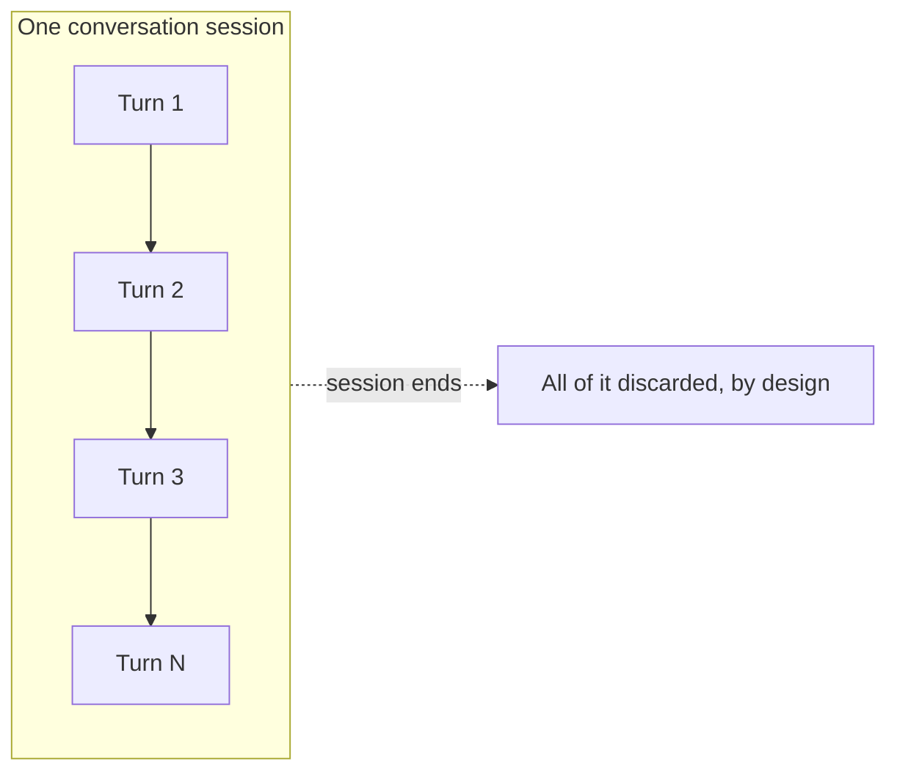
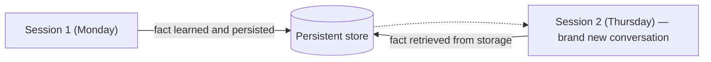
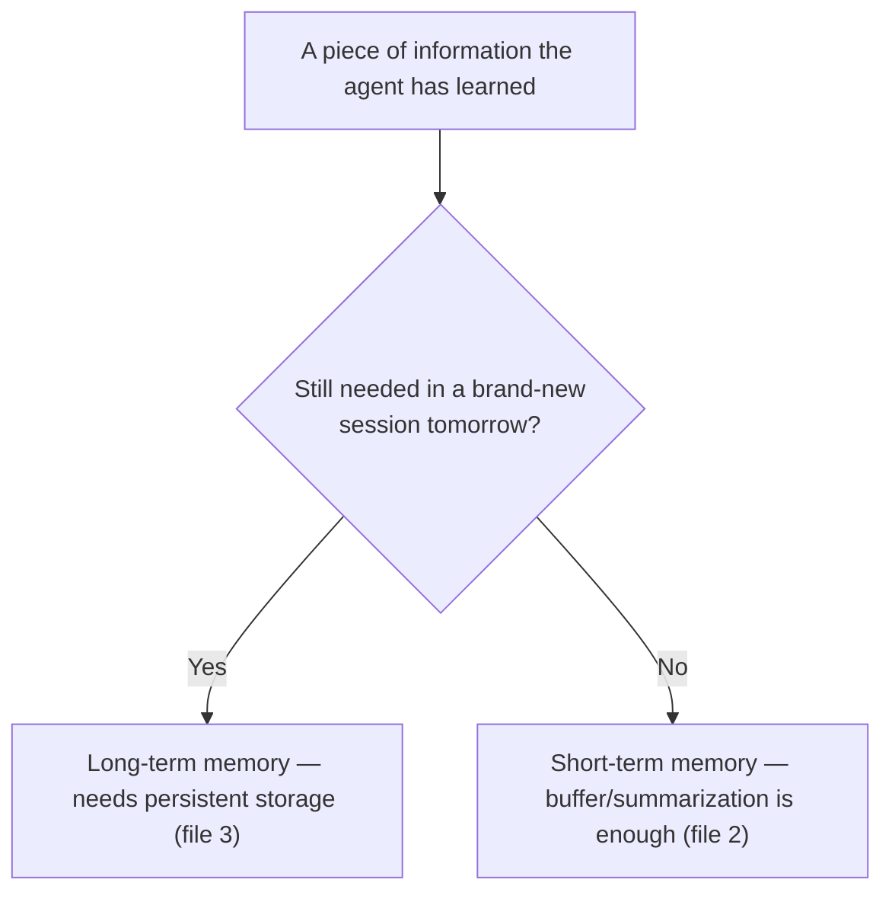

# Short-Term vs. Long-Term Memory

## Why this exists

"Memory" is used loosely enough in AI-engineering discussion that it's worth pinning down two genuinely different problems it can refer to, because the right engineering solution for one is often the wrong solution for the other. Conflating them is a common source of both wasted engineering effort (building persistent long-term storage for a problem that only needed a bigger short-term buffer) and real production bugs (relying on short-term context for something that actually needed to survive across sessions, and finding out it didn't).

## Short-term memory: within one continuous conversation

This is exactly what Phase 02's `ConversationState` implements: the back-and-forth within a single, continuous session. Its scope is bounded by the conversation itself — once the session ends (the user closes the chat, the process restarts, the conversation object goes out of scope), this memory is gone, by design. The engineering problem here isn't "how do we persist this" — it's "how do we manage its size and relevance as it grows," since Phase 01 already established that this content directly drives cost and context-window usage on every single call.

## Long-term memory: across sessions, potentially across a long time span

This is a different problem: information that needs to survive *after* the current conversation ends, and be available again the next time this user (or this agent, in a multi-session task) starts a brand-new conversation — a user's stated preferences, a fact learned three weeks ago that's still relevant today, a running project's accumulated context across many separate work sessions. Unlike short-term memory, this genuinely requires persistent storage — a database, a file, a vector store (file 3) — because nothing about the stateless API call itself, nor the in-memory `ConversationState` object, survives a process restart or a brand-new session starting from zero.

## Why conflating these causes real problems

**Treating long-term needs as short-term (the more common mistake):** an assistant that's supposed to remember a user's stated dietary restriction "forever" but only actually stores it in the current session's `ConversationState` will behave correctly today and "forget" completely the next time the user opens a new session — a bug that's easy to miss in testing, because testing usually happens within one continuous session, and only surfaces once real users return across multiple separate visits.

**Treating short-term needs as long-term (less common, but a real cost problem):** persisting every single conversational turn to a database and vector-embedding all of it, when the actual requirement was just "handle a reasonably long single conversation well," adds real infrastructure and cost overhead (storage, embedding API calls per turn, retrieval latency) for a problem that a well-managed in-memory buffer or summarization strategy (file 2) would have solved more simply and more cheaply.

## The engineering question that decides which you need

Ask, concretely: **"if this exact conversation ended right now and the user came back tomorrow in a brand-new session, does this specific piece of information need to still be available?"** If yes, it's a long-term memory concern and needs persistent storage of some kind. If the information is only relevant to helping the current exchange make sense — "what did they just ask three messages ago" — it's short-term, and the strategies in the next file (buffering, summarization) are the right tool, not a database.

## Trade-offs and when this matters most

- Most single-session tools (a one-off support chat, a quick coding assistant invocation) only ever need short-term memory — don't build persistence you don't need.
- Any assistant meant to feel like it "knows" a specific user over time — a personal productivity assistant, a long-running customer account concierge — needs long-term memory as a deliberate design decision from the start, not as an afterthought bolted on once users start complaining that "it forgot what I told it last week."
- Many real systems need both simultaneously, operating independently: a well-managed short-term buffer for the current exchange, and a separate long-term store queried for durable facts — file 3 shows exactly how these two coexist without interfering with each other.

## Why this matters next

You now have the vocabulary to classify a memory requirement correctly. The next file covers the two dominant strategies for managing short-term memory once a conversation grows long enough that "keep everything" (Phase 02's baseline) stops being the right default.