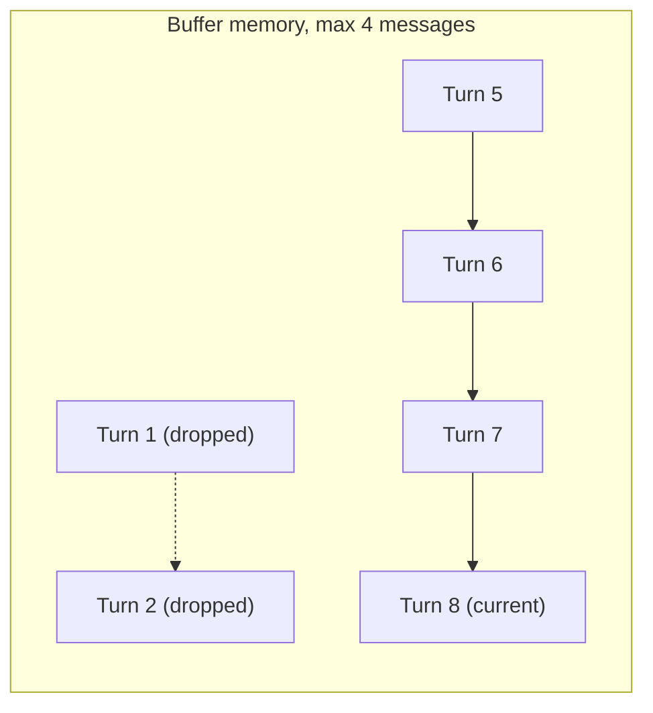
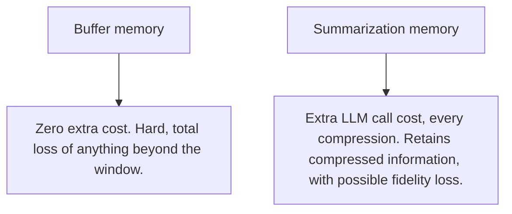

# Conversation Buffer and Summarization Memory

## Why this exists

You now know short-term memory is about managing a growing conversation's size and relevance within a session. This file covers the two dominant, concrete strategies for doing that, their exact failure modes, and working Java implementations of both — because "just keep everything" (Phase 02's baseline) is a valid *starting* strategy, not a permanent one, and knowing exactly when and how it breaks is what tells you when to switch.

## Strategy 1: Buffer memory (with a bound)

The simplest evolution beyond "keep everything forever" is a bounded buffer — keep the most recent N turns, and drop the oldest ones once the limit is exceeded:

```java
public class BufferMemory {

    private final Deque<Message> buffer = new ArrayDeque<>();
    private final int maxMessages;

    public BufferMemory(int maxMessages) {
        this.maxMessages = maxMessages;
    }

    public void add(Message message) {
        buffer.addLast(message);
        while (buffer.size() > maxMessages) {
            buffer.removeFirst();
        }
    }

    public List<Message> currentHistory() {
        return List.copyOf(buffer);
    }
}
```

This directly bounds the cost-growth problem from Phase 01 — input tokens no longer grow without limit as a conversation lengthens. Its exact failure mode is equally direct: **anything mentioned before the buffer's cutoff is gone, with no trace.** If a user states an important constraint in turn 2 of a 30-turn conversation and your buffer only retains the last 10 turns, that constraint has fallen out of context entirely by turn 15 — not summarized, not degraded, simply absent, and the model has no way to know it was ever told. This is the sharpest possible version of Phase 01's "buried fact" problem: not buried, but deleted.



## Strategy 2: Summarization memory

Instead of dropping older turns outright, summarization memory periodically compresses them into a shorter representation — using the LLM itself, via a separate, dedicated call, to condense the older portion of the conversation into a summary that's retained going forward in place of the original turns:

```java
public class SummarizationMemory {

    private final LlmClient llmClient;
    private String runningSummary = "";
    private final List<Message> recentBuffer = new ArrayList<>();
    private final int summarizeAfterMessages;

    public SummarizationMemory(LlmClient llmClient, int summarizeAfterMessages) {
        this.llmClient = llmClient;
        this.summarizeAfterMessages = summarizeAfterMessages;
    }

    public void add(Message message) throws Exception {
        recentBuffer.add(message);
        if (recentBuffer.size() >= summarizeAfterMessages) {
            compressOldestIntoSummary();
        }
    }

    private void compressOldestIntoSummary() throws Exception {
        String summarizePrompt = """
            Existing summary of the conversation so far: %s

            New messages to incorporate into the summary:
            %s

            Produce an updated, concise summary capturing all important facts,
            decisions, and constraints mentioned, in a few sentences.
            """.formatted(runningSummary, formatMessages(recentBuffer));

        ChatRequest summarizeRequest = new ChatRequest(
            "some-model-name", 256, 0.0, null,
            List.of(new Message("user", summarizePrompt))
        );
        ChatResponse response = llmClient.send(summarizeRequest);
        runningSummary = response.content().get(0).text();
        recentBuffer.clear();
    }

    public List<Message> currentHistory() {
        List<Message> history = new ArrayList<>();
        if (!runningSummary.isBlank()) {
            history.add(new Message("user", "Summary of earlier conversation: " + runningSummary));
        }
        history.addAll(recentBuffer);
        return history;
    }

    private String formatMessages(List<Message> messages) {
        return messages.stream()
            .map(m -> m.role() + ": " + m.content())
            .reduce("", (a, b) -> a + "\n" + b);
    }
}
```

This solves the "constraint mentioned in turn 2, gone by turn 15" problem directly — that constraint survives, compressed, inside `runningSummary`, rather than being silently deleted. Its trade-off is a different, subtler failure mode: **summarization is itself a generation step, with all of Phase 01's risks** — it can drop a detail that seemed unimportant at summarization time but turns out to matter later, or subtly alter a fact's phrasing in a way that changes its meaning. Unlike buffer memory's failure (total, obvious loss once you notice it), summarization's failure mode is quieter and harder to detect: the information is *there*, just possibly degraded, which can be more dangerous precisely because it looks present and reliable.

## The direct cost trade-off between the two

Buffer memory costs nothing extra to maintain — it's pure Java list manipulation. Summarization memory costs a real, additional LLM call every time compression triggers — meaning summarization memory has its own token cost (Phase 01) layered on top of the conversation's own ongoing cost, which needs to be included in any cost projection (Phase 01's project, Phase 11's dashboards), not treated as free housekeeping.



## A hybrid, and usually the most practical default

Most real systems combine both: keep a small buffer of the most recent turns verbatim (for exact, high-fidelity recent context, where fidelity matters most since it's what the user is actively discussing right now) plus a running summary of everything older (for durable but compressed context) — exactly what the `SummarizationMemory` class above already implements, by design: `recentBuffer` holds verbatim recent turns, `runningSummary` holds the compressed older history, and `currentHistory()` combines both.

## Trade-offs and when this matters most

- Short, bounded conversations (a quick support interaction expected to last under 10-15 turns) rarely need either strategy — Phase 02's unbounded baseline is fine, and adding complexity here would be solving a problem you don't have.
- Long-running conversations (extended troubleshooting sessions, agent loops with many tool-call iterations — a preview of Phase 07's own memory pressure) need one of these strategies as a hard requirement, not an optimization to consider later, since Phase 01's cost-growth mechanics apply with real force at that length.
- Choose buffer memory when losing older detail entirely is an acceptable trade-off for simplicity and zero added cost; choose summarization when durable fidelity to earlier facts genuinely matters and you can tolerate the added cost and small fidelity risk of an extra generation step.
- Don't summarize on every single turn if it's not needed — summarizing only when the buffer crosses a size threshold (as implemented above) avoids paying summarization's cost far more often than necessary.

## Why this matters next

Both strategies in this file operate on *this session's own history*. Neither one, by itself, solves the long-term memory problem from the previous file — information that needs to survive into an entirely new session next week. The next file covers exactly that: reusing Phase 03's vector-retrieval machinery, now pointed at persisted facts and past conversations instead of documents.