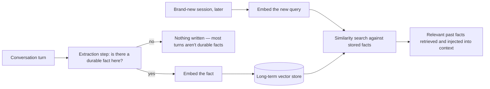

# Vector Store as Long-Term Memory

## Why this exists

The previous file solved managing *this session's* history. This file solves the problem the first file in this phase framed explicitly: information that must survive into a brand-new session, potentially much later. The mechanism is not new — it's Phase 03's entire retrieval pipeline (chunk or structure a piece of information, embed it, store the vector, retrieve by similarity later) applied to a different kind of content: facts about a user or past conversation turns, instead of external documents. If Phase 03 feels distant, this is the moment to recognize why this handbook placed retrieval immediately before memory — this file would otherwise need to re-teach vector similarity, embedding, and storage from scratch.

## The reframe: memories are just another kind of document

Recall Phase 03's `EmbeddedChunk` record: `(text, vector, metadata)`. A long-term memory is exactly this shape — the `text` might be "User prefers responses in bullet-point format" or "User's production database runs on PostgreSQL 15," the `vector` is that fact's embedding, and `metadata` might record when it was learned and from which conversation. Storage and retrieval both reuse Phase 03's `InMemoryVectorStore` (or a real vector database) completely unchanged — the only genuinely new engineering questions are **what gets written to long-term memory in the first place**, and **when**.



## Deciding what gets written: extraction, not blind logging

A naive approach — embed and store every single conversational turn as a "memory" — reproduces exactly the problem Phase 01 and Phase 03 warned about: a store cluttered with low-signal content dilutes retrieval quality and wastes storage and embedding cost on facts nobody will ever need again. The better approach is an explicit **extraction step**: a dedicated (often small, cheap) LLM call whose only job is to look at a conversation turn and decide whether it contains a durable, worth-remembering fact at all:

```java
public record ExtractedFact(boolean shouldRemember, String factText) {}

public ExtractedFact extractFact(String userMessage, String assistantReply) throws Exception {
    String extractionPrompt = """
        Conversation turn:
        User: %s
        Assistant: %s

        Does this turn contain a durable fact worth remembering long-term
        (a stated preference, a persistent technical detail, a standing constraint)?
        If yes, respond with just that fact in one sentence.
        If no durable fact is present, respond with exactly: NONE
        """.formatted(userMessage, assistantReply);

    ChatRequest request = new ChatRequest(
        "some-model-name", 100, 0.0, null,
        List.of(new Message("user", extractionPrompt))
    );
    String result = llmClient.send(request).content().get(0).text().trim();

    return result.equals("NONE")
        ? new ExtractedFact(false, null)
        : new ExtractedFact(true, result);
}
```

This is a real, additional LLM call (with its own Phase 01 cost) run after each turn, or on some batched schedule — the cost trade-off is directly analogous to summarization memory's from the previous file, and the same "is this worth it for this use case" judgment applies.

## Writing and retrieving, reusing Phase 03 directly

```java
public class LongTermMemoryStore {

    private final InMemoryVectorStore vectorStore; // exact same class from Phase 03
    private final EmbeddingClient embeddingClient;  // the /v1/embeddings client from Phase 03, file 4

    public LongTermMemoryStore(InMemoryVectorStore vectorStore, EmbeddingClient embeddingClient) {
        this.vectorStore = vectorStore;
        this.embeddingClient = embeddingClient;
    }

    public void remember(String factText, String userId) throws Exception {
        double[] vector = embeddingClient.embed(factText);
        vectorStore.add(new EmbeddedChunk(
            factText, vector, Map.of("userId", userId, "storedAt", Instant.now().toString())
        ));
    }

    public List<EmbeddedChunk> recall(String query, String userId, int k) throws Exception {
        double[] queryVector = embeddingClient.embed(query);
        return vectorStore.findTopK(queryVector, k).stream()
            .filter(chunk -> userId.equals(chunk.metadata().get("userId")))
            .toList();
    }
}
```

Notice the `userId` metadata filter in `recall` — exactly the metadata discipline Phase 03, file 4 argued for, now serving a genuinely important purpose: without it, one user's stored memories could be retrieved and injected into a completely different user's conversation, since raw vector similarity has no inherent concept of "whose fact this is." This is a real privacy and correctness boundary, not a cosmetic detail — get this filter wrong in a multi-user system and you have a data-leakage bug.

## Assembling the full picture: short-term and long-term memory operating together

A realistic agent turn combines everything from this phase so far: the previous file's buffer/summary for the current session, plus this file's long-term recall for durable cross-session facts, plus Phase 03's document retrieval if the query also needs external knowledge:

```java
public ChatRequest buildRequest(String userMessage, String userId) throws Exception {
    List<Message> shortTermHistory = summarizationMemory.currentHistory();      // file 2
    List<EmbeddedChunk> longTermFacts = longTermMemoryStore.recall(userMessage, userId, 3); // this file
    List<EmbeddedChunk> retrievedDocs = documentRetriever.retrieveTopK(userMessage, 3);      // Phase 03

    String contextPrefix = formatAsContext(longTermFacts, retrievedDocs);

    List<Message> messages = new ArrayList<>();
    messages.add(new Message("user", contextPrefix));
    messages.addAll(shortTermHistory);
    messages.add(new Message("user", userMessage));

    return new ChatRequest("some-model-name", 1024, 0.3, systemPrompt, messages);
}
```

This is the moment the last three phases visibly converge into one coherent request-construction pipeline — worth pausing on, since it's easy to have absorbed each phase's mechanics individually without noticing they're all just different sources feeding the same context-engineering discipline from Phase 03, file 1.

## Trade-offs and when this matters most

- For tools with no real notion of a returning, individual user (a stateless internal utility, a one-off document Q&A tool), long-term memory adds real infrastructure and cost for no corresponding benefit — skip it.
- For any assistant meant to feel personalized and continuous across sessions, long-term memory is close to the entire value proposition, and skipping it is usually the single biggest gap between a demo and something users actually find useful over time.
- The extraction step's cost and the risk of extracting the wrong things (or missing genuinely important facts) both scale with how aggressively you extract — a conservative extraction prompt that only flags clearly durable facts is usually safer and cheaper than one that eagerly stores anything that sounds vaguely persistent.
- Multi-tenant metadata filtering (the `userId` example above) is not optional in any system serving more than one user — treat it with the same seriousness as row-level security in a shared database.

## Why this matters next

You now have the complete conceptual and hand-built toolkit for memory: the short-term/long-term distinction, buffer and summarization strategies, and vector-backed long-term recall reusing Phase 03's machinery. The next file shows how LangChain4j and Spring AI package these same strategies into ready-made memory abstractions, and where each framework's defaults align with — or diverge from — what you've built by hand here.