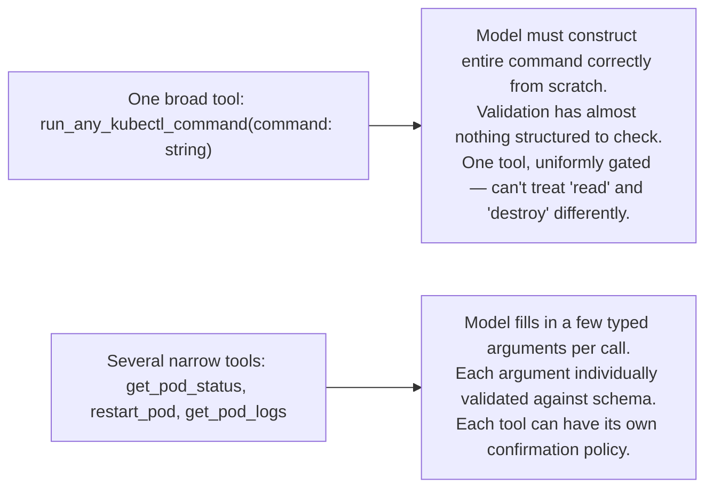

# Designing Tool Schemas

## Why this exists

Phase 02, file 5 showed you the JSON shape of a tool definition — `name`, `description`, `input_schema`. This file is about the actual engineering skill of writing a *good* one, because a tool that's technically well-formed JSON can still cause the model to select it at the wrong time, pass it the wrong arguments, or ignore it entirely in favor of a worse choice. This is a genuinely learnable skill with concrete failure patterns, not a vague art — treat it with the same rigor you'd apply to designing a public method signature that other engineers (in this case, the model) will call based only on its name and documentation, with no access to its implementation.

## The description field is your API documentation, and the model is your only caller

The model decides whether and how to call a tool based almost entirely on the `name`, `description`, and parameter descriptions you provide — it has no access to your tool's actual implementation, no ability to read your Java source, and no memory of how the tool behaved on a previous call unless that's in the current context. This means a vague or ambiguous description produces exactly the failure mode you'd expect from a poorly documented method: sometimes called when it shouldn't be, sometimes not called when it should be, and sometimes called with arguments that technically satisfy the schema but don't reflect what the tool actually needs.

**A weak example:**
```json
{
  "name": "get_data",
  "description": "Gets data.",
  "input_schema": {
    "type": "object",
    "properties": { "id": { "type": "string" } }
  }
}
```

**A strong example, describing the same underlying capability:**
```json
{
  "name": "get_customer_order_history",
  "description": "Retrieves the last 90 days of order history for a specific customer, identified by their account email address. Use this when the user asks about past orders, order status, or purchase history for a named customer. Does not include cart or wishlist data.",
  "input_schema": {
    "type": "object",
    "properties": {
      "customer_email": {
        "type": "string",
        "description": "The customer's account email address, exactly as stored in the system."
      }
    },
    "required": ["customer_email"]
  }
}
```

The strong version tells the model three things the weak version doesn't: *when* to use this tool (order-related questions), what it explicitly does *not* cover (scoping expectations, reducing incorrect assumptions about capability), and precisely what shape the identifying argument should take. Each of these directly reduces a specific, real failure mode: wrong-tool selection, over-scoped assumptions about what the tool returns, and malformed argument values.

## Naming and scope: narrow, single-purpose tools over broad, multi-purpose ones

A tool like `run_any_kubectl_command`, accepting an arbitrary shell-like string, is tempting because it's maximally flexible — one tool covers everything. It's also close to the worst possible design from a reliability and safety standpoint: the model has to correctly construct an entire command from scratch every time, with every opportunity for a malformed or dangerous string that entails, and your validation code (file 3) has almost nothing structured to check against beyond parsing a free-form string after the fact.

Compare that to a small set of narrow, named tools: `get_pod_status(namespace, pod_name)`, `restart_pod(namespace, pod_name)`, `get_pod_logs(namespace, pod_name, lines)`. Each has a fixed, validated shape; each can be individually gated behind different confirmation requirements (file 4 — reading status is harmless, restarting a pod is consequential); and the model's job in each case is simple, constrained argument-filling rather than open-ended command construction.



## Parameter design: types and constraints do real work

`input_schema` is standard JSON Schema — the same format familiar from OpenAPI specs — and its constraint keywords (`enum`, `minimum`/`maximum`, `pattern`) aren't decorative; they meaningfully narrow what the model can even attempt to pass, and what your validation layer needs to double-check versus what's already structurally ruled out:

```json
{
  "type": "object",
  "properties": {
    "namespace": {
      "type": "string",
      "enum": ["dev", "staging", "prod"],
      "description": "The Kubernetes namespace to operate in."
    },
    "log_lines": {
      "type": "integer",
      "minimum": 1,
      "maximum": 500,
      "description": "Number of recent log lines to retrieve."
    }
  },
  "required": ["namespace"]
}
```

Constraining `namespace` to an `enum` of exactly the valid values means the model is far less likely to hallucinate a nonexistent namespace, and it gives you a hard, structural guarantee (albeit not an absolute one — file 3 covers why validation is still necessary even with a constrained schema) to check against, rather than validating an arbitrary free-form string after the fact.

## Trade-offs and when this matters most

- Investing real effort in tool description quality matters most for tools whose *purpose* could plausibly be confused with another tool's, or whose correct usage isn't obvious from the name alone — a tool named `get_pod_status` barely needs elaboration; a tool with any ambiguity in scope needs it far more.
- Splitting one broad tool into several narrow ones costs you more tool definitions to maintain and, per Phase 02 file 5, more tokens sent on every request that includes them all — worth pruning to only the tools relevant to a given agent's actual task scope, rather than exposing your entire tool library on every call regardless of relevance.
- Don't over-invest in exhaustive descriptions for tools already narrowly scoped by their schema (an `enum`-constrained parameter needs less prose explanation than a free-form string one) — match documentation effort to actual ambiguity, not uniformly across every tool.

## Why this matters next

You now know how to describe tools well. The next file explains the mechanism behind *why* the model picks one tool over another, or none at all, at generation time — tying this file's design guidance back to Phase 01's sampling and attention concepts, so "write a good description" stops being a rule you follow and becomes something you can reason about mechanically.