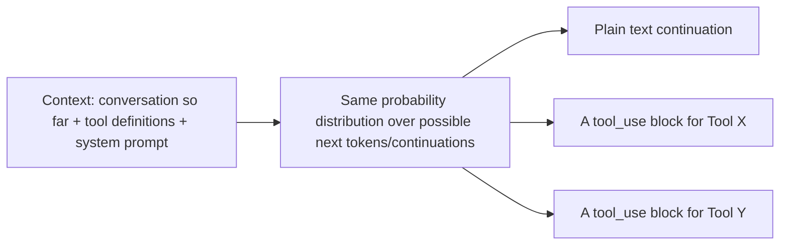

# How Models Decide to Call Tools

## Why this exists

The previous file gave you design guidance — narrow tools, clear descriptions, constrained schemas — as rules to follow. This short file grounds those rules in the actual mechanism, tying directly back to Phase 01, so you can reason about *new* situations the rules didn't explicitly cover, rather than only pattern-matching to examples you've already seen.

## There's no separate "decision engine" — it's the same generation process from Phase 01

A common mental model to unlearn: that the model has some distinct, rule-based dispatcher sitting apart from its normal generation process, evaluating "should I call a tool here?" as a special-cased decision. It doesn't. Generating a `tool_use` block is exactly the same autoregressive, token-by-token sampling process from Phase 01, file 4 — the model is simply generating the next tokens that continue the conversation, and a `tool_use` block is one of the possible continuations available to it, alongside plain text, given the current context and the tool definitions you supplied.

This is precisely why tool description quality (previous file) has real, mechanical leverage: a clearer, more distinctive description shifts the probability distribution more decisively toward the correct tool at the moment a matching request appears in context, in the same way a more distinctive, well-chosen variable or method name in code reduces the chance of a future reader misusing it — except here, the "future reader" choosing based on the name and description is the model itself, at generation time.

## Attention explains why irrelevant tools get selected anyway

Recall Phase 01, file 3: attention weighs all available context, including everything in the `tools` array, when generating the next token. A tool with a description that overlaps significantly with another tool's — or a large `tools` array cluttered with many rarely-relevant options — makes correct selection harder for the same reason a long, unfocused context makes any fact harder to weight correctly: more competing signal to sort through, more opportunity for the "wrong but plausible" continuation to get sampled instead of the right one. This is the direct mechanical justification, beyond the practical guidance in the previous file, for keeping the active tool set narrow and relevant to the current task rather than exposing everything available at all times.

## Why arguments can be malformed even when a tool selection is correct

Once the model has "decided" (generated a `tool_use` block) to call the right tool, filling in the `input` arguments is *still* generation — still sampling, still subject to Phase 01's hallucination mechanics. A correctly-selected tool can still receive a hallucinated argument value, particularly for free-form string parameters without an `enum` constraint — the model generates a plausible-looking value for, say, a customer ID or a date, and that value can be entirely invented rather than grounded in anything actually present in the conversation. This is precisely why the previous file's schema-constraint guidance (`enum`, `minimum`/`maximum`) has real mechanical value: it doesn't just document intent, it narrows the space of tokens the model can plausibly sample into a syntactically valid argument, catching a class of error before it ever reaches your validation code.

## Why this matters next

You now understand tool selection and argument generation as instances of the same generation mechanism from Phase 01 — meaning neither is guaranteed correct, however well-designed your schemas are. The next file is the direct engineering consequence of that fact: every tool-call request the model produces must be treated as untrusted input requiring validation, exactly the way you'd validate any request arriving at a public API endpoint, regardless of how trustworthy the caller seems.