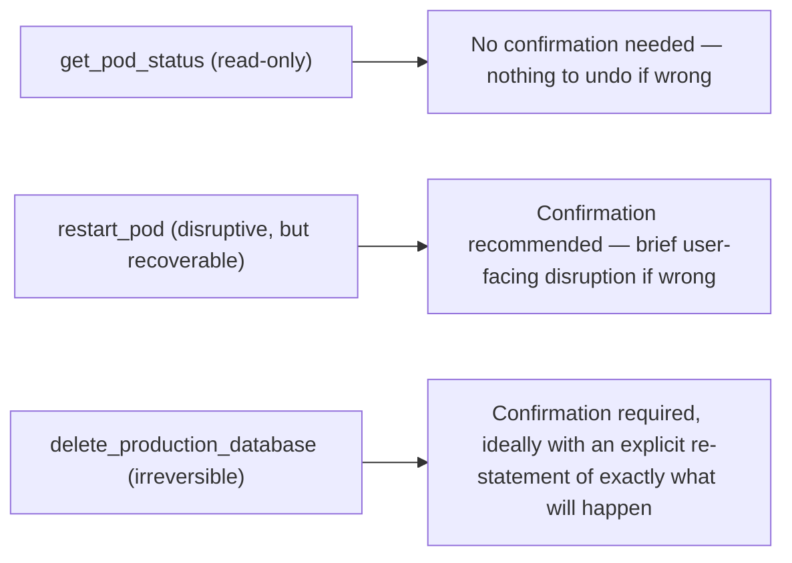

# Human-in-the-Loop Confirmation Patterns

## Why this exists

The previous file's three validation layers reduce the risk of a malformed or unauthorized tool call executing — but "reduce" is not "eliminate," and some actions are consequential or irreversible enough that even a well-validated request shouldn't execute automatically. This file covers the last, and simplest, safeguard: requiring explicit human approval before a specific class of action actually runs.

## Not every tool needs this — and adding it everywhere defeats the point of automation

The instinct to gate *everything* behind confirmation is understandable but counterproductive: an agent that asks for approval before every read-only status check is barely more useful than no agent at all, and the constant confirmation prompts train users to click "approve" reflexively without reading them — which defeats the entire safeguard for the times it actually matters. The right approach is selective: classify each tool by consequence, and gate only the ones where an unintended or wrong execution would be costly or hard to reverse.



## Implementing the gate

Structurally, this is a pause point inserted between validation (previous file) and execution: instead of calling the tool implementation directly once validation passes, the flow surfaces the pending action to a human and waits for explicit approval before proceeding.

```java
public enum ConfirmationLevel { NONE, RECOMMENDED, REQUIRED }

public record ToolDefinition(String name, ConfirmationLevel confirmationLevel) {}

public String executeWithConfirmation(
    ToolDefinition tool,
    Object validatedInput,
    ConfirmationPrompter prompter
) throws Exception {
    if (tool.confirmationLevel() != ConfirmationLevel.NONE) {
        boolean approved = prompter.confirm(
            "The agent wants to run: " + tool.name() + " with input: " + validatedInput
        );
        if (!approved) {
            return "Action cancelled by user.";
        }
    }
    return dispatchToImplementation(tool, validatedInput);
}
```

The key design point: the confirmation prompt should describe the *specific, concrete action* about to be taken — not a generic "the AI wants to do something, allow?" — since a vague prompt produces the same reflexive-approval problem as over-gating in the first place. "Restart pod `payments-service` in namespace `prod`" gives a human something real to evaluate; "execute tool call?" does not.

## Where this fits in a larger agent loop

In an interactive session, this is naturally a pause-and-wait-for-user-input step. In a fully autonomous agent (previewed here, covered properly in Phase 07 and Phase 09), where no human is actively watching the conversation turn by turn, "human in the loop" more often takes the shape of a queued approval — the agent proposes the action and halts that specific step, a designated person reviews and approves asynchronously (via a dashboard, a Slack message, an approval queue), and only then does execution proceed. The underlying principle — an irreversible action does not execute without an explicit, informed approval step — is identical in both cases; only the mechanism for surfacing and collecting that approval differs.

## Trade-offs and when this matters most

- Read-only or fully reversible actions rarely need this gate — the cost of occasional wrong execution is low, and adding friction here mainly trains users to stop reading confirmations at all.
- Irreversible or high-blast-radius actions (deleting data, financial transactions, production infrastructure changes) need this gate essentially without exception, regardless of how well file 3's validation layers are implemented — validation reduces the chance of a *malformed* request, not the consequence of a correctly-formed but simply wrong or unwanted one.
- Don't rely on confirmation prompts as your only safeguard — this file's pattern is the last layer in a stack that includes schema validation, business-rule checks, and sandboxing (previous file); removing any of the earlier layers on the assumption "a human will catch it" reintroduces exactly the risks those layers exist to catch automatically, before a human is even asked to weigh in.

## Why this matters next

You now have the complete safety and reliability discipline for tool use: well-designed schemas, an understanding of why arguments can still be wrong, layered validation and sandboxing, and confirmation gating for consequential actions. The next file shows how LangChain4j and Spring AI package tool definition and dispatch — worth reading with a specific question in mind: does the framework give you a natural place to insert this file's confirmation gate, or does it assume tools always execute immediately once selected?