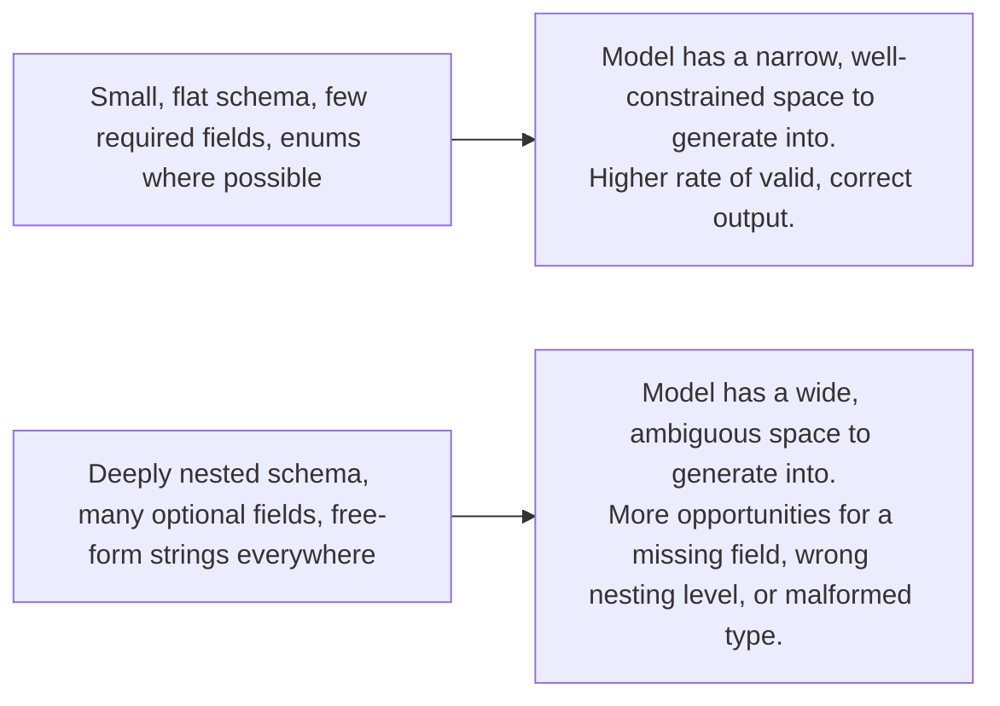

# Schema-Driven Generation

## Why this exists

Phase 02, file 6 showed you two protocol-level mechanisms for constraining output: a generic JSON-mode flag, and the stronger forced-tool-call trick. Both of those files treated the schema itself as a given — something you'd already decided on. This file is about the actual engineering skill of *designing* that schema well, because the shape of your schema has a direct, measurable effect on how often the model produces valid output in the first place, independent of which enforcement mechanism you're using. A well-designed schema against a weak enforcement mechanism often outperforms a poorly-designed schema against a strong one — this file is about the lever that's too often ignored in favor of just reaching for a stronger enforcement flag.

## Schema complexity is not free — it competes with generation quality

It's tempting to think of a JSON Schema as purely declarative documentation with no runtime cost beyond validation. In practice, the schema (or its equivalent tool definition) is part of what occupies the model's context and shapes its generation, exactly like everything else covered in Phase 01's attention discussion — a schema with deeply nested objects, many optional fields, and inconsistent naming conventions gives the model more surface area to get something subtly wrong, in the same way a sprawling, inconsistent Java DTO with unclear nullability is more error-prone for a human developer to populate correctly than a small, well-normalized one.



## Principle 1: flatten where you reasonably can

Compare two ways of representing the same extracted invoice data:

**Deeply nested (harder for the model to get consistently right):**
```json
{
  "type": "object",
  "properties": {
    "invoice": {
      "type": "object",
      "properties": {
        "parties": {
          "type": "object",
          "properties": {
            "vendor": { "type": "object", "properties": { "name": { "type": "string" } } },
            "customer": { "type": "object", "properties": { "name": { "type": "string" } } }
          }
        },
        "amounts": {
          "type": "object",
          "properties": {
            "total": { "type": "object", "properties": { "value": { "type": "number" }, "currency": { "type": "string" } } }
          }
        }
      }
    }
  }
}
```

**Flattened (fewer places for a nesting mistake to occur):**
```json
{
  "type": "object",
  "properties": {
    "vendor_name": { "type": "string" },
    "customer_name": { "type": "string" },
    "total_amount": { "type": "number" },
    "currency": { "type": "string" }
  },
  "required": ["vendor_name", "total_amount", "currency"]
}
```

The flattened version isn't just easier to deserialize into a simpler Java record — it genuinely reduces the number of distinct structural decisions the model has to get right simultaneously (correct nesting depth, correct field placement within each nested level, correct type at every leaf). This doesn't mean nesting is never appropriate — a genuinely one-to-many relationship (an invoice's list of line items, covered below) needs *some* structure — but reflexively mirroring a deeply object-oriented domain model into your extraction schema, the way you might naturally design a rich Java class hierarchy, often works against you here in a way it wouldn't in ordinary application code.

## Principle 2: prefer enums over free-form strings wherever the value space is actually fixed

This is a direct extension of Phase 05, file 1's guidance on tool parameters, applied equally to any structured output, not just tool arguments:

```json
{
  "payment_status": {
    "type": "string",
    "enum": ["paid", "unpaid", "overdue", "partially_paid"]
  }
}
```

versus the weaker, more error-prone:

```json
{
  "payment_status": { "type": "string" }
}
```

With the free-form version, you'll see real variation across calls — `"unpaid"`, `"Unpaid"`, `"not paid"`, `"outstanding"` — all plausible completions for the same underlying fact, none of them wrong from the model's perspective, and all of them a genuine headache for downstream code doing an equality check or a switch statement. The `enum` constraint doesn't just document the valid values for a human reader; it meaningfully narrows the token-level generation space (Phase 01, file 4) to only the tokens matching one of those exact strings, producing dramatically more consistent output.

## Principle 3: make required fields genuinely required, and give the model an explicit way to express absence

A subtle failure mode: marking a field `required` in the schema when the source text genuinely might not contain that information forces the model to either fabricate a value (a direct, schema-induced hallucination) or produce invalid output by omitting it. If a field is sometimes legitimately absent from the source material — an invoice without a purchase order number, for instance — the schema should say so explicitly, and give the model a clear way to represent "not present" rather than guessing:

```json
{
  "purchase_order_number": {
    "type": ["string", "null"],
    "description": "The purchase order number, or null if none is present in the source document."
  }
}
```

This is a direct schema-level defense against hallucination (Phase 01, file 5): rather than relying purely on an instruction like "don't make up values," you remove the *pressure* to fabricate by giving `null` as an explicitly valid, schema-conformant answer for genuinely missing information.

## Principle 4: arrays of objects, when you genuinely need one-to-many structure

Line items on an invoice are a legitimate case for array-of-object structure, since flattening genuinely loses information here:

```json
{
  "line_items": {
    "type": "array",
    "items": {
      "type": "object",
      "properties": {
        "description": { "type": "string" },
        "quantity": { "type": "integer", "minimum": 1 },
        "unit_price": { "type": "number", "minimum": 0 }
      },
      "required": ["description", "quantity", "unit_price"]
    }
  }
}
```

The discipline here is keeping each *item's* shape flat and enum-constrained wherever possible, even though the outer structure is necessarily an array — the flattening principle applies within each repeated unit, not as an argument against ever using arrays at all.

## Mapping a well-designed schema onto Java

A schema designed with these principles maps naturally onto simple, mostly-flat Java records, which is itself a useful signal — if your target Java representation feels awkward or deeply nested, that's often a sign the schema driving it should be reconsidered too, not just the Java side of the mapping:

```java
public record InvoiceLineItem(String description, int quantity, double unitPrice) {}

public record ExtractedInvoice(
    String vendorName,
    String customerName,
    double totalAmount,
    String currency,
    String purchaseOrderNumber, // null when absent, per the schema's explicit nullable design
    PaymentStatus paymentStatus, // a real Java enum, mapped directly from the schema's enum
    List<InvoiceLineItem> lineItems
) {}

public enum PaymentStatus { PAID, UNPAID, OVERDUE, PARTIALLY_PAID }
```

## Trade-offs and when this matters most

- For low-stakes, human-reviewed extraction (a draft summary a person will proofread), schema imperfections matter less — a human catches and corrects the occasional malformed field.
- For anything an agent parses and acts on automatically without human review — which is the majority of what Phases 07 through 09 build — schema design quality directly determines how often your downstream reliability layer (next file) even needs to intervene at all. A well-designed schema reduces the *frequency* of the problems the rest of this phase is built to catch; it doesn't remove the need for that catching layer entirely.
- Don't over-flatten to the point of losing genuinely structural information (forcing a real one-to-many relationship like line items into a single delimited string field, for instance) purely in the name of simplicity — the goal is removing *unnecessary* structural complexity, not all structure.

## Why this matters next

A well-designed schema meaningfully reduces how often the model produces something invalid — it does not reduce that probability to zero, and it says nothing about whether a schema-valid response is factually correct. The next file covers the actual Java code that sits downstream of generation: parsing, and the multi-stage validation that catches both malformed shape and questionable content, before anything reaches your business logic.