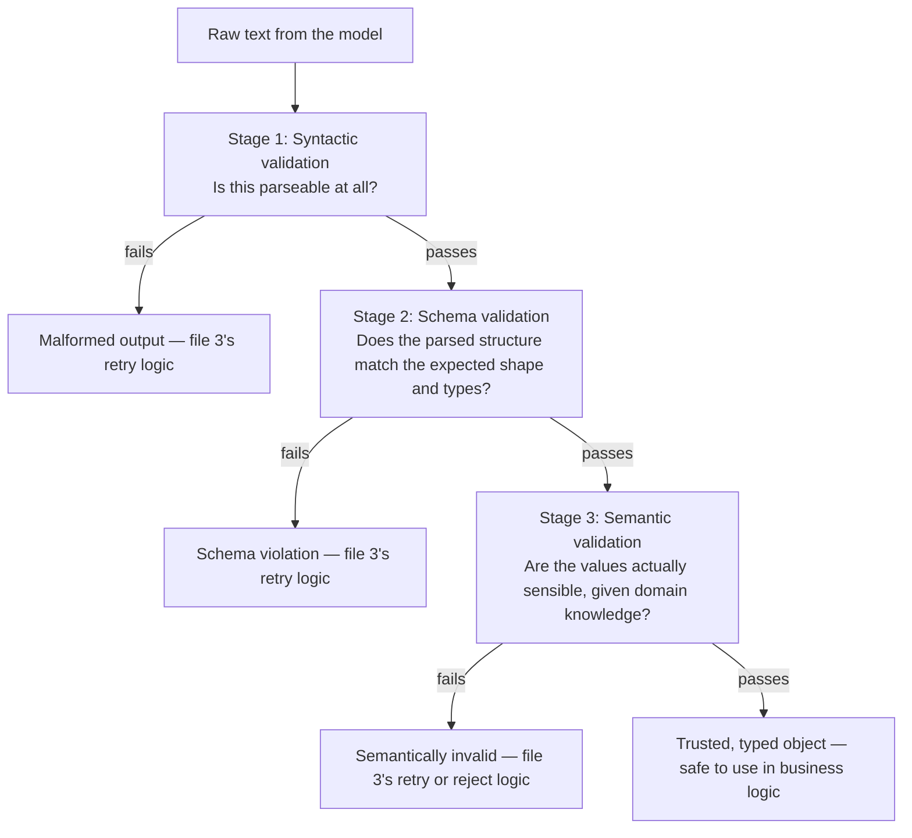

# Output Parsers and Validators

## Why this exists

The previous file showed you how to design a schema that reduces malformed output. This file is about what happens after generation, regardless of how good your schema design was: the actual Java code that takes raw text or JSON from the model and turns it into a typed object your business logic can trust — and, critically, the multi-stage validation that has to happen before you trust it. This is genuinely one of the highest-leverage pieces of engineering in this entire handbook, because nearly every agent failure that reaches a user, traced back far enough, turns out to be a decision point that skipped one of these stages.

## Why one big try/catch around `ObjectMapper.readValue` is not enough

The instinctively simplest approach is to wrap deserialization in a try/catch and treat any exception as "parsing failed":

```java
try {
    ExtractedInvoice invoice = mapper.readValue(rawResponseText, ExtractedInvoice.class);
    processInvoice(invoice); // proceeds with whatever came out, unconditionally
} catch (JsonProcessingException e) {
    handleFailure(e);
}
```

This catches one specific failure mode — syntactically invalid JSON — and nothing else. It does not catch: a `totalAmount` of `-4500.00` that deserialized perfectly cleanly but is semantically nonsensical for an invoice; a `paymentStatus` string that happened to deserialize into a valid enum constant but doesn't actually match what the source text said; or a response that's valid JSON matching a *different*, unrelated shape entirely (the model producing a plausible-looking but wrong object because your prompt was ambiguous about which of two extraction tasks it should perform). Treating "deserialization didn't throw" as "this output is trustworthy" is the single most common reliability gap in agent implementations, and it's exactly the gap this file's three-stage pipeline closes.

## The three distinct validation stages, and why each is genuinely separate



Each stage catches a genuinely different class of failure, and conflating them into one check loses the specific diagnostic information you need to decide what to do next (file 3) — a syntactic failure usually warrants a straightforward retry; a semantic failure might warrant a very different response, such as flagging the item for human review rather than blindly retrying the same extraction again.

### Stage 1: syntactic validation

Is the raw text even parseable as JSON at all, independent of whether it matches your expected shape? This is the narrowest possible check, deliberately kept separate from schema validation so you can distinguish "the model didn't produce JSON at all" (often caused by the model wrapping the JSON in explanatory prose despite instructions not to) from "the model produced valid JSON that just doesn't match what I expected":

```java
public class SyntacticValidator {

    private final ObjectMapper mapper = new ObjectMapper();

    public SyntacticValidationResult validate(String rawText) {
        String candidateJson = extractJsonCandidate(rawText); // strips prose wrapping, if present
        try {
            JsonNode node = mapper.readTree(candidateJson);
            return SyntacticValidationResult.valid(node);
        } catch (JsonProcessingException e) {
            return SyntacticValidationResult.invalid(
                "Response is not valid JSON: " + e.getOriginalMessage()
            );
        }
    }

    private String extractJsonCandidate(String rawText) {
        // A model that ignores "respond with only JSON" instructions often wraps output
        // in prose or markdown code fences — a defensive extraction step, not a workaround
        // for anything this phase's schema-constrained generation (file 1, Phase 02 file 6)
        // should be relied upon to always prevent on its own.
        int start = rawText.indexOf('{');
        int end = rawText.lastIndexOf('}');
        if (start == -1 || end == -1 || end < start) {
            return rawText; // let the parser fail with a clear error rather than guessing further
        }
        return rawText.substring(start, end + 1);
    }
}
```

### Stage 2: schema validation

Given syntactically valid JSON, does its *structure* match what you expect — correct field names, correct types, all required fields present? This is a distinct check from simply deserializing into a Java object, because Jackson's default behavior can be surprisingly permissive (silently coercing types, defaulting missing primitive fields to zero rather than failing) in ways that mask a real problem:

```java
public class SchemaValidator {

    private final ObjectMapper strictMapper;

    public SchemaValidator() {
        this.strictMapper = new ObjectMapper()
            .configure(DeserializationFeature.FAIL_ON_NULL_FOR_PRIMITIVES, true)
            .configure(DeserializationFeature.FAIL_ON_MISSING_CREATOR_PROPERTIES, true);
    }

    public SchemaValidationResult<ExtractedInvoice> validate(JsonNode node) {
        try {
            ExtractedInvoice invoice = strictMapper.treeToValue(node, ExtractedInvoice.class);
            return SchemaValidationResult.valid(invoice);
        } catch (JsonProcessingException e) {
            return SchemaValidationResult.invalid(
                "Response does not match expected invoice structure: " + e.getOriginalMessage()
            );
        }
    }
}
```

Notice the deliberate configuration choices — `FAIL_ON_NULL_FOR_PRIMITIVES` and `FAIL_ON_MISSING_CREATOR_PROPERTIES` turn Jackson's normally lenient defaults into strict ones. A primitive `double totalAmount` field silently defaulting to `0.0` when the model omitted it entirely is a genuinely dangerous silent failure for a financial extraction task — you want that to throw, loudly, rather than quietly proceeding with a fabricated zero that looks like a legitimate value downstream.

### Stage 3: semantic validation

This is the stage most implementations skip entirely, and it's where domain knowledge — the kind no generic JSON Schema validator can express — belongs:

```java
public class InvoiceSemanticValidator {

    public List<String> validate(ExtractedInvoice invoice) {
        List<String> violations = new ArrayList<>();

        if (invoice.totalAmount() <= 0) {
            violations.add("Total amount must be positive, got: " + invoice.totalAmount());
        }

        double lineItemSum = invoice.lineItems().stream()
            .mapToDouble(item -> item.quantity() * item.unitPrice())
            .sum();
        if (Math.abs(lineItemSum - invoice.totalAmount()) > 0.01) {
            violations.add(
                "Line items sum to " + lineItemSum +
                " but total_amount is " + invoice.totalAmount() + " — likely extraction error"
            );
        }

        if (invoice.vendorName() == null || invoice.vendorName().isBlank()) {
            violations.add("Vendor name is blank — likely missed during extraction");
        }

        return violations;
    }
}
```

This is precisely where you catch the failure mode Phase 01's hallucination discussion warned about: a `totalAmount` field that's perfectly well-typed, schema-conformant, and simply wrong, because it doesn't reconcile with the line items also extracted from the same document. A schema validator has no way to know that line items should sum to the total — that's domain knowledge you have to encode explicitly, and it's frequently the single highest-value check in the entire pipeline, since it catches the exact class of "succeeded but wrong" failure Phase 00 first warned you about.

## Assembling the full pipeline

```java
public class InvoiceExtractionPipeline {

    private final SyntacticValidator syntactic = new SyntacticValidator();
    private final SchemaValidator schema = new SchemaValidator();
    private final InvoiceSemanticValidator semantic = new InvoiceSemanticValidator();

    public PipelineResult process(String rawModelOutput) {
        var syntacticResult = syntactic.validate(rawModelOutput);
        if (!syntacticResult.isValid()) {
            return PipelineResult.failedAt("SYNTACTIC", syntacticResult.error());
        }

        var schemaResult = schema.validate(syntacticResult.node());
        if (!schemaResult.isValid()) {
            return PipelineResult.failedAt("SCHEMA", schemaResult.error());
        }

        List<String> semanticViolations = semantic.validate(schemaResult.value());
        if (!semanticViolations.isEmpty()) {
            return PipelineResult.failedAt("SEMANTIC", String.join("; ", semanticViolations));
        }

        return PipelineResult.success(schemaResult.value());
    }
}
```

Notice each stage's failure carries a labeled category (`SYNTACTIC`, `SCHEMA`, `SEMANTIC`) — this is exactly the information the next file's retry logic needs to decide *how* to respond, since the right recovery action genuinely differs by category, as the next file covers in depth.

## Trade-offs and when this matters most

- For low-stakes, exploratory extraction where a human will review the result anyway, running only syntactic and schema validation is often a reasonable scope reduction — semantic validation is the most domain-specific and effort-intensive stage to build well.
- For anything financial, anything feeding an automated downstream action (Phase 05's tool execution, Phase 07's agent decisions), semantic validation is not optional polish — it's frequently the only layer capable of catching a confidently-wrong, perfectly-well-formed answer before it causes a real consequence.
- Don't skip stage separation even when you're tempted to combine syntactic and schema validation into one Jackson call for brevity — losing the distinction between "not JSON at all" and "JSON but wrong shape" costs you diagnostic precision you'll want the moment you need to debug a production failure pattern.

## Why this matters next

You now have a pipeline that reliably tells you *whether* output is trustworthy, and *at which stage* it failed if not. The next file is the other half of the story: what your code actually does with that failure signal — when to retry, how to retry differently than a simple repeat, and when retrying at all is the wrong response.