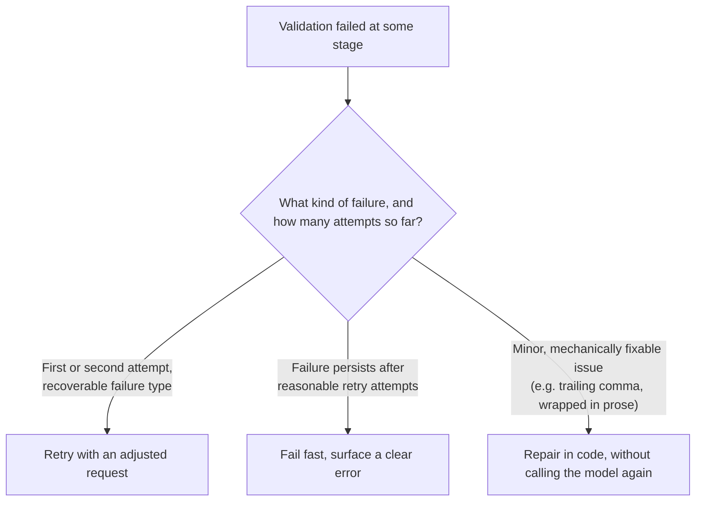

# Retry on Malformed Output

## Why this exists

The previous file gave you a pipeline that classifies a failure by stage — syntactic, schema, or semantic. This file is about the actual decision that classification feeds into: what should your code *do* when validation fails? This is a genuinely different problem from Phase 02, file 9's HTTP-level retry logic, and conflating the two is a common mistake. Phase 02's retries handled the transport layer — a `429`, a dropped connection, a `529` — where the request itself was fine and the *call* failed. This file handles the case where the call *succeeded* at the HTTP level and the *content* is the problem, which needs a materially different response: retrying the identical request is often pointless, because an identical prompt at a similar temperature can plausibly produce the same kind of malformed output again.

## The three possible responses, and when each is correct



**Repair without retrying** is the cheapest and fastest option, and it's appropriate only for failures that are clearly a formatting artifact rather than a genuine content problem — a JSON object wrapped in markdown code fences or explanatory prose despite instructions not to include either, for instance, where the actual data payload is intact and correct.

**Retry with an adjusted request** is appropriate when the failure suggests the model's *generation*, not just its formatting, went wrong — a missing required field, a value that fails semantic validation — and where you have a genuine adjustment to make that's likely to change the outcome, not just an identical repeat.

**Fail fast** is appropriate once you've exhausted a reasonable retry budget, or immediately for failure types unlikely to be fixed by retrying at all — this mirrors Phase 02, file 9's non-retryable-4xx logic directly: don't keep trying an approach that has no realistic path to success.

## Why "just retry the identical request" is usually the wrong first move

Recall Phase 01, file 4: even at low temperature, generation still samples from a probability distribution, and it's entirely possible for the same class of error to recur on an identical retry, especially if the underlying cause is a genuinely ambiguous or hard case in the source material rather than one unlucky sampling draw. A more effective retry **changes something about the request** in response to the specific failure, rather than blindly resending the same one:

```java
public class RetryingExtractionClient {

    private final LlmClient llmClient;
    private final InvoiceExtractionPipeline pipeline;
    private final int maxAttempts;

    public RetryingExtractionClient(LlmClient llmClient, InvoiceExtractionPipeline pipeline, int maxAttempts) {
        this.llmClient = llmClient;
        this.pipeline = pipeline;
        this.maxAttempts = maxAttempts;
    }

    public PipelineResult extractWithRetry(String sourceText) throws Exception {
        String basePrompt = buildExtractionPrompt(sourceText);
        String currentPrompt = basePrompt;
        PipelineResult lastResult = null;

        for (int attempt = 1; attempt <= maxAttempts; attempt++) {
            ChatRequest request = new ChatRequest(
                "some-model-name", 1024, 0.0, null,
                List.of(new Message("user", currentPrompt))
            );
            ChatResponse response = llmClient.send(request);
            String rawOutput = response.content().get(0).text();

            lastResult = pipeline.process(rawOutput);
            if (lastResult.isSuccess()) {
                return lastResult;
            }

            currentPrompt = buildCorrectivePrompt(basePrompt, rawOutput, lastResult);
        }

        return lastResult; // caller inspects failure category and decides how to surface it
    }

    private String buildCorrectivePrompt(String basePrompt, String priorRawOutput, PipelineResult failure) {
        return basePrompt + "\n\n" + """
            Your previous response had a problem: %s
            Your previous response was:
            %s

            Please correct this specific issue and respond again with only the corrected JSON.
            """.formatted(failure.errorMessage(), priorRawOutput);
    }
}
```

The key design choice here is `buildCorrectivePrompt`: instead of resending `basePrompt` unchanged, the retry explicitly tells the model *what specifically went wrong* and shows it the previous attempt — giving it genuinely new information to correct against, rather than asking it to guess what might be different this time. This is directly analogous to how you'd handle a validation failure with a human collaborator: you don't just repeat the original request verbatim and hope for a different result, you point out the specific problem.

## Different failure categories warrant different corrective strategies

- **Syntactic failures** (the model wrapped JSON in prose) — the corrective prompt should explicitly restate the "respond with only JSON, no other text" instruction, since this usually indicates the instruction wasn't weighted strongly enough the first time.
- **Schema failures** (a required field was missing or mistyped) — the corrective prompt should name the exact missing or malformed field, giving the model a precise, narrow target to fix rather than a vague "something was wrong."
- **Semantic failures** (line items don't sum to the stated total) — the corrective prompt should state the specific inconsistency detected, since this is often the case where re-reading the source material more carefully, prompted by a concrete discrepancy, genuinely helps: "the line items you extracted sum to $340.00 but you reported a total of $430.00 — please re-check the source text and correct whichever value was extracted incorrectly."

## The retry-loop trap: capping attempts, and what to do when you hit the cap

A retry loop without a hard cap is a real production risk — Phase 01's cost mechanics apply directly here, since every retry is a full additional generation call, and a persistently malformed case (a genuinely ambiguous or malformed source document, for instance) can otherwise consume unbounded cost and latency chasing a fix that was never going to succeed. The `maxAttempts` bound in the code above is not a minor implementation detail — it's the primary safeguard against exactly this failure mode.

When the cap is reached without success, the correct response depends on the stakes of the task: for a fully automated pipeline, this usually means routing the item to a human-review queue rather than either silently using the last (invalid) result or blocking the entire pipeline indefinitely. This is a direct, smaller-scale preview of the human-in-the-loop pattern from Phase 05, file 4 — applied here not to a consequential *action* awaiting approval, but to an extraction result that couldn't be validated with enough confidence to trust automatically.

```java
public void processInvoiceBatch(List<String> sourceTexts) throws Exception {
    for (String sourceText : sourceTexts) {
        PipelineResult result = retryingClient.extractWithRetry(sourceText);
        if (result.isSuccess()) {
            downstreamProcessor.process(result.value());
        } else {
            humanReviewQueue.enqueue(sourceText, result.errorMessage(), result.failureStage());
        }
    }
}
```

## Trade-offs and when this matters most

- For a low-volume, interactive use case where a human is present in the conversation anyway, a smaller retry budget (one or two attempts) followed by simply surfacing the raw failure to the user for their own judgment is often sufficient — you don't need an automated review queue for a case a human is already watching.
- For a fully automated batch pipeline (this phase's project), a bounded retry budget followed by a human-review queue is close to mandatory — silently accepting a failed extraction's last attempt, or blocking the entire batch on one bad item, are both worse outcomes than routing that one item aside for review.
- Don't set the retry budget arbitrarily high "just to be safe" — beyond two or three corrective attempts, a persistent failure is usually a sign of a genuinely hard or ambiguous case that more identical-shaped retries won't resolve, and the cost of continuing to try (Phase 01) rarely justifies the marginal chance of eventual success.

## Why this matters next

You now have the complete reliability discipline for this phase: schemas designed to minimize malformed output in the first place, a three-stage validation pipeline that classifies exactly what went wrong when it does, and a retry strategy that responds to each failure category deliberately rather than blindly repeating. The final project asks you to build all of this against real, messy invoice text — including a deliberately constructed set of edge cases designed to exercise every stage of this pipeline, not just the happy path.