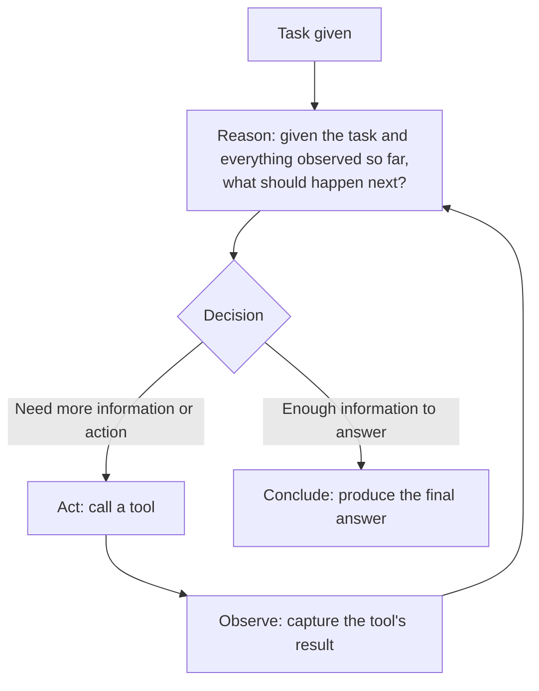
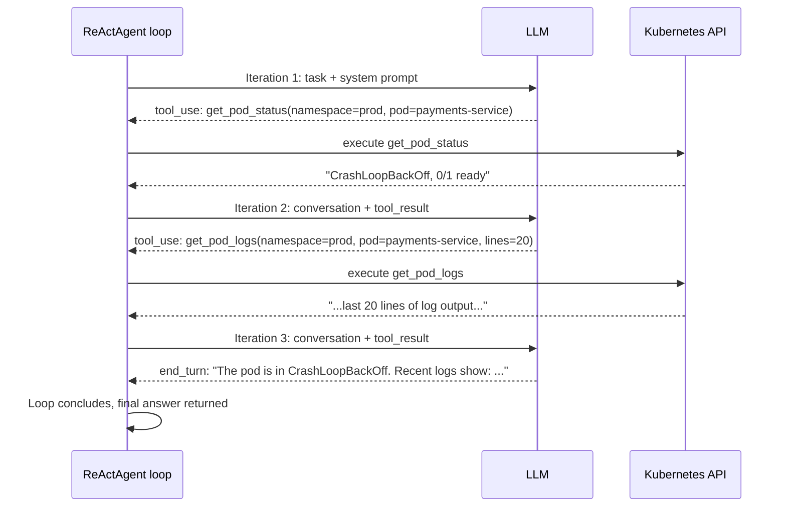

# The ReAct Pattern, From Scratch

## Why this exists

Every capability from Phases 02 through 06 has, so far, been demonstrated as either a single request/response exchange or a bounded, known sequence (Phase 05's tool-call round trip: request, tool call, execute, follow-up). ReAct — short for **Reason + Act** — is the pattern that turns a bounded, known sequence into an open-ended loop: the model reasons about what to do, takes an action, observes the result, and then reasons again about *that* result, deciding whether to act further or conclude. This is the foundational pattern underneath essentially every "agent" framework you'll encounter, including LangChain4j's and Spring AI's tool-calling agent abstractions in Phase 08 — understanding it by hand here is what makes those abstractions transparent rather than magical later.

## The core loop, conceptually



The crucial thing to notice, and the reason this is called ReAct rather than just "tool calling": the model doesn't decide its entire sequence of actions upfront. Each new decision is made *after* seeing the result of the previous one, exactly the way a human debugging a production issue doesn't plan every diagnostic step in advance — they check one thing, see what it reveals, and let that inform what to check next. This adaptive, one-step-at-a-time structure is what lets an agent handle situations it couldn't have fully anticipated at the start (a tool call revealing something unexpected that changes what's actually needed next), at the cost of the loop's length and final path being genuinely unpredictable in advance — a direct, structural consequence you have to engineer around, covered in file 4's termination and budget discussion.

## Why this is really just Phase 05's tool round trip, repeated with a decision point added

If you've internalized Phase 05, file 2's explanation of how a model decides to call a tool — that it's the same autoregressive generation process from Phase 01, just producing a `tool_use` block as one possible continuation among others — ReAct requires almost no new mechanical concept. It's the *same* decision, made repeatedly: after each `tool_result` is fed back into the conversation (exactly per Phase 02, file 5's wire protocol), the model is asked, implicitly, the same question again — "given everything you now know, what's the next appropriate continuation: another tool call, or a final answer?" ReAct isn't a different protocol. It's the existing protocol, wrapped in a loop that keeps calling until the model's response is a final answer instead of another tool request.

## A minimal, hand-built ReAct loop in Java

This uses the `LlmClient`, `Message`, and tool-execution pieces already built in Phases 02 and 05 — nothing new is introduced at the protocol level, only the looping control flow:

```java
public class ReActAgent {

    private final LlmClient llmClient;
    private final Map<String, ToolExecutor> tools;
    private final int maxIterations;

    public ReActAgent(LlmClient llmClient, Map<String, ToolExecutor> tools, int maxIterations) {
        this.llmClient = llmClient;
        this.tools = tools;
        this.maxIterations = maxIterations;
    }

    public String run(String task) throws Exception {
        List<Message> conversation = new ArrayList<>();
        conversation.add(new Message("user", task));

        for (int iteration = 1; iteration <= maxIterations; iteration++) {
            ChatRequest request = new ChatRequest(
                "some-model-name", 1024, 0.2, systemPromptForAgent(), conversation
            );
            ChatResponse response = llmClient.send(request);

            if ("tool_use".equals(response.stopReason())) {
                ContentBlock toolUseBlock = findToolUseBlock(response);
                conversation.add(assistantMessageFrom(response));

                String toolResult = executeTool(toolUseBlock); // Phase 05's validation happens inside here
                conversation.add(toolResultMessage(toolUseBlock, toolResult));
                // Loop continues — the model will reason over this new observation next iteration
            } else {
                // stop_reason is "end_turn" — the model has produced a final answer
                return response.content().get(0).text();
            }
        }

        throw new AgentIterationLimitExceededException(
            "Agent did not conclude within " + maxIterations + " iterations"
        );
    }

    private String executeTool(ContentBlock toolUseBlock) {
        ToolExecutor executor = tools.get(toolUseBlock.name());
        if (executor == null) {
            return "Error: unknown tool " + toolUseBlock.name();
        }
        return executor.execute(toolUseBlock.input()); // Phase 05's validation/sandboxing lives inside ToolExecutor
    }
}
```

Notice `maxIterations` and the exception thrown when it's exceeded — this is not a minor defensive add-on, it's the single most important safeguard in this entire file, and it's discussed in depth in file 4. Without it, a loop that never produces a final answer (because the model keeps deciding another tool call is warranted, correctly or not) would run indefinitely, calling the API — and therefore incurring cost, per Phase 01 — without bound.

## Tracing through a concrete example

Task: *"What's the current status of the payments-service pod in prod, and if it's not healthy, what were the last 20 log lines?"*



Notice the model's second tool call — `get_pod_logs` — was never explicitly requested in the original task in isolation; it was a decision the model made *because* the first tool's result revealed the pod wasn't healthy, triggering the task's conditional "if it's not healthy" clause. This is exactly the adaptive behavior ReAct's iterative structure enables, and exactly what a single, non-looping tool-call round trip (Phase 05's original example) could not have produced on its own — that example assumed one tool call would be sufficient, and many real tasks simply aren't shaped that way.

## The system prompt's role in a ReAct loop

Unlike a single-turn request, an agent's system prompt needs to establish *behavioral* expectations that shape how it reasons across iterations, not just a persona:

```java
private String systemPromptForAgent() {
    return """
        You are a diagnostic assistant with access to tools for checking Kubernetes pod status and logs.
        Use tools as needed to gather information before answering.
        Do not guess at information you could verify with an available tool.
        Once you have enough information to fully answer the user's question, respond directly without calling further tools.
        If a tool call fails or returns an error, consider whether a different tool or argument would help, rather than repeating the identical failed call.
        """;
}
```

The last line is worth calling attention to specifically: without an explicit instruction against it, it's a real, observed failure mode for a model to retry an identical failed tool call rather than adapting its approach — a direct consequence of the fact that, mechanically (Phase 05, file 2), each decision is generated fresh each iteration, with no inherent, hardcoded logic preventing the same "plausible next action" from being sampled again if the context hasn't meaningfully changed to discourage it.

## Trade-offs and when this matters most

- ReAct is well-suited to tasks whose full path can't be known in advance — troubleshooting, multi-hop research, anything where one action's result genuinely determines what to try next.
- ReAct is *not* the right pattern for tasks where the full sequence of steps is already well-known and fixed in advance — for those, the next file's plan-and-execute pattern is usually more efficient and more predictable, since committing to a known sequence upfront avoids the overhead of re-reasoning from scratch at every single step when there was nothing genuinely uncertain about what came next.
- Don't build a ReAct loop for a task that's really just Phase 05's single tool-call round trip in disguise — if you already know, deterministically, that exactly one tool call will always be needed, the added complexity of a full iterative loop (and its termination-condition engineering, file 4) isn't buying you anything.

## Why this matters next

You now have the foundational reasoning pattern and a working, minimal implementation. The next file covers a structurally different approach — planning the full sequence of steps upfront rather than deciding one step at a time — and the specific kinds of tasks where that structure is the better engineering choice.