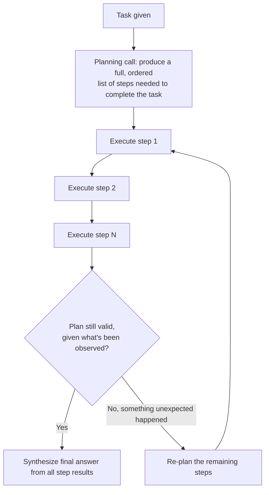

# The Plan-and-Execute Pattern

## Why this exists

ReAct's core strength — deciding one step at a time, adapting as new information arrives — is also its core cost: every single step requires a full reasoning call, and the model has no visibility into where the task is ultimately heading beyond the immediate next action. For tasks where the overall shape of the solution is actually knowable in advance, this step-by-step approach is doing more work than necessary, and can even produce worse results, since the model is optimizing locally (what's the best next single action) rather than globally (what's the best overall sequence). Plan-and-execute is the alternative structure: have the model commit to a multi-step plan upfront, then execute that plan, rather than re-deciding from scratch after every single observation.

## The core loop, conceptually



Notice the "still valid?" check and the re-planning branch — a rigid plan-and-execute implementation that never revisits its plan is brittle in exactly the way ReAct's step-by-step adaptivity isn't; a robust plan-and-execute agent needs at least a lightweight version of ReAct's "observe and reconsider" instinct built back in for the case where an early step reveals the original plan was based on a wrong assumption. This is worth sitting with: plan-and-execute and ReAct are not opposites competing for the same job — they're different starting postures on the same reasoning spectrum, and a mature implementation of either often borrows from the other.

## A hand-built implementation

```java
public record PlanStep(String description, String toolName, Map<String, Object> toolArgs) {}

public class PlanAndExecuteAgent {

    private final LlmClient llmClient;
    private final Map<String, ToolExecutor> tools;
    private final ObjectMapper mapper = new ObjectMapper();

    public PlanAndExecuteAgent(LlmClient llmClient, Map<String, ToolExecutor> tools) {
        this.llmClient = llmClient;
        this.tools = tools;
    }

    public String run(String task) throws Exception {
        List<PlanStep> plan = generatePlan(task);
        List<String> stepResults = new ArrayList<>();

        for (int i = 0; i < plan.size(); i++) {
            PlanStep step = plan.get(i);
            String result = executeStep(step);
            stepResults.add(result);

            if (resultSuggestsReplanning(result)) {
                List<PlanStep> remainingSteps = generatePlan(
                    task, plan.subList(0, i + 1), stepResults
                );
                plan = mergePlans(plan.subList(0, i + 1), remainingSteps);
            }
        }

        return synthesizeFinalAnswer(task, plan, stepResults);
    }

    private List<PlanStep> generatePlan(String task) throws Exception {
        return generatePlan(task, List.of(), List.of());
    }

    private List<PlanStep> generatePlan(
        String task, List<PlanStep> completedSteps, List<String> completedResults
    ) throws Exception {
        String planningPrompt = """
            Task: %s

            %s

            Produce a JSON array of remaining steps needed to complete this task.
            Each step must specify: a short description, the tool to call, and its arguments.
            Only include steps that are genuinely necessary — do not pad the plan with extra steps.
            """.formatted(task, formatCompletedContext(completedSteps, completedResults));

        ChatRequest request = new ChatRequest(
            "some-model-name", 1024, 0.2, null,
            List.of(new Message("user", planningPrompt))
        );
        String rawPlan = llmClient.send(request).content().get(0).text();
        return mapper.readValue(rawPlan, new TypeReference<List<PlanStep>>() {});
        // In a real implementation, this deserialization goes through Phase 06's full validation pipeline —
        // a plan is structured output like any other, and deserves the same reliability discipline.
    }

    private String executeStep(PlanStep step) {
        ToolExecutor executor = tools.get(step.toolName());
        return executor.execute(step.toolArgs()); // Phase 05's validation/sandboxing applies identically here
    }

    private boolean resultSuggestsReplanning(String result) {
        // A simple heuristic: an error or an unexpected/empty result signals the original
        // plan's assumption about this step may no longer hold.
        return result.toLowerCase().contains("error") || result.isBlank();
    }
}
```

Notice the planning step itself is structured output (a JSON array of steps) — meaning it's subject to exactly the reliability discipline from Phase 06: the raw plan the model produces needs syntactic, schema, and arguably semantic validation (does the plan actually address the stated task, are the referenced tools real) before you trust it enough to start executing steps against real systems. It would be a mistake to treat a "plan" as inherently safer or more reliable simply because it was produced in one upfront call rather than iteratively — it's still generated, probabilistic output, and Phase 01's hallucination risk applies to a fabricated or nonsensical plan step exactly as it would to any other generated content.

## When plan-and-execute genuinely outperforms ReAct

**Predictable, well-understood task shapes.** "Gather this quarter's sales figures from three specific systems, then compute the percentage change from last quarter, then draft a summary" has a knowable shape — the steps aren't contingent on surprising discoveries along the way. Committing to the plan upfront lets the model reason about the *whole* task's structure at once, rather than losing that broader view by only ever considering "what's the single best next step."

**Steps that can be parallelized.** If step 2 and step 3 don't depend on each other's results, a known plan lets your code execute them concurrently — something ReAct's strictly sequential reason-act-observe cycle can't naturally express, since each step's execution in ReAct is gated behind the previous step's observation being fed back into the next reasoning call.

**Cost and latency predictability.** A plan with a known step count gives you a much better upfront cost and latency estimate (Phase 01) than an open-ended ReAct loop whose iteration count is fundamentally unknown until it finishes — useful when you need to budget or set expectations before starting.

## When ReAct genuinely outperforms plan-and-execute

**Highly uncertain or exploratory tasks**, where an early step's result plausibly redirects the entire remaining approach in ways a static plan can't anticipate — troubleshooting an unknown production issue is the clearest example, since the very point of the investigation is that you don't yet know what you'll find.

**Tasks where over-committing to a plan is actively harmful** — a rigid, upfront plan pursued past the point where its assumptions have clearly broken down (without a genuinely responsive re-planning mechanism, which adds back real complexity) can waste more effort than ReAct's natively adaptive structure would have.

## Trade-offs and when this matters most

- Plan-and-execute without any re-planning capability is brittle and should be treated as an incomplete implementation for any task where step outcomes are even moderately uncertain — the re-planning branch in the diagram above is not optional polish for real-world use.
- The planning step itself is an additional, real cost (Phase 01) on top of every subsequent step's own cost — for very short, simple tasks, this upfront planning overhead can exceed what a two- or three-iteration ReAct loop would have cost outright.
- Don't choose a pattern based on general preference — choose based on whether the task's shape is genuinely knowable in advance (favors plan-and-execute) or genuinely contingent on what earlier steps reveal (favors ReAct), and be honest with yourself about which category a given real task actually falls into, since it's tempting to over-plan tasks that are actually more exploratory than they first appear.

## Why this matters next

Both patterns covered so far assume each step's result is used as-is once produced. The next file adds a distinct capability on top of either pattern: having the agent evaluate and critique its own intermediate output before proceeding, catching a specific class of error neither ReAct's nor plan-and-execute's basic structure addresses on its own.