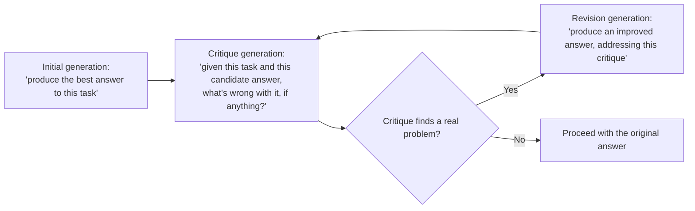
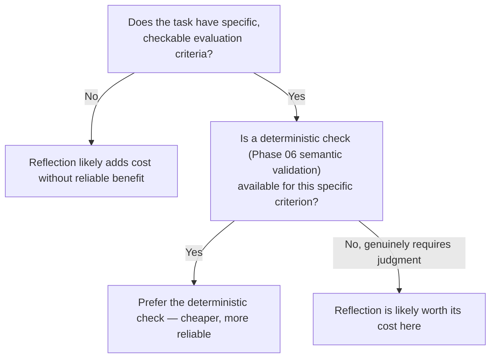

# Reflection and Self-Critique Loops

## Why this exists

Both patterns covered so far — ReAct and plan-and-execute — treat each step's output as final once produced: a tool result is observed and moved past, a plan step's output feeds directly into the next decision. Neither pattern, on its own, asks the model to pause and evaluate whether its own intermediate reasoning or output is actually good before proceeding. Reflection (sometimes called self-critique) is the addition of exactly that pause: a distinct step where the model reviews its own prior output against the task's actual requirements, and either proceeds or revises. This is not a new agent architecture competing with ReAct or plan-and-execute — it's a layer that can be added on top of either.

## The mechanism, and why it can genuinely help

It's worth being precise about why this works at all, tying back to Phase 01's generation mechanics, rather than treating it as a vague "let the AI double-check itself" folk technique. A model producing an initial answer is generating the most plausible continuation given the task and context so far (Phase 01, file 4) — and that generation process has no inherent step where it re-examines its own output against the original requirements once produced. A **separate** call, explicitly prompted to critique a specific piece of prior output against specific criteria, is a genuinely different generation context: the model is no longer trying to produce the answer, it's evaluating one, which is a different task with different failure modes, and — critically — it can catch errors the *original* generation had no structural opportunity to catch, since nothing in ordinary generation asks the model to step back and re-examine what it just produced before it's used.



This is a real, distinct generation call, with all of Phase 01's cost implications — reflection is not free introspection, it's an additional round trip, and the loop in the diagram (critique, revise, critique again) needs the same bounded-iteration discipline as ReAct's main loop, covered fully in the next file.

## A hand-built implementation

```java
public record CritiqueResult(boolean hasIssues, String critique) {}

public class ReflectiveAgent {

    private final LlmClient llmClient;
    private final int maxRevisions;

    public ReflectiveAgent(LlmClient llmClient, int maxRevisions) {
        this.llmClient = llmClient;
        this.maxRevisions = maxRevisions;
    }

    public String produceWithReflection(String task, String evaluationCriteria) throws Exception {
        String candidate = generateInitial(task);

        for (int revision = 0; revision < maxRevisions; revision++) {
            CritiqueResult critique = critique(task, candidate, evaluationCriteria);
            if (!critique.hasIssues()) {
                return candidate;
            }
            candidate = revise(task, candidate, critique.critique());
        }

        return candidate; // returned even if the final critique still found issues — capped, not indefinite
    }

    private String generateInitial(String task) throws Exception {
        ChatRequest request = new ChatRequest(
            "some-model-name", 1024, 0.3, null,
            List.of(new Message("user", task))
        );
        return llmClient.send(request).content().get(0).text();
    }

    private CritiqueResult critique(String task, String candidate, String criteria) throws Exception {
        String critiquePrompt = """
            Original task: %s

            Evaluation criteria: %s

            Candidate answer:
            %s

            Critique this candidate strictly against the stated criteria only.
            If it fully satisfies the criteria, respond with exactly: NO_ISSUES
            Otherwise, describe specifically what is missing or incorrect.
            """.formatted(task, criteria, candidate);

        ChatRequest request = new ChatRequest(
            "some-model-name", 512, 0.0, null,
            List.of(new Message("user", critiquePrompt))
        );
        String result = llmClient.send(request).content().get(0).text().trim();

        return result.equals("NO_ISSUES")
            ? new CritiqueResult(false, null)
            : new CritiqueResult(true, result);
    }

    private String revise(String task, String candidate, String critiqueText) throws Exception {
        String revisionPrompt = """
            Original task: %s

            Previous candidate answer:
            %s

            Critique of that answer: %s

            Produce a revised answer that specifically addresses this critique.
            """.formatted(task, candidate, critiqueText);

        ChatRequest request = new ChatRequest(
            "some-model-name", 1024, 0.3, null,
            List.of(new Message("user", revisionPrompt))
        );
        return llmClient.send(request).content().get(0).text();
    }
}
```

Notice `critique` is explicitly instructed to evaluate against **stated criteria only**, not an open-ended "is this good." This is a deliberate, important constraint: an unconstrained critique prompt ("what's wrong with this?") tends to produce vague or manufactured criticism — a model asked to find fault will often find *something* to say even when the original answer was actually fine, precisely because "find something wrong" is itself a plausible-continuation-generating prompt (Phase 01, file 4) that can manufacture issues to satisfy the implied expectation of the question. Grounding the critique in specific, named criteria — the same discipline Phase 06's semantic validation applied to structured data — gives the critique step something concrete to check against rather than inventing concerns from nothing.

## Where reflection earns its cost, and where it doesn't

Reflection is a real, additional expense (potentially several extra calls per task, per Phase 01) for a benefit that isn't universal. It's worth being honest about exactly when that expense is justified:

**Genuinely worth it:** tasks with checkable, objective-ish criteria where an initial pass commonly misses something specific — a generated summary that's supposed to cover five required points and might have missed one; a piece of code that's supposed to handle a specific edge case; a structured extraction (Phase 06) where a self-critique pass checking "does this actually reconcile with the source" catches errors the original extraction call, focused purely on extracting, didn't have the framing to catch on its own.

**Usually not worth it:** open-ended creative tasks with no objective evaluation criteria to critique against (in which case the critique step degenerates into the vague, manufactured-criticism failure mode above); simple, low-stakes tasks where the cost of an occasional imperfect answer is lower than the guaranteed cost of an additional round of calls on every single task, regardless of whether that task needed it; and tasks already covered by Phase 06's structured validation, where a dedicated semantic-validation check (line items summing to the total, for instance) is a cheaper, more deterministic, and more reliable way to catch the exact same class of error than a general-purpose "critique this" prompt would be.



## Trade-offs and when this matters most

- Reflection compounds with whichever base pattern (ReAct or plan-and-execute) it's layered onto — a reflective ReAct loop can, in the worst case, multiply per-step cost by the number of critique/revise cycles on top of the reasoning iterations already happening, so the bounded-iteration discipline from the next file needs to account for both loops together, not just the outer one.
- Don't reach for reflection as a default quality-improvement technique applied uniformly — per the decision diagram above, it's most valuable exactly where a deterministic check (Phase 06) *isn't* available, and reaching for a general LLM-based critique when a specific, cheap, deterministic validation would catch the same error is strictly worse engineering.
- A critique step is itself generated, probabilistic output (Phase 01) — it can be wrong, can miss a real issue, or can manufacture a false one, exactly like any other model output; don't treat a "NO_ISSUES" result as a stronger guarantee of correctness than the validation disciplines from Phase 06 would provide for the same content.

## Why this matters next

You've now seen three distinct reasoning structures — ReAct, plan-and-execute, and reflection layered on top of either — each hand-built and understood mechanically rather than taken on faith. The next file assembles a complete, production-shaped agent loop combining whichever of these patterns fits the task, with every safeguard from this phase and the phases before it wired in together: termination conditions, iteration and cost budgets, and the full validation and tool-safety disciplines from Phases 05 and 06.