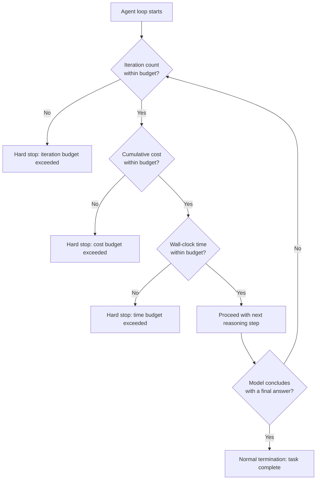

# Building an Agent Loop in Plain Java

## Why this exists

The previous three files each introduced one reasoning structure in relative isolation, with simplified implementations for clarity. This file assembles a complete, production-shaped agent loop — the kind you could actually deploy, not a teaching simplification — combining ReAct's iterative structure with every safeguard the earlier phases and files in this handbook have established: bounded iterations, bounded cost, memory management for the loop's own growing context, and the full tool validation and structured-output reliability disciplines. This is the single most consequential file in this phase, because nearly every real production incident involving an agent traces back to one of the safeguards built here being missing or misconfigured, not to the model's reasoning being poor.

## Why an unbounded loop is a real, not hypothetical, risk

Recall Phase 01's cost mechanics: every iteration of an agent loop is a full API call, with real token cost that compounds as the loop's own conversation history grows (Phase 04's memory-growth problem, now happening within a single task rather than across a human conversation). A loop with no hard cap on iterations, no cap on total cost, and no cap on wall-clock time is not a theoretical edge case — it's a system that will, with real and non-negligible probability given Phase 01's probabilistic generation, occasionally get stuck reasoning in circles (repeatedly deciding "one more tool call is needed" without ever reaching a state that satisfies its own termination condition) and consume unbounded API cost until something external stops it. Every one of the following budgets exists specifically to bound that risk, and none of them are optional in a system that will run without a human watching every single execution.



## The complete implementation

```java
public class ProductionAgentLoop {

    private final LlmClient llmClient;
    private final Map<String, ToolExecutor> tools;
    private final AgentBudget budget;
    private final MemoryManager memoryManager; // Phase 04's summarization/buffer strategy, applied to loop history

    public ProductionAgentLoop(
        LlmClient llmClient,
        Map<String, ToolExecutor> tools,
        AgentBudget budget,
        MemoryManager memoryManager
    ) {
        this.llmClient = llmClient;
        this.tools = tools;
        this.budget = budget;
        this.memoryManager = memoryManager;
    }

    public AgentResult run(String task) {
        AgentExecutionContext ctx = new AgentExecutionContext(task, Instant.now());
        ctx.addMessage(new Message("user", task));

        while (true) {
            BudgetCheckResult budgetCheck = budget.check(ctx);
            if (!budgetCheck.withinBudget()) {
                return AgentResult.haltedByBudget(budgetCheck.reason(), ctx.partialHistory());
            }

            ChatResponse response;
            try {
                ChatRequest request = new ChatRequest(
                    "some-model-name", 1024, 0.2,
                    systemPromptForAgent(), memoryManager.currentHistory(ctx)
                );
                response = llmClient.send(request); // Phase 02's resilient client — HTTP-level retries handled inside
            } catch (LlmApiException e) {
                return AgentResult.failed("LLM API call failed after retries: " + e.getMessage());
            }

            ctx.recordCallCost(response.usage()); // feeds the next iteration's budget check

            if ("tool_use".equals(response.stopReason())) {
                ContentBlock toolUseBlock = findToolUseBlock(response);
                ctx.addMessage(assistantMessageFrom(response));

                ToolExecutionOutcome outcome = executeToolSafely(toolUseBlock); // Phase 05's full validation stack
                ctx.addMessage(toolResultMessage(toolUseBlock, outcome.resultText()));
                ctx.recordToolCall(toolUseBlock.name(), outcome.succeeded());

            } else {
                String finalText = response.content().get(0).text();
                var validation = validateFinalOutput(finalText); // Phase 06's pipeline, applied to the concluding answer
                if (validation.isSuccess()) {
                    return AgentResult.success(finalText, ctx.summary());
                } else {
                    // Treat an invalid final answer as a recoverable case, not a silent pass-through —
                    // ask the model to correct it, bounded by the same overall budget check above.
                    ctx.addMessage(new Message(
                        "user",
                        "Your answer had an issue: " + validation.errorMessage() + ". Please correct it."
                    ));
                }
            }
        }
    }

    private ToolExecutionOutcome executeToolSafely(ContentBlock toolUseBlock) {
        ToolExecutor executor = tools.get(toolUseBlock.name());
        if (executor == null) {
            return ToolExecutionOutcome.failed("Unknown tool: " + toolUseBlock.name());
        }
        try {
            String validatedResult = executor.executeWithValidation(toolUseBlock.input());
            return ToolExecutionOutcome.succeeded(validatedResult);
        } catch (ToolValidationException | UnauthorizedToolCallException e) {
            return ToolExecutionOutcome.failed(e.getMessage()); // fed back as a tool_result error, per Phase 05 file 3
        }
    }
}
```

## The budget object, in detail

```java
public class AgentBudget {

    private final int maxIterations;
    private final double maxCostUsd;
    private final Duration maxWallClockTime;

    public AgentBudget(int maxIterations, double maxCostUsd, Duration maxWallClockTime) {
        this.maxIterations = maxIterations;
        this.maxCostUsd = maxCostUsd;
        this.maxWallClockTime = maxWallClockTime;
    }

    public BudgetCheckResult check(AgentExecutionContext ctx) {
        if (ctx.iterationCount() >= maxIterations) {
            return BudgetCheckResult.exceeded(
                "Iteration limit reached (" + maxIterations + ")"
            );
        }
        if (ctx.cumulativeCostUsd() >= maxCostUsd) {
            return BudgetCheckResult.exceeded(
                "Cost limit reached ($" + maxCostUsd + ")"
            );
        }
        if (Duration.between(ctx.startedAt(), Instant.now()).compareTo(maxWallClockTime) >= 0) {
            return BudgetCheckResult.exceeded(
                "Time limit reached (" + maxWallClockTime + ")"
            );
        }
        return BudgetCheckResult.withinBudget();
    }
}
```

Three genuinely distinct budget dimensions, each catching a different real failure pattern: **iteration count** catches a loop stuck in an unproductive reasoning cycle even if each individual call is cheap; **cumulative cost** catches a loop making expensive calls (large tool results being fed back in, ballooning context per Phase 01) even if the iteration count looks modest; **wall-clock time** catches a loop that's technically making progress but too slowly for the use case's actual latency requirements, independent of cost or iteration count. Relying on only one of these leaves a real gap — a loop could stay within a generous iteration budget while still blowing through a reasonable cost or time budget, if individual iterations are expensive or slow.

## Memory management within the loop itself

Recall Phase 04's central lesson: unbounded conversation growth is a cost and quality risk. An agent loop's own history — every reasoning step, every tool call and result — grows exactly the way a long human conversation does, often faster, since a single multi-step task can generate more content in a few minutes than a human conversation would in an hour. The `MemoryManager` referenced above applies Phase 04's exact strategies to this internal loop history:

```java
public class MemoryManager {

    private final int recentMessagesToKeepVerbatim;
    private final LlmClient summarizerClient;

    public List<Message> currentHistory(AgentExecutionContext ctx) {
        List<Message> allMessages = ctx.allMessages();
        if (allMessages.size() <= recentMessagesToKeepVerbatim) {
            return allMessages;
        }

        // Older tool results, in particular, are prime summarization candidates —
        // a full log dump from three iterations ago rarely needs to stay verbatim
        // once its key finding has already informed a subsequent decision.
        List<Message> toSummarize = allMessages.subList(0, allMessages.size() - recentMessagesToKeepVerbatim);
        List<Message> recent = allMessages.subList(allMessages.size() - recentMessagesToKeepVerbatim, allMessages.size());

        String summary = summarizeOlderSteps(toSummarize); // same technique as Phase 04, file 2's SummarizationMemory

        List<Message> managed = new ArrayList<>();
        managed.add(new Message("user", "Summary of earlier steps in this task: " + summary));
        managed.addAll(recent);
        return managed;
    }
}
```

## Trace-level observability — a preview of Phase 10, essential even here

Notice `ctx.summary()` and `ctx.recordToolCall(...)` in the loop above. Even before Phase 10 covers formal tracing and evaluation, a production agent loop needs to record, at minimum, every reasoning step, every tool call and its outcome, and every budget check — not as an afterthought, but as a structural part of the loop itself. Without this, a halted or misbehaving agent is nearly impossible to debug after the fact: you'd have no way to reconstruct why it stopped, which step went wrong, or how close it came to a budget limit before succeeding or failing.

## Trade-offs and when this matters most

- For a low-stakes, interactive prototype where a human is watching every step and can manually interrupt if something looks wrong, a simplified loop (like file 1's minimal `ReActAgent`) without full budget enforcement is a reasonable and appropriate simplification for that context.
- For anything running unattended, on a schedule, or serving production traffic without a human watching each execution, every budget dimension in this file is close to mandatory — the cost of implementing them is small and fixed; the cost of a single unbounded runaway loop in production can be large and unbounded in exactly the way Phase 01 warned you to model before committing to a design.
- Don't set iteration, cost, and time budgets arbitrarily generous "just in case" — a budget so loose it never actually triggers provides no real protection; budgets should be set based on the actual expected shape of legitimate tasks (how many steps a normal, successful run typically takes) with headroom, not an arbitrary large number chosen to avoid ever thinking about the question again.

## Why this matters next

You now have a complete, safeguarded, hand-built agent loop — the most substantial single artifact in this handbook so far, combining reasoning patterns, tool safety, structured-output reliability, and memory management into one coherent system with real operational guardrails. The final project in this phase asks you to put this loop to work on a genuinely open-ended task — a research agent — where the value of everything built in this phase becomes concretely visible rather than theoretical.