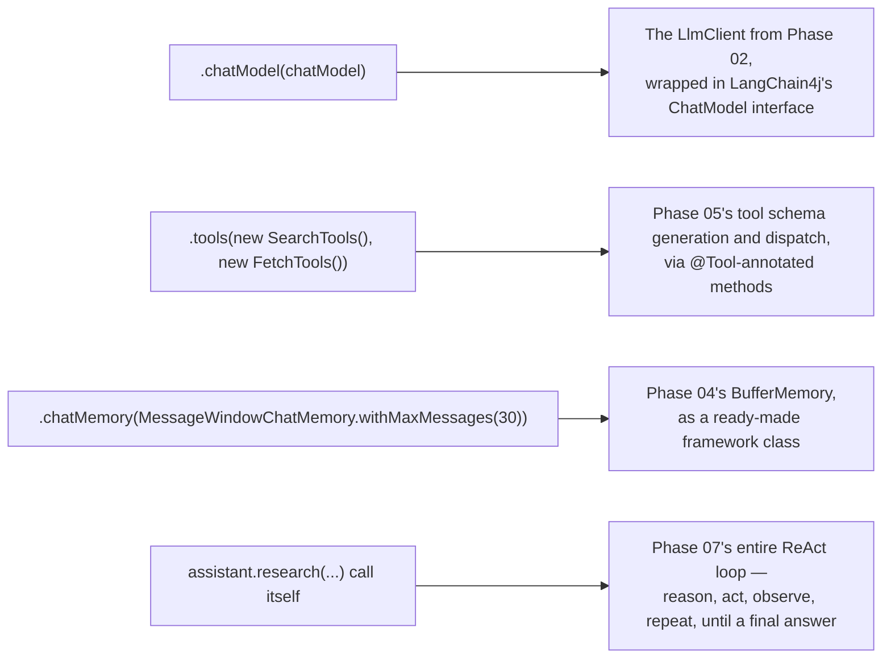

# LangChain4j's AiServices Abstraction

## Why this exists

Phase 07 ended with a complete, hand-built, budgeted agent loop — several hundred lines of Java implementing ReAct, tool dispatch, memory management, and structured-output validation, wired together explicitly. This file shows you `AiServices`, LangChain4j's high-level abstraction that collapses most of that into a declarative interface definition and a builder call. The goal here is not to learn a new concept — every mechanism `AiServices` uses, you've already built by hand. The goal is to develop the specific skill of reading a framework's convenience API and immediately translating it back into the mechanics you know are running underneath, so that when it behaves unexpectedly, you have somewhere concrete to look.

## The abstraction itself

```java
interface ResearchAssistant {
    String research(String question);
}

ResearchAssistant assistant = AiServices.builder(ResearchAssistant.class)
    .chatModel(chatModel)
    .tools(new SearchTools(), new FetchTools())
    .chatMemory(MessageWindowChatMemory.withMaxMessages(30))
    .build();

String answer = assistant.research("What caused the 2003 Northeast blackout, and what changed as a result?");
```

Four lines of configuration, and a plain Java interface with no implementation body at all — LangChain4j generates a dynamic proxy implementing `ResearchAssistant` at runtime, and calling `research(...)` on it triggers the entire agent loop internally. It's worth pausing on how much this compresses: Phase 07, file 4's `ProductionAgentLoop` was an explicit `while` loop with visible budget checks, tool dispatch, and memory management. This is that same loop, running, but with none of its internal structure visible to you at the call site.

## Mapping every line back to Phase 07's hand-built mechanics



**The `chatModel` you pass in** is functionally equivalent to the `LlmClient` you built in Phase 02 — it's the thing that actually sends requests and receives responses. LangChain4j's `ChatModel` interface abstracts over multiple providers (Phase 02, file 7's provider-difference discussion), but underneath, for whichever provider you've configured, it's making the same HTTP calls, with the same statelessness (Phase 02, file 2) and the same token-driven cost (Phase 01) as your hand-built client.

**The `.tools(...)` call** registers your `@Tool`-annotated methods (Phase 05, file 5), and `AiServices` handles exactly the dispatch loop you wrote by hand in Phase 07, file 1 — receiving a `tool_use` block, matching it to the correct method by name, deserializing its arguments, invoking the method, and constructing the `tool_result` message to feed back in. Every validation and sandboxing concern from Phase 05, file 3 still has to live *inside* your annotated tool methods; `AiServices` provides the dispatch machinery, not the safety layer around what's being dispatched to.

**The `.chatMemory(...)` call** is Phase 04's buffer strategy, provided as a ready-made class rather than something you write yourself — `MessageWindowChatMemory.withMaxMessages(30)` is functionally identical to the `BufferMemory` class from Phase 04, file 2, down to the same "oldest messages silently drop once the limit is exceeded" behavior, including that strategy's exact failure mode (a fact mentioned early in a long research task falling out of the window entirely, with no summarization fallback unless you build one yourself around this same memory object).

**The call to `research(...)` itself** is where the real compression happens — this single method call runs the entire loop from Phase 07, file 4: reasoning calls, tool dispatch, observation, repeated until the model produces a final answer. `AiServices` does not expose an equivalent to your `AgentBudget` class by default — there is no built-in iteration cap, cost cap, or wall-clock time cap unless you add one yourself.

## What this means concretely: the safeguards you have to add back

This last point deserves to be stated plainly, because it's the single most important thing this file has to teach: **`AiServices`, used exactly as shown above, has no iteration limit, no cost limit, and no time limit.** Phase 07, file 4 argued at length that these are not optional safeguards for anything running without a human watching every execution — and adopting `AiServices` does not remove that requirement, it just removes the code that was providing it, unless you explicitly reintroduce it:

```java
public class BudgetedResearchService {

    private final ResearchAssistant assistant;
    private final AgentBudget budget; // the exact class from Phase 07, file 4

    public String researchWithBudget(String question) {
        AgentExecutionContext ctx = new AgentExecutionContext(question, Instant.now());
        // AiServices does not expose per-iteration hooks by default, so a real production
        // deployment typically wraps the call with an overall timeout and a cost check
        // performed via usage tracking on the underlying ChatModel, or drops to LangChain4j's
        // lower-level ChatModel + tool dispatch APIs directly when this level of control is required.
        return withTimeout(budget.maxWallClockTime(), () -> assistant.research(question));
    }
}
```

This is a genuinely important limitation to internalize: `AiServices`'s high-level interface trades away exactly the fine-grained control Phase 07, file 4 built explicitly. For a prototype or a low-stakes internal tool, that trade is often worth it. For anything running unattended in production, this is precisely the situation where dropping to LangChain4j's lower-level APIs — or wrapping the high-level call in your own budget-and-timeout layer, as sketched above — is not optional polish, it's replacing a safeguard the convenience abstraction quietly removed.

## Where AiServices genuinely earns its convenience

None of the above should read as an argument against `AiServices` — it's an argument for using it with your eyes open. For the class of problems it fits well — an interface-driven agent with a bounded, well-scoped tool set, running in a context where either a human is present to notice runaway behavior or the task shape genuinely bounds itself (a fixed, small number of tools with no path to an infinite loop) — the four-line configuration above replaces genuinely substantial boilerplate, and the resulting code is far more legible to a new team member than the hand-rolled loop, precisely because so much of the mechanics is now standard, well-tested framework code rather than custom logic every engineer has to independently verify.

## Trade-offs and when this matters most

- For prototyping, internal tools, and any agent whose tool set is small and inherently bounded (few enough distinct tools that an infinite loop is structurally unlikely), `AiServices` as shown is a legitimate, efficient choice.
- For production systems processing untrusted input, running unattended, or with a tool set broad enough that a reasoning loop could plausibly get stuck, reintroduce Phase 07, file 4's budget disciplines explicitly — either by wrapping the high-level call or by dropping to LangChain4j's lower-level, more explicit APIs where iteration-level control is directly exposed.
- Don't assume any framework, this one included, has quietly reintroduced a safeguard you removed by using its convenience layer — verify what a builder call actually provides by checking its documentation and, where unclear, its behavior directly, the same diligence you'd apply to any third-party library making a claim about its own guarantees.

## Why this matters next

You've now seen how LangChain4j compresses Phase 07's hand-built loop into a declarative interface, and precisely which safeguard gets silently dropped in that compression. The next file covers Spring AI's equivalent — a genuinely different architectural approach, built around a chain of composable "advisors" — and asks the same mapping question: which of Phase 07's mechanics does each piece correspond to, and which, if any, do you have to reintroduce yourself.