# Spring AI's ChatClient and Advisors

## Why this exists

The previous file showed LangChain4j's approach to packaging Phase 07's agent loop: an interface, a builder, and a proxy that runs the loop internally, largely opaque at the call site. Spring AI takes a structurally different approach, built around a chain of composable **advisors** — interceptors that can inspect and modify a request before it's sent and a response after it's received. This is worth understanding as a genuinely distinct architectural idea, not just "Spring AI's version of the same thing" — the advisor pattern gives you a different, arguably more visible, seam for inserting exactly the kind of custom logic (budget checks, validation, logging) that Phase 07 built explicitly and the previous file showed disappearing into `AiServices`'s opacity.

## The basic ChatClient, and where it maps to Phase 07

```java
ChatClient chatClient = ChatClient.builder(chatModel)
    .defaultSystem("You are a research assistant with access to search and fetch tools.")
    .defaultTools(new SearchTools(), new FetchTools())
    .defaultAdvisors(MessageChatMemoryAdvisor.builder(chatMemory).build())
    .build();

String answer = chatClient.prompt("What caused the 2003 Northeast blackout?")
    .call()
    .content();
```

The mapping to Phase 07's hand-built mechanics is largely the same as the previous file's for `AiServices`: `chatModel` is your Phase 02 client wrapped in Spring AI's interface; `.defaultTools(...)` is Phase 05's schema generation and dispatch via `@Tool`-annotated methods; `MessageChatMemoryAdvisor` wraps Phase 04's buffer or custom memory strategy; and the `.call()` invocation itself runs the same ReAct-shaped loop from Phase 07, file 4 internally, with the same critical caveat as `AiServices`: **no built-in iteration, cost, or wall-clock budget** unless you add one — Phase 07, file 4's safeguards do not come free with either framework, and this is worth restating precisely because it's easy to assume a mature, widely-used framework has already solved a concern this fundamental. It hasn't, by default, in either case.

## The advisor chain: a genuinely distinctive architectural idea

Where `AiServices` gives you a small number of builder methods and otherwise hides its internal loop, Spring AI's advisor mechanism exposes the request/response pipeline as an explicit, ordered chain you can insert your own logic into — closer, conceptually, to a servlet filter chain or a Spring MVC interceptor chain you may already be familiar with, applied here to the chat request/response cycle instead of an HTTP request/response cycle:

```mermaid
flowchart LR
    A["Incoming prompt"] --> B["Advisor 1: e.g. memory —<br/>injects prior conversation history"]
    B --> C["Advisor 2: e.g. your own budget-check advisor"]
    C --> D["Advisor 3: e.g. RAG content injection (Phase 03)"]
    D --> E["Actual model call"]
    E --> F["Advisor 3 (response phase): e.g. logging the retrieved context used"]
    F --> G["Advisor 2 (response phase): e.g. recording cost against budget"]
    G --> H["Advisor 1 (response phase): e.g. persisting the new turn to memory"]
    H --> I["Final response returned to caller"]
```



Each advisor gets a chance to act both before the call (modifying the outgoing request) and after (inspecting or modifying the response), and advisors compose in a defined order — which is precisely the seam where Phase 07, file 4's budget checks can be reintroduced as first-class, reusable framework citizens rather than ad hoc wrapper code around a black-box call:

```java
public class BudgetEnforcingAdvisor implements CallAroundAdvisor {

    private final AgentBudget budget; // the exact class from Phase 07, file 4
    private final Map<String, AgentExecutionContext> contextsByConversationId = new ConcurrentHashMap<>();

    @Override
    public AdvisedResponse aroundCall(AdvisedRequest request, CallAroundAdvisorChain chain) {
        AgentExecutionContext ctx = contextsByConversationId.computeIfAbsent(
            request.conversationId(), id -> new AgentExecutionContext(id, Instant.now())
        );

        BudgetCheckResult check = budget.check(ctx);
        if (!check.withinBudget()) {
            return AdvisedResponse.haltedWith(check.reason());
        }

        AdvisedResponse response = chain.nextAroundCall(request); // proceeds to the next advisor / the model call
        ctx.recordCallCost(response.usage());
        return response;
    }
}

ChatClient chatClient = ChatClient.builder(chatModel)
    .defaultAdvisors(
        MessageChatMemoryAdvisor.builder(chatMemory).build(),
        new BudgetEnforcingAdvisor(myBudget)
    )
    .build();
```

This is a genuinely more natural home for Phase 07, file 4's safeguards than the wrapper-function approach the previous file had to resort to for `AiServices` — the advisor is a first-class, reusable, composable piece of the request pipeline, testable in isolation, and its position in the chain (before or after the memory advisor, for instance) is an explicit, visible design decision rather than something buried in an ad hoc wrapper method.

## Where the advisor pattern's explicitness costs you something too

This visibility is not free. Every advisor in the chain is more code you write and maintain than `AiServices`'s four-line configuration — Spring AI's design trades some of LangChain4j's raw convenience for this additional, explicit control surface. For a team that values being able to point at exactly where a piece of cross-cutting logic (memory persistence, budget enforcement, logging) lives in the pipeline, this is a real advantage; for a team that wants the shortest path to a working agent and is comfortable with less visibility into the internals, it's added ceremony for a benefit they may not need.

## Trade-offs and when this matters most

- If your team is already comfortable with Spring's interceptor/filter-chain style of thinking (from Spring MVC, Spring Security, or similar), the advisor pattern will likely feel like a natural extension of conventions you already use, and is a genuinely strong fit for reintroducing Phase 07's safeguards as clean, reusable, testable components.
- If you want the fastest path from "I have a tool set and a task" to "I have a working agent," and you're comfortable wrapping the call site yourself for anything the framework doesn't provide out of the box, `AiServices`'s more opaque, four-line style (previous file) gets you there with less code, at the cost of a less visible seam for inserting custom cross-cutting logic later.
- Don't assume the advisor pattern's visibility means Spring AI has more built-in safety than LangChain4j — as emphasized above, neither framework ships iteration, cost, or time budgets by default; Spring AI simply gives you a more natural, idiomatic place to add them yourself.

## Why this matters next

You've now seen both frameworks' architectural approaches to packaging Phase 07's agent loop — LangChain4j's compact, interface-driven style, and Spring AI's explicit, composable advisor chain — and, in both cases, precisely which of Phase 07's safeguards you have to reintroduce yourself. The next file makes the direct comparison and recommendation explicit: which of these two genuinely different philosophies fits which kind of team and codebase, including the honest limitations of each as of today.