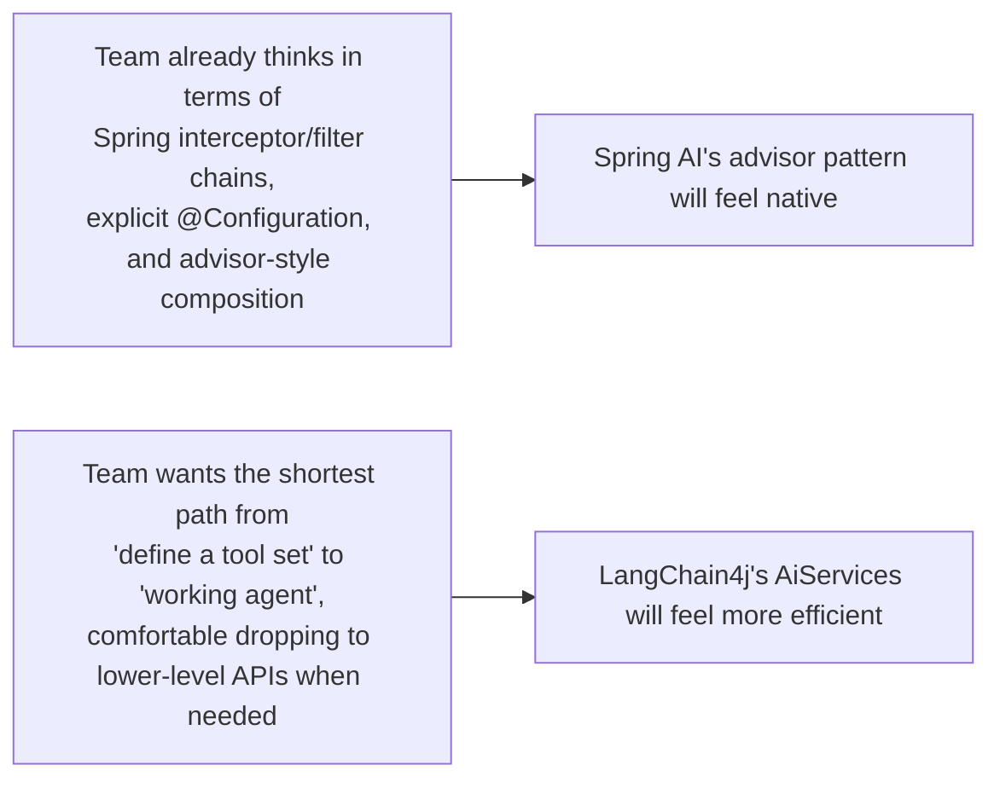

# Choosing Between LangChain4j and Spring AI

## Why this exists

The previous two files each described one framework largely on its own terms. This file makes the comparison and the recommendation explicit and opinionated — not a neutral feature-parity table, which tends to understate the real differences that actually matter in practice, but a genuine engineering judgment call, the way a principal engineer would actually make this decision for a real team, complete with the honest limitations of each option as of today.

## The philosophical difference, restated precisely

LangChain4j's design center of gravity is **declarative composition**: define an interface, describe your tools, hand the framework a chat model and memory strategy, and let it assemble and run the loop, largely opaque at the call site (file 1). Spring AI's design center of gravity is **explicit, ordered interception**: build a pipeline of advisors, each doing one well-defined thing, composed in a visible, testable chain (file 2). Neither is "more powerful" than the other in any absolute sense — LangChain4j can be dropped down to lower-level, more explicit APIs when needed, and Spring AI can be used at a similarly high level of abstraction without engaging its advisor chain directly. The difference that actually matters is which default posture — opaque-but-concise, or explicit-but-more-verbose — better matches how your team already thinks about structuring cross-cutting concerns in software.



## Where LangChain4j wins concretely

**Broader alignment with the wider (Python) LangChain ecosystem's vocabulary and patterns.** If your team reads AI-engineering research, blog posts, or ports patterns from Python LangChain implementations, LangChain4j's naming and structure (`ChatMemory`, `EmbeddingStore`, `AiServices`) map onto that broader body of discourse more directly than Spring AI's Spring-flavored equivalents — a genuinely practical advantage if you expect to be reading and adapting patterns from that wider ecosystem regularly.

**A more mature, wider surface of ready-made integrations** for document loaders, embedding stores, and vector database backends (Phase 03), reflecting its longer track record specifically in the Java LangChain ecosystem as of today — worth verifying directly against your specific integration needs rather than taking as a permanent, unchanging advantage, since both ecosystems are actively evolving.

**A genuinely honest limitation:** LangChain4j's high-level `AiServices` abstraction, as file 1 demonstrated at length, has no built-in budget enforcement, and its more opaque, proxy-based design gives you a less natural seam for inserting your own cross-cutting logic (budget checks, custom logging, request modification) than Spring AI's advisor chain does — you're more likely to end up wrapping call sites in ad hoc code, rather than composing a clean, reusable pipeline component, when you need Phase 07-style safeguards in a LangChain4j-based system.

## Where Spring AI wins concretely

**Native fit with an existing Spring Boot codebase's conventions.** If your team already manages configuration via `@ConfigurationProperties`, wires cross-cutting concerns via interceptor-style patterns, and expects dependency injection to be the primary composition mechanism throughout an application, Spring AI's `ChatClient` and advisor chain extend that existing mental model directly, rather than introducing a parallel, LangChain-flavored set of conventions alongside it.

**A more natural home for Phase 07's safeguards**, as file 2 demonstrated directly — the advisor pattern gives budget enforcement, logging, and custom validation a first-class, testable, composable place to live in the request pipeline, rather than requiring ad hoc wrapper functions around an otherwise opaque call.

**A genuinely honest limitation:** Spring AI is, as of today, a younger project than LangChain4j specifically in the Java ecosystem, and its integration surface for some vector store backends, document loaders, and less mainstream providers can be narrower — worth checking directly against your specific needs, and worth expecting more genuine churn in its API surface between versions than a more mature library might have, given its comparative youth.

## A concrete decision framework, not a coin flip

```mermaid
flowchart TD
    Q1{Is your codebase already deeply<br/>Spring-Boot-convention-driven,<br/>with heavy use of interceptors/advisors elsewhere?}
    Q1 -- Yes --> SpringAI["Lean Spring AI"]
    Q1 -- No / greenfield --> Q2{Do you expect to regularly read and adapt<br/>patterns from the wider Python LangChain<br/>ecosystem or research community?}
    Q2 -- Yes --> LC4J["Lean LangChain4j"]
    Q2 -- No --> Q3{Do you need fine-grained, reusable,<br/>testable cross-cutting logic<br/>(budgets, custom validation) from day one?}
    Q3 -- Yes --> SpringAI
    Q3 -- No, a fast prototype is the priority --> LC4J
```

This is a genuine decision framework, not a rationalization for a predetermined answer — real teams land on both sides of it, and the right answer for your specific situation depends on which of these questions actually describes your circumstances, not on which framework is more discussed online at any given moment.

## What doesn't change regardless of which you pick

Every safety and reliability discipline from Phases 05 through 07 remains entirely your responsibility in either framework: tool validation and sandboxing (Phase 05) still lives inside your annotated tool methods; structured-output reliability (Phase 06) still needs its own validation pipeline layered around whatever the framework returns; and budget enforcement (Phase 07, file 4) needs to be explicitly reintroduced in either framework's high-level API, whether via a wrapper function (LangChain4j) or a purpose-built advisor (Spring AI). Neither framework is a substitute for the engineering discipline this handbook has built up to this point — both are conveniences for the mechanical wiring, not replacements for the judgment underneath it.

## Trade-offs and when this matters most

- Don't let this decision block getting started — both frameworks are capable of building the same production agents, and the cost of having chosen "the other one" is real but rarely severe enough to justify extended deliberation over a fast, informed choice based on the framework above.
- Revisit this choice if your team's circumstances genuinely change — a greenfield LangChain4j prototype that later needs to integrate deeply with an existing Spring Boot monolith's conventions is a legitimate reason to reconsider, not a sign the original choice was wrong for its original context.
- Don't treat either framework's current popularity or GitHub star count as a proxy for which is the better technical fit for your specific team and codebase — the decision framework above is about your actual circumstances, not general community sentiment.

## Why this matters next

You've now seen both frameworks in depth and have a real, defensible basis for choosing between them. The final project in this phase asks you to verify this comparison yourself, directly: rebuild Phase 07's hand-built research agent once in each framework, using the exact same tools and task, so you have first-hand evidence of the trade-offs this file has argued for, rather than taking them on this handbook's word alone.