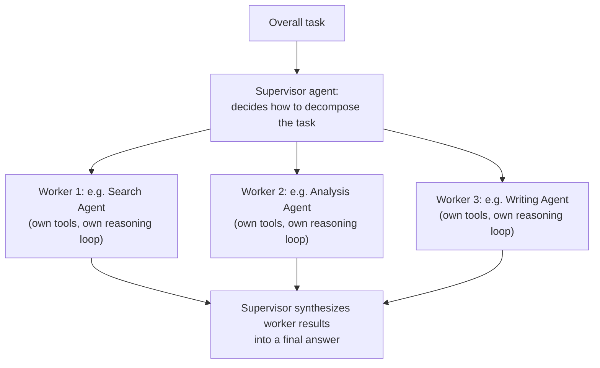
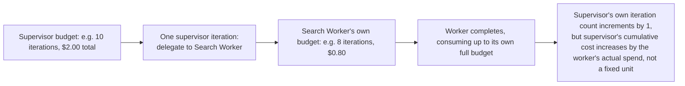
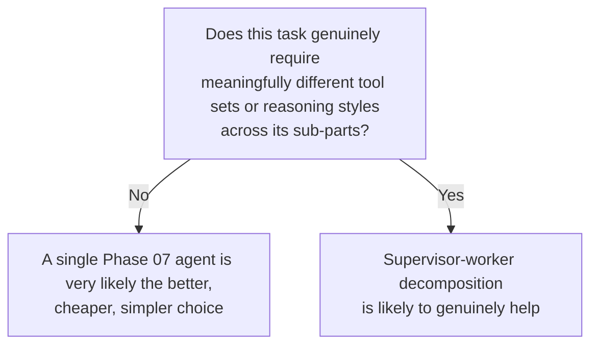

# The Supervisor-Worker Pattern

## Why this exists

Of every multi-agent pattern this phase covers, supervisor-worker is both the most common in real production systems and the most direct extension of everything you've already built — it's genuinely just Phase 07's tool-calling agent loop, except some of the "tools" it calls are themselves complete agents rather than simple functions. Understanding it this way, as a direct generalization rather than a new concept, is the fastest path to using it well and avoiding the over-engineering trap this phase's overview warned against.

## The core structure

A **supervisor** agent receives the overall task, decides how to break it into sub-tasks, delegates each sub-task to an appropriate **worker** agent, and synthesizes the workers' results into a final answer. Each worker is itself a complete, independently-scoped agent — potentially with its own tools, its own system prompt, and its own reasoning loop (any pattern from Phase 07) — but with a narrower job than the supervisor's overall task.



## Why this is mechanically just Phase 07's tool-calling loop, one level up

Recall Phase 05's tool-calling wire protocol and Phase 07's ReAct loop: the supervisor's "decision" to delegate to a worker is generated exactly the same way a decision to call any other tool is generated (Phase 05, file 2) — the supervisor's context includes a description of each available worker (functionally identical to a tool's `description`, per Phase 05, file 1), and the supervisor's underlying model produces a structured request to invoke one, exactly like any `tool_use` block. The only genuine difference is what executes when that "tool" is invoked: instead of a simple Java method calling an external API, it's an entire nested agent loop (Phase 07, file 4, budget and all) running to completion and returning its own final answer as the "tool result."

```java
public class WorkerAsToolExecutor implements ToolExecutor {

    private final ProductionAgentLoop workerAgent; // Phase 07, file 4's complete agent loop

    public WorkerAsToolExecutor(ProductionAgentLoop workerAgent) {
        this.workerAgent = workerAgent;
    }

    @Override
    public String execute(Map<String, Object> input) {
        String subTask = (String) input.get("sub_task");
        AgentResult result = workerAgent.run(subTask); // an entire nested loop runs here
        if (result.isSuccess()) {
            return result.finalAnswer();
        }
        return "Worker agent failed to complete sub-task: " + result.failureReason();
    }
}
```

This single class is the entire mechanical insight of this file: a worker agent, wrapped in a `ToolExecutor` implementation, is indistinguishable from any other tool from the supervisor's perspective. The supervisor's own loop is built with exactly the `ProductionAgentLoop` class from Phase 07, file 4, unchanged — only its registered tools differ, some being ordinary functions (Phase 05) and some being entire nested agents.

## The supervisor's system prompt: describing workers as capabilities, not implementation details

Exactly as Phase 05, file 1 argued for tool descriptions, a worker's description needs to communicate *when to use it* and *what it covers*, not its internal implementation:

```java
Map<String, ToolExecutor> supervisorTools = Map.of(
    "delegate_to_search_agent", new WorkerAsToolExecutor(searchWorkerLoop),
    "delegate_to_analysis_agent", new WorkerAsToolExecutor(analysisWorkerLoop),
    "delegate_to_writing_agent", new WorkerAsToolExecutor(writingWorkerLoop)
);

String supervisorSystemPrompt = """
    You are a supervisor coordinating specialized agents to complete a research task.
    delegate_to_search_agent: use for finding raw information from external sources. Does not analyze or summarize.
    delegate_to_analysis_agent: use for interpreting or drawing conclusions from information already gathered. Does not search externally.
    delegate_to_writing_agent: use for producing polished, final-form written output from analysis already completed.
    Delegate each sub-task to exactly one appropriate agent. Do not attempt research, analysis, or writing yourself directly.
    """;
```

Notice the explicit negative scoping in each description ("does not analyze," "does not search externally") — this directly parallels Phase 05, file 1's guidance on narrow tool scope, and it matters more here than for an ordinary tool: an overlapping or ambiguous worker description risks the supervisor delegating the same kind of sub-task to the wrong worker, or worse, having two workers redundantly perform the same kind of work, each unaware the other is doing something similar — a failure mode with no single-agent equivalent, since it only arises once you have multiple independent loops that can't see each other's internal reasoning.

## Why cost and budget management compound here specifically

Phase 07, file 4 established three separate budget dimensions — iteration, cost, and wall-clock time — for a single agent loop. In a supervisor-worker system, every worker invocation is itself a complete, separately-budgeted agent loop, meaning the supervisor's own budget check has to account for the fact that a single "tool call" (delegating to a worker) can, by itself, consume a worker's entire iteration and cost budget before returning:



This means the supervisor's cost budget (Phase 07, file 4's `AgentBudget.maxCostUsd`) needs to track *actual* cumulative spend across every nested worker invocation, not just the supervisor's own direct calls — a supervisor that only tracks its own token usage while ignoring what its workers spent underneath it has a real, silent gap in its cost enforcement, precisely the kind of gap Phase 07, file 4 warned against leaving in any single dimension of budget tracking.

```java
public class SupervisorBudgetAwareExecutor implements ToolExecutor {

    private final ProductionAgentLoop workerAgent;
    private final AgentExecutionContext supervisorContext; // the supervisor's own budget-tracking context

    @Override
    public String execute(Map<String, Object> input) {
        AgentResult result = workerAgent.run((String) input.get("sub_task"));
        supervisorContext.recordCallCost(result.totalUsage()); // propagate the worker's spend upward
        return result.isSuccess() ? result.finalAnswer() : "Worker failed: " + result.failureReason();
    }
}
```

## When this pattern is actually warranted, and when it isn't

**Warranted:** the overall task genuinely decomposes into sub-problems requiring meaningfully different tool sets, system prompts, or expertise framings — a research task needing both broad web search and precise numerical analysis is a reasonable case, since a single agent juggling both a search tool's usage patterns and careful numeric reasoning in one undifferentiated system prompt tends to perform worse at both than two agents each optimized for one.

**Not warranted:** the task is sequential but not genuinely differentiated — if every "worker" would use roughly the same tools and the same kind of reasoning, you've likely just reinvented Phase 07's single ReAct loop with extra indirection and extra cost, since every worker invocation is a separate agent loop with its own overhead, not a free structural improvement.



## Trade-offs and when this matters most

- Supervisor-worker adds real cost overhead — every delegation is a nested agent loop's full cost, not a lightweight function call — and real debugging overhead, since a wrong final answer now requires tracing through which worker's output was wrong, not just one loop's reasoning.
- The pattern earns its complexity specifically when sub-tasks are differentiated enough that specialized prompting and tooling per worker produces a measurably better result than one generalist agent — this is an empirical claim you should actually be able to demonstrate, not assume, ideally using the evaluation techniques Phase 10 covers in full.
- Don't build a supervisor-worker system as a default architecture for any moderately complex task — per this phase's overview, the burden of proof is on the multi-agent design, not on the single-agent alternative.

## Why this matters next

Supervisor-worker delegation handles tasks that decompose into a small, relatively flat set of specialized sub-tasks. The next file covers a structurally different orchestration approach — modeling a workflow as an explicit graph of states and transitions — for tasks whose control flow is genuinely more complex than "delegate a few sub-tasks and synthesize," including conditional branches, loops between specific stages, and workflows that don't fit a clean supervisor-and-workers shape at all.