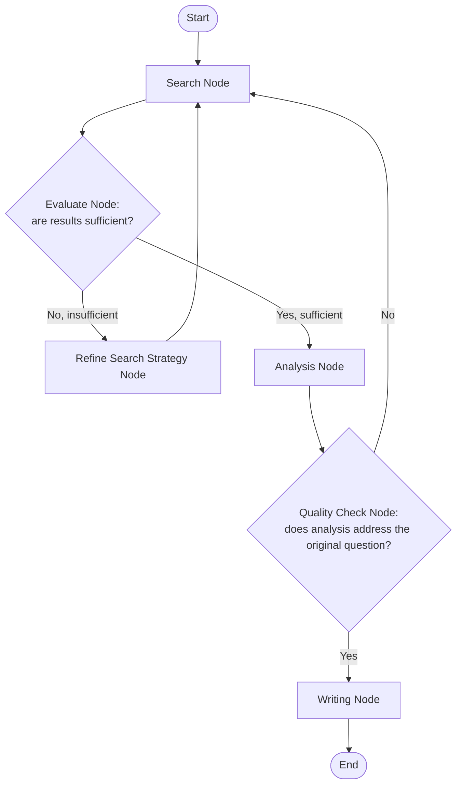

# Graph-Based Agent Orchestration

## Why this exists

The previous file's supervisor-worker pattern assumes a relatively flat structure: a supervisor delegates to workers, workers return results, the supervisor synthesizes. Many real workflows don't fit that shape — they have conditional branches ("if the search results are insufficient, try a different search strategy before proceeding to analysis"), loops back to earlier stages ("if analysis reveals the wrong data was gathered, return to search"), and stages that aren't cleanly "supervisor" or "worker" at all. Graph-based orchestration — the core idea behind LangGraph in the Python ecosystem — models a workflow as an explicit state machine: a set of named nodes (each typically an agent or a processing step) and a set of defined transitions between them, often conditional on what a given node produced.

## Why a graph, and not just more nested if-statements in a supervisor's prompt

It's tempting to handle branching logic ("if this, delegate to that worker instead") by writing more elaborate instructions into a supervisor's system prompt and letting the model's own reasoning handle the branch. This works for simple cases, but it has a real reliability cost as branching complexity grows: the actual control-flow logic — which state comes after which, under what conditions — becomes implicit, embedded in prose the model has to correctly interpret and follow *every single time*, rather than explicit, deterministic Java code that reliably enforces it. A graph externalizes that control flow into your own code, where it's testable, debuggable with a standard debugger, and guaranteed to route correctly — the model's job narrows to deciding content *within* a given node, not deciding the workflow's overall shape from scratch on every run.



Notice this graph has a genuine loop (`Evaluate` back to `Refine` back to `Search`) and a genuine long-range branch (`QualityCheck` back to `Search` entirely, not just to `Refine`) — control-flow shapes that would be awkward to express reliably as pure natural-language instructions to a single supervisor agent, but are straightforward to express as explicit graph edges in code.

## A hand-built Java implementation of a graph executor

This deliberately mirrors the shape of a classic state-machine implementation, not a new AI-specific concept — if you've built a workflow engine or an order-processing state machine before, this will look immediately familiar:

```java
public interface GraphNode {
    String name();
    NodeResult execute(GraphState state) throws Exception;
}

public record NodeResult(GraphState updatedState, String nextNodeName) {}

public class GraphState {
    private final Map<String, Object> data = new HashMap<>();

    public void put(String key, Object value) { data.put(key, value); }
    public Object get(String key) { return data.get(key); }
    public <T> T get(String key, Class<T> type) { return type.cast(data.get(key)); }
}

public class AgentGraphExecutor {

    private final Map<String, GraphNode> nodes;
    private final String startNodeName;
    private final int maxTransitions; // a graph-level budget, directly analogous to Phase 07 file 4's iteration cap

    public AgentGraphExecutor(Map<String, GraphNode> nodes, String startNodeName, int maxTransitions) {
        this.nodes = nodes;
        this.startNodeName = startNodeName;
        this.maxTransitions = maxTransitions;
    }

    public GraphState run(GraphState initialState) throws Exception {
        GraphState state = initialState;
        String currentNodeName = startNodeName;
        int transitions = 0;

        while (!"END".equals(currentNodeName)) {
            if (transitions++ >= maxTransitions) {
                throw new GraphTransitionLimitExceededException(
                    "Graph exceeded " + maxTransitions + " transitions without reaching END — likely stuck in a loop"
                );
            }
            GraphNode node = nodes.get(currentNodeName);
            NodeResult result = node.execute(state);
            state = result.updatedState();
            currentNodeName = result.nextNodeName();
        }

        return state;
    }
}
```

Notice `maxTransitions`, functioning identically to Phase 07, file 4's `maxIterations` — a graph with a genuine loop (as this file's example has) is exactly as capable of running indefinitely as an unbounded ReAct loop, and needs the same hard cap for the same reason: a probabilistic evaluation node (like `Evaluate` or `QualityCheck` in the diagram) can, in principle, repeatedly decide "not sufficient yet" without ever converging, and nothing about a graph's explicit structure removes that risk on its own — it only makes the *shape* of the risk more visible and easier to reason about than an unstructured supervisor loop would.

## Implementing a node — where an entire Phase 07 agent lives inside a graph node

Each node in a real system is very often a complete agent loop from Phase 07, or a single tool call from Phase 05, wrapped to fit the `GraphNode` interface:

```java
public class SearchNode implements GraphNode {

    private final ProductionAgentLoop searchAgent; // Phase 07's full agent loop

    @Override
    public String name() { return "Search"; }

    @Override
    public NodeResult execute(GraphState state) throws Exception {
        String query = (String) state.get("current_query");
        AgentResult result = searchAgent.run(query);

        state.put("search_results", result.finalAnswer());
        return new NodeResult(state, "Evaluate"); // deterministic, hardcoded transition — no branching here
    }
}

public class EvaluateNode implements GraphNode {

    private final LlmClient llmClient; // a lighter-weight, single-call evaluation — not a full agent loop

    @Override
    public String name() { return "Evaluate"; }

    @Override
    public NodeResult execute(GraphState state) throws Exception {
        String results = (String) state.get("search_results");
        String evaluationPrompt = "Are these search results sufficient to answer the original question? Respond YES or NO.\n" + results;

        ChatResponse response = llmClient.send(new ChatRequest(
            "some-model-name", 50, 0.0, null, List.of(new Message("user", evaluationPrompt))
        ));
        boolean sufficient = response.content().get(0).text().trim().equalsIgnoreCase("YES");

        return sufficient
            ? new NodeResult(state, "Analyze")
            : new NodeResult(state, "Refine");
        // This is the genuinely conditional transition — the branch this graph structure exists to express cleanly
    }
}
```

Notice the deliberate difference between `SearchNode` (a hardcoded, deterministic transition to `Evaluate`, no branching) and `EvaluateNode` (a genuinely conditional transition, based on the model's own generated judgment). Not every node needs to introduce branching — a graph is valuable precisely because it lets you be explicit about *which* points in the workflow are genuinely conditional and which are simple, fixed sequence, rather than treating the entire workflow as uniformly uncertain the way a single unstructured agent loop implicitly does.

## Trade-offs and when this matters most

- Graph-based orchestration is worth its added structural overhead specifically when a workflow has genuine branches or loops between distinct stages that would otherwise have to be expressed as increasingly elaborate natural-language instructions to a single agent — a workflow with a real "go back and redo an earlier stage" requirement is close to the clearest justification for this pattern.
- For a workflow that's genuinely linear — always search, then always analyze, then always write, with no conditional branching — a graph adds bookkeeping overhead (defining nodes, wiring transitions) without buying you anything the supervisor-worker pattern, or even a single Phase 07 agent, wouldn't already provide more simply.
- Don't build deeply nested or highly branching graphs speculatively, for flexibility you don't yet know you'll need — start with the simplest structure that correctly expresses your workflow's actual known branches, and add complexity only when a genuinely new conditional requirement emerges, exactly the same incremental-complexity discipline you'd already apply to any other state machine or workflow engine in ordinary backend work.

## Why this matters next

You've now seen two structurally different orchestration approaches: supervisor-worker's relatively flat delegation, and graph-based orchestration's explicit state machine for genuinely branching workflows. The next file covers a third framing — role-based agent teams, the conceptual core of CrewAI — and asks a pointed question this phase has been building toward throughout: how much of that framing is genuine additional engineering value, and how much is a presentation layer over mechanics you've already fully understood from the previous two files.