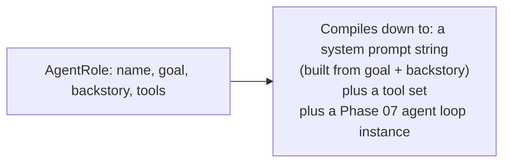
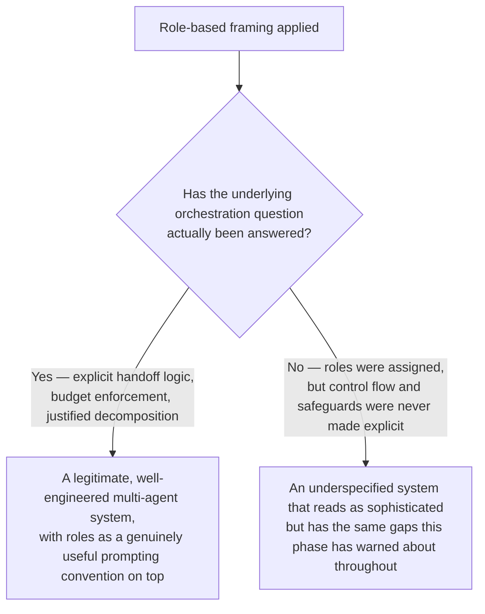

# Role-Based Agent Teams: CrewAI Concepts

## Why this exists

CrewAI, in the Python ecosystem, frames multi-agent systems around **roles**: each agent is defined with a name, a goal, a backstory, and a persona, and agents "collaborate" as a "crew" toward a shared objective. This file examines that framing honestly and specifically — not to dismiss it, but to separate what's genuine engineering value from what's presentation, since this phase's overview asked you to be skeptical of multi-agent complexity that doesn't earn its keep, and role-based framing is exactly the kind of pattern where that skepticism needs to be applied carefully rather than reflexively.

## The framing itself

A role-based agent might be defined conceptually like this:

```java
public record AgentRole(
    String name,
    String goal,
    String backstory,
    List<ToolExecutor> tools
) {}

AgentRole researcher = new AgentRole(
    "Senior Research Analyst",
    "Uncover cutting-edge developments in a given topic area",
    "You are a meticulous researcher with a decade of experience in technology journalism, known for finding sources others miss.",
    List.of(searchTool, fetchTool)
);

AgentRole writer = new AgentRole(
    "Technical Content Strategist",
    "Craft compelling, well-structured content from research findings",
    "You are a skilled writer who transforms complex technical research into clear, engaging narratives.",
    List.of()
);
```

## What this actually compiles down to, mechanically

Strip away the framing, and an `AgentRole` is exactly a Phase 07 agent's `systemPromptForAgent()` value, constructed from a template (`goal` and `backstory` concatenated into an instruction) plus a tool set (Phase 05) plus, implicitly, its own agent loop (Phase 07). The "researcher" and "writer" agents above are mechanically identical to the "search worker" and "writing worker" from the previous file's supervisor-worker example — same `ProductionAgentLoop` class, same tool registration, same budget concerns. Nothing about assigning a "backstory" changes the underlying request/response mechanics from Phase 02, the tool-calling protocol from Phase 05, or the reasoning loop from Phase 07.



## Where this framing does add genuine value — and it's a real one

It would be a mistake to conclude the role framing is *purely* cosmetic. There is a real, measurable effect worth taking seriously: **prompting a model with a specific persona and framing measurably shifts its generation distribution** (Phase 01, file 4) toward outputs consistent with that persona — a model prompted as a "meticulous senior researcher" does tend to produce more thorough, citation-conscious output than the same model given a bare, unadorned instruction to "find information about X," in the same way a well-written, specific job description tends to attract and shape different behavior than a vague one, even though both are, structurally, just text. This is a legitimate, learnable prompting technique, not an illusion — but it's worth being precise about *what* it is: it's a system-prompt-construction convention, applied consistently across multiple agents, not a new orchestration mechanism distinct from what the previous two files already gave you.

## Where the framing risks obscuring real engineering concerns

The risk is specific and worth naming directly: because "assign roles to a crew" reads as a complete architectural pattern, it's easy to adopt the role-based framing while never actually answering the harder questions the previous two files forced you to confront explicitly — how do agents actually hand off state to each other (next file), what's the termination and budget discipline across the whole team (Phase 07, file 4, applied at this scale), and does this task genuinely need multiple differentiated agents at all (this phase's opening question). A "crew" of agents with evocative backstories can look like sophisticated engineering while quietly having none of Phase 07's budget safeguards, none of the previous file's explicit transition logic for how control actually passes between agents, and no more justification for existing as multiple agents than "roles seemed like the natural way to describe this."



## A concrete, honest recommendation

Use role-based framing — clear, specific personas and goals per agent — as a genuine and worthwhile prompting technique when you build each individual agent, whether that agent is a supervisor, a worker, or a node in a graph. But do not treat "we've defined roles for our crew" as a substitute for answering the previous two files' harder questions: is this decomposition actually justified (file 1's diagram), what is the explicit control-flow structure connecting these agents (file 1's delegation or file 2's graph), and what is the budget and termination discipline across the whole system (Phase 07, file 4, applied cumulatively). Role definitions are a real, useful layer on top of those answers — not a replacement for having them.

## Trade-offs and when this matters most

- Invest in specific, well-written personas and goals per agent — this is cheap, genuinely effective (per Phase 01's generation mechanics), and worth doing regardless of which orchestration pattern (supervisor-worker or graph-based) you're using underneath.
- Don't mistake "we've named our agents and given them backstories" for having answered the actual architectural questions this phase is about — if you can't clearly state, in the terms of file 1 or file 2, how control and state actually pass between your "crew" members and what stops the system from running away, the role framing hasn't done that work for you.
- If you're evaluating a framework or a team's proposed design and it's described primarily in role/persona terms ("we have a researcher agent and a writer agent"), ask the file 1/file 2-level question directly: what triggers the handoff, what state passes between them, and what's the budget — a genuinely well-designed system will have clear answers; one that doesn't is worth scrutinizing further before treating it as production-ready.

## Why this matters next

You've now seen three orchestration framings — flat delegation, explicit graphs, and role-based teams — and, more importantly, developed the specific skepticism needed to evaluate which parts of any of them are genuine engineering substance versus presentation. None of them, so far, has addressed the actual mechanics of *how* information passes from one agent to another when a handoff happens — what exactly gets communicated, in what form, and what can go wrong in that communication itself. That's the subject of the next file, and it's the piece every pattern in this phase has been assuming works correctly without yet examining closely.