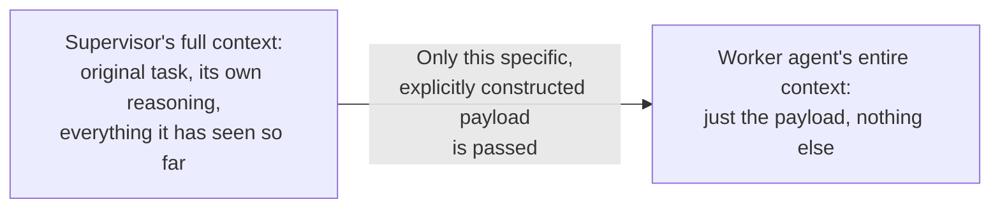

# Inter-Agent Communication Protocols

## Why this exists

Every pattern in this phase so far has included a moment of handoff — the supervisor delegating to a worker, one graph node passing state to the next, one "crew" member's output becoming another's input — and each file deferred the actual mechanics of that handoff to this one. This file addresses it directly, because it's where a genuinely new class of failure mode lives: not failures within a single agent's reasoning (which Phase 07 already covered), but failures in the *transfer* of context and state between independently-reasoning agents, which has no equivalent in anything built before this phase.

## What actually gets communicated, concretely

Recall that every agent — supervisor, worker, or graph node — is, underneath, a Phase 02 stateless API client wrapped in a Phase 07 reasoning loop. When one agent "hands off" to another, there is no shared memory, no implicit shared context, and no automatic transfer of anything — exactly the same statelessness lesson from Phase 00 and Phase 02, now applying *between* agents rather than between turns of one conversation. Whatever the receiving agent knows about the task, it knows only because it was explicitly included in whatever text or structured data was passed to it.



This is a critical point to internalize precisely because it's easy to unconsciously assume otherwise: it's tempting to think of a "worker" as somehow aware of the broader task it's contributing to, the way a human team member retains general awareness of a shared project even while focused on their own piece. A worker agent has no such general awareness — its entire understanding of the task begins and ends with whatever was explicitly written into the sub-task description it received. If the supervisor's delegation payload is vague or incomplete, the worker's response will reflect exactly that vagueness, with no way to compensate for missing context it was never given.

## Failure mode 1: context loss through under-specified handoffs

```java
// Under-specified — loses critical framing from the original task
String subTask = "Find information about renewable energy adoption.";

// Well-specified — preserves the actual constraints and intent from the original task
String subTask = """
    Find recent (within the last 18 months) statistics on renewable energy
    adoption specifically in manufacturing sectors, for a report comparing
    policy effectiveness across the US, Germany, and Japan. Focus on
    government incentive programs, not general market trends.
    """;
```

The first version technically satisfies "delegate a search task," but it silently drops the actual constraints that made the original task specific — recency, sector focus, the comparative policy angle, the three named countries. A worker given the first version will produce a plausible-sounding, well-formed result that's simply answering a different, broader question than the one actually being asked — a failure that's easy to miss during a quick review, since the worker's output looks competent and complete on its own terms, and only becomes visible once you notice it doesn't actually serve the original, more specific need.

## Failure mode 2: contradictory or stale partial state

In a graph-based system (previous file) or any multi-step handoff, `GraphState` accumulates data written by multiple nodes over time. A genuine risk specific to this accumulation: a later node reading a field that an earlier node wrote under different, now-outdated assumptions — for example, a `Refine` node updating `current_query` after a poor initial search, while a later node still reads a stale `original_query` field for a different purpose, producing a final answer that's internally inconsistent (addressing the refined query in one part, the original in another) without any single component being "wrong" in isolation.

```java
public class GraphState {
    private final Map<String, Object> data = new HashMap<>();
    private final List<String> writeHistory = new ArrayList<>(); // a lightweight defense against this exact failure mode

    public void put(String key, Object value) {
        data.put(key, value);
        writeHistory.add(key + " updated by current node at " + Instant.now());
    }

    public Object get(String key) {
        return data.get(key);
    }

    public List<String> writeHistory() { return writeHistory; }
}
```

Tracking a simple write history, as shown above, doesn't prevent this failure mode outright, but it makes it debuggable after the fact — when a final answer looks internally inconsistent, the write history lets you reconstruct exactly which node last touched each piece of state and when, rather than having to guess at how stale data ended up where it did. This is a direct, smaller-scale preview of the full tracing discipline Phase 10 builds out formally for entire agent systems.

## Failure mode 3: cost multiplication through redundant context re-transmission

Recall Phase 01's cost mechanics and Phase 04's memory-growth problem: every agent in a multi-agent system maintains its own conversation history (Phase 02, file 2's statelessness), and if a supervisor naively passes its *entire* accumulated context to every worker "just in case it's useful," each worker's own context — and therefore each worker's own cost, per Phase 01 — grows to include material that may be entirely irrelevant to its specific, narrow sub-task. This is the multi-agent version of Phase 03's "why not just embed the whole document" problem: more context isn't free, and passing everything defeats the entire purpose of narrowly scoping a worker's job in the first place.

```java
// A naive, costly handoff — passes everything the supervisor has ever seen
String subTaskWithFullContext = supervisorFullHistory.toString() + "\n\nNow, find X.";

// A deliberately scoped handoff — passes only what this specific worker actually needs
String subTaskScoped = buildScopedContext(
    task: "Find X",
    relevantConstraints: extractRelevantConstraints(supervisorFullHistory, "X")
);
```

The scoped version requires the supervisor (or your own orchestration code) to actively decide what's relevant to a given handoff, rather than defaulting to "include everything" — a real design and engineering effort, but one that directly controls a real, compounding cost, exactly the same discipline Phase 04 asked you to apply to a single agent's own conversation history, now applied at the boundary between agents.

## A concrete handoff contract, as a pattern worth adopting deliberately

Rather than passing an ad hoc string built differently at every handoff point, a well-engineered multi-agent system benefits from a consistent, typed handoff structure — making explicit exactly what's being communicated, and making it easy to audit whether a given handoff is under-specified:

```java
public record AgentHandoff(
    String subTaskDescription,
    Map<String, String> relevantConstraints,
    List<String> priorFindingsSummary, // deliberately summarized, not the full history — Phase 04's discipline applied here
    String expectedOutputFormat
) {}

public String buildDelegationPrompt(AgentHandoff handoff) {
    return """
        Task: %s
        Constraints: %s
        Relevant prior findings: %s
        Expected output format: %s
        """.formatted(
            handoff.subTaskDescription(),
            handoff.relevantConstraints(),
            String.join("; ", handoff.priorFindingsSummary()),
            handoff.expectedOutputFormat()
        );
}
```

Structuring handoffs this way — as a typed record with explicit, named fields — makes the under-specification failure mode from earlier in this file visible at review time: a handoff missing `relevantConstraints` or with an empty `expectedOutputFormat` is immediately noticeable as incomplete, in a way a free-form concatenated string tends to hide.

## Trade-offs and when this matters most

- For a small, low-stakes multi-agent system with only two or three agents and simple handoffs, ad hoc string-building for delegation prompts is a reasonable simplification — the overhead of a formal handoff contract isn't yet justified.
- For any system with more than a couple of agents, or any handoff carrying genuinely important constraints that must survive the transfer, a typed handoff contract (as shown above) is worth the small additional structure — it turns an easy-to-miss under-specification bug into something visible in code review.
- Don't default to passing full accumulated context at every handoff "to be safe" — per the cost-multiplication discussion, this is rarely actually safer, and is reliably more expensive; deliberately scoping what each agent receives is both a cost control and, often, a quality improvement, since a narrowly-scoped worker with precisely relevant context tends to perform its specific job better than one wading through a large, mostly-irrelevant history.

## Why this matters next

You now have the complete conceptual toolkit for this phase: three orchestration patterns (supervisor-worker, graph-based, role-based framing) and the actual mechanics — and failure modes — of how information passes between the agents within any of them. The final project asks you to build a real multi-agent system end to end, and to justify, concretely, why this particular task warrants more than the single research agent you already built in Phase 07.