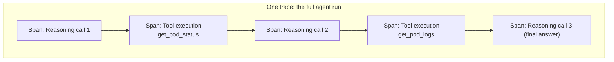
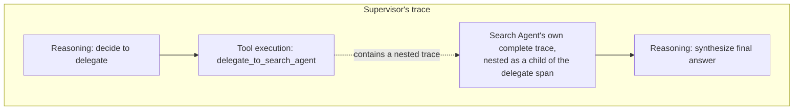

# Tracing LLM Calls with OpenTelemetry

## Why this exists

Phase 07, file 4 mentioned, in passing, that a production agent loop needs to record every reasoning step, tool call, and budget check — and gestured at `ctx.summary()` as a placeholder for that need without building it out properly. Phase 09's inter-agent communication file introduced a lightweight write-history mechanism specifically because a multi-agent system's failures are otherwise nearly impossible to reconstruct after the fact. This file is where both of those deferred needs get a real, proper implementation: distributed tracing, using infrastructure you likely already operate for your other microservices, extended to cover the LLM-specific parts of an agent's execution.

## Why this is "just" distributed tracing, with new attributes

If you've instrumented a microservices architecture with OpenTelemetry (or any comparable distributed tracing system) before, the core concepts transfer directly and require no new mental model: a **trace** represents one complete request or task from start to finish; a **span** represents one unit of work within that trace, with a start time, an end time, and attributes describing what happened; spans can be nested, representing work that happens inside other work. An agent loop's execution maps onto this structure with almost no translation needed — the entire agent run is a trace, each reasoning call is a span, each tool execution is a span, and in a multi-agent system (Phase 09), each worker agent's entire run is itself a nested trace inside the supervisor's span, exactly mirroring the nested-cost-tracking discussion from Phase 09, file 1.



## Instrumenting the Phase 07 agent loop directly

```java
public class TracedAgentLoop {

    private final Tracer tracer; // standard OpenTelemetry Tracer, the same one used elsewhere in your services
    private final LlmClient llmClient;
    private final Map<String, ToolExecutor> tools;
    private final AgentBudget budget;

    public AgentResult run(String task) {
        Span traceSpan = tracer.spanBuilder("agent.run")
            .setAttribute("agent.task", task)
            .startSpan();

        try (Scope scope = traceSpan.makeCurrent()) {
            AgentExecutionContext ctx = new AgentExecutionContext(task, Instant.now());
            ctx.addMessage(new Message("user", task));

            while (true) {
                BudgetCheckResult budgetCheck = budget.check(ctx);
                if (!budgetCheck.withinBudget()) {
                    traceSpan.setAttribute("agent.outcome", "halted_by_budget");
                    traceSpan.setAttribute("agent.halt_reason", budgetCheck.reason());
                    return AgentResult.haltedByBudget(budgetCheck.reason(), ctx.partialHistory());
                }

                ChatResponse response = tracedReasoningCall(ctx);
                ctx.recordCallCost(response.usage());

                if ("tool_use".equals(response.stopReason())) {
                    ContentBlock toolUseBlock = findToolUseBlock(response);
                    ctx.addMessage(assistantMessageFrom(response));

                    ToolExecutionOutcome outcome = tracedToolExecution(toolUseBlock);
                    ctx.addMessage(toolResultMessage(toolUseBlock, outcome.resultText()));
                } else {
                    traceSpan.setAttribute("agent.outcome", "success");
                    traceSpan.setAttribute("agent.total_iterations", ctx.iterationCount());
                    traceSpan.setAttribute("agent.total_cost_usd", ctx.cumulativeCostUsd());
                    return AgentResult.success(response.content().get(0).text(), ctx.summary());
                }
            }
        } finally {
            traceSpan.end();
        }
    }

    private ChatResponse tracedReasoningCall(AgentExecutionContext ctx) {
        Span reasoningSpan = tracer.spanBuilder("agent.reasoning_call")
            .setAttribute("agent.iteration", ctx.iterationCount())
            .setAttribute("agent.input_message_count", ctx.allMessages().size())
            .startSpan();
        try {
            ChatResponse response = llmClient.send(buildRequest(ctx));
            reasoningSpan.setAttribute("llm.input_tokens", response.usage().inputTokens());
            reasoningSpan.setAttribute("llm.output_tokens", response.usage().outputTokens());
            reasoningSpan.setAttribute("llm.stop_reason", response.stopReason());
            return response;
        } finally {
            reasoningSpan.end();
        }
    }

    private ToolExecutionOutcome tracedToolExecution(ContentBlock toolUseBlock) {
        Span toolSpan = tracer.spanBuilder("agent.tool_execution")
            .setAttribute("tool.name", toolUseBlock.name())
            .setAttribute("tool.input", toolUseBlock.input().toString()) // see file 2 for safe-logging caveats here
            .startSpan();
        try {
            ToolExecutionOutcome outcome = executeToolSafely(toolUseBlock); // Phase 05's validation stack, unchanged
            toolSpan.setAttribute("tool.succeeded", outcome.succeeded());
            return outcome;
        } finally {
            toolSpan.end();
        }
    }
}
```

Notice how little this changes about the actual `ProductionAgentLoop` logic from Phase 07, file 4 — every piece of business logic (budget checks, tool dispatch, message construction) is identical; what's been added is a span wrapping each meaningful unit of work, with attributes capturing exactly the information you'd want when reconstructing what happened after the fact. This is precisely the value of building on standard, already-operated tracing infrastructure rather than inventing a bespoke agent-specific logging format: your existing tracing backend, dashboards, and alerting — whatever you already use for your other services — work against this data without any new tooling.

## What attributes actually matter for an agent trace specifically

Beyond the standard span timing information any tracing setup gives you for free, the attributes worth deliberately capturing for LLM-specific spans are:

- **Token usage per call** (`llm.input_tokens`, `llm.output_tokens`) — directly feeds file 5's cost dashboards, and lets you retroactively identify exactly which reasoning step in a run was unexpectedly expensive.
- **`stop_reason`** — recall Phase 02, file 1's insistence that this field is not optional to check; capturing it in every reasoning span lets you later query "how often did this agent's reasoning calls get cut off by `max_tokens` versus conclude naturally," a question you cannot answer at all without having recorded it at the time.
- **Tool name and success/failure**, per Phase 05's validation and sandboxing discipline — lets you build an aggregate view of which tools fail validation most often, which is a direct, evidence-based signal for revisiting that tool's schema design (Phase 05, file 1) rather than guessing at which tool needs attention.
- **Iteration count and cumulative cost at halt**, for any run that hits a budget limit (Phase 07, file 4) — without this, a budget halt is a dead end in your logs; with it, you can see exactly how close to (or far from) a reasonable budget a given task actually needed, informing whether your budget values are well-calibrated or arbitrary.

## Cross-agent tracing in a multi-agent system (Phase 09)

The nested-span structure extends naturally to Phase 09's supervisor-worker and graph-based patterns — a worker agent's entire `agent.run` trace becomes a child span nested inside the specific `agent.tool_execution` span (or graph node span) that invoked it, which is exactly what lets you answer a question Phase 09, file 4 raised but couldn't fully resolve on its own: when a multi-agent system's final answer is wrong, which specific agent, at which specific step, is responsible.



## Trade-offs and when this matters most

- For early prototyping, full tracing infrastructure is real setup overhead that may not be justified yet — simple structured logging (next file) of key events is often sufficient while a single agent is still being iterated on rapidly by one person.
- For anything running in production, especially any multi-agent system (Phase 09) where a failure could originate in any of several independently-reasoning components, tracing is close to mandatory — without it, debugging a production incident means guessing at which agent or step went wrong rather than being able to look it up directly.
- Don't instrument every possible attribute speculatively — focus on the ones this file identified as having concrete diagnostic or cost-analysis value (token usage, stop reason, tool success, budget state); an over-instrumented trace with excessive, low-value attributes is harder to read during an actual incident, not easier.

## Why this matters next

Tracing gives you the *structure* of what happened — which spans, in what order, with what timing and outcome attributes. It deliberately doesn't yet address the *content* question: what do you actually log inside those spans (the full prompt text? the full response? just a hash?), and what data-handling discipline does that content require, given that your agent's prompts and responses may contain PII, customer data, or secrets flowing through them. That's the subject of the next file.