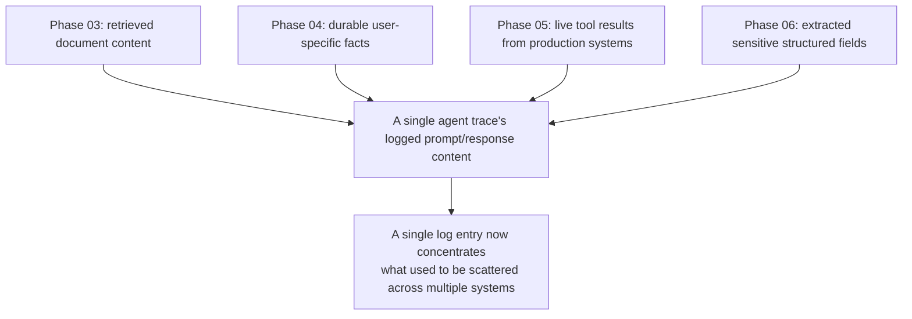
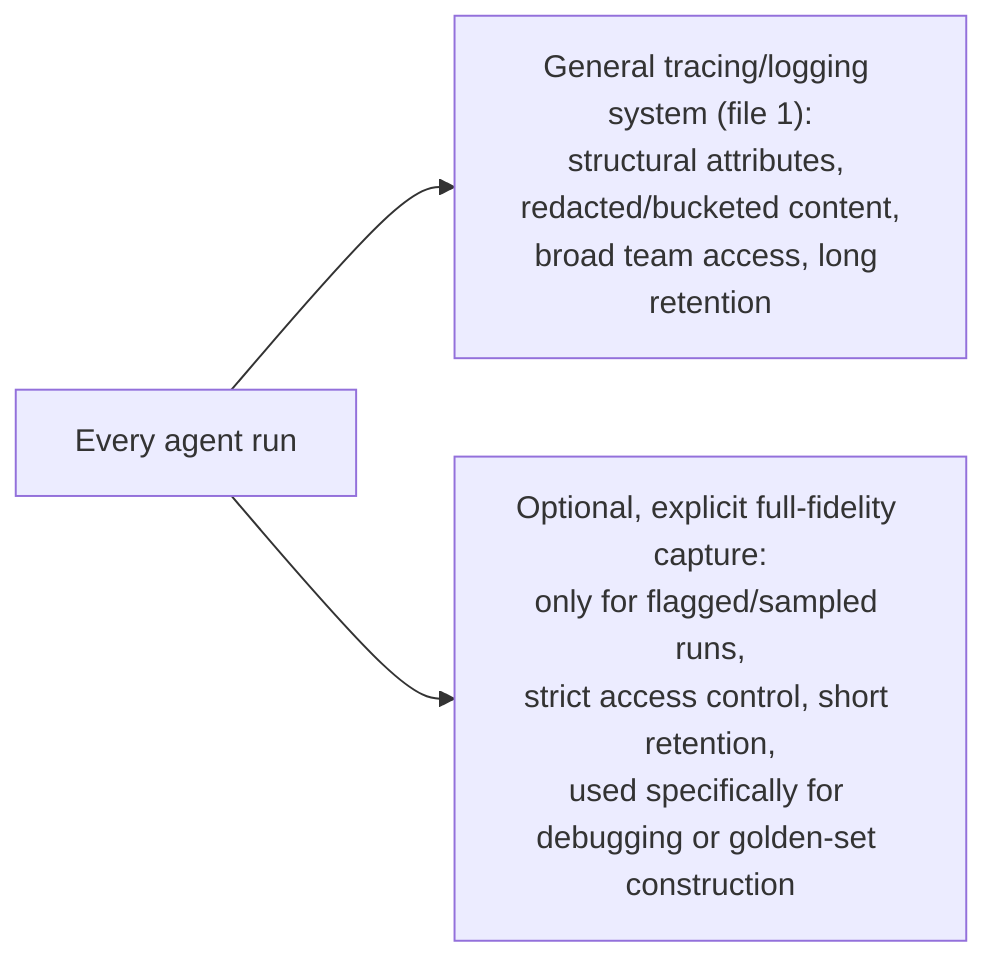

# Logging Prompts and Responses Safely

## Why this exists

The previous file gave you the structure for capturing what happened during an agent's run. This file is about the actual content inside that structure — the full prompt text, the full response text, tool arguments and results — and why logging all of it verbatim, the way you might log a request/response pair for an ordinary internal REST API, is a materially bigger risk here than it typically is elsewhere in your systems. This isn't a hypothetical compliance concern to wave at briefly — it's a direct, practical consequence of what actually flows through an agent's context, given everything built in the preceding phases.

## Why LLM logs are riskier than typical request/response logs

Think concretely about what actually populates an agent's context window by this point in the handbook. Phase 03's retrieval pulls real document content — potentially including confidential internal material — directly into the prompt. Phase 04's memory stores durable facts *about specific named users*, by design. Phase 05's tool results can include real customer data, infrastructure details, or financial figures pulled live from production systems. Phase 06's structured extraction literally exists to pull sensitive fields (invoice amounts, customer names) out of source documents. None of this is unusual or a sign of bad design — it's the entire point of these capabilities. But it also means a full, verbatim trace of an agent's prompts and responses is, structurally, one of the most sensitive logs your system produces, often more so than a typical application log, precisely because so many of the earlier phases' techniques are specifically designed to concentrate relevant, often sensitive, information into one place: the context window.



## The core discipline: log for debugging value, not by default completeness

The instinct from ordinary request/response logging — "just log everything, storage is cheap, you'll want it eventually" — needs deliberate reconsideration here. The right default posture is closer to: log what you specifically need for the diagnostic and evaluation purposes this phase exists to serve, and apply real handling discipline to the rest, rather than defaulting to full verbatim capture because it's the path of least resistance.

**Redaction before storage, for known-sensitive field patterns:**

```java
public class PromptRedactor {

    private static final Pattern EMAIL_PATTERN = Pattern.compile(
        "[a-zA-Z0-9._%+-]+@[a-zA-Z0-9.-]+\\.[a-zA-Z]{2,}"
    );
    private static final Pattern CREDIT_CARD_PATTERN = Pattern.compile(
        "\\b(?:\\d[ -]*?){13,16}\\b"
    );

    public String redactForLogging(String rawText) {
        String redacted = EMAIL_PATTERN.matcher(rawText).replaceAll("[REDACTED_EMAIL]");
        redacted = CREDIT_CARD_PATTERN.matcher(redacted).replaceAll("[REDACTED_CARD_NUMBER]");
        return redacted;
    }
}
```

This kind of pattern-based redaction is a genuinely useful first layer, and it's also genuinely incomplete — it catches known, structurally-recognizable patterns (emails, card numbers) and will miss a great deal of sensitive content that doesn't match a fixed pattern (a customer's name mentioned in prose, a confidential project codename, an internal financial figure with no distinguishing format). Treat pattern-based redaction as a floor, not a guarantee.

**Structured field-level control, where you know the shape of what's flowing through:**

For structured extraction (Phase 06) specifically, you often know the schema of what's being extracted, which lets you be precise rather than relying on pattern-matching after the fact:

```java
public record LoggableInvoiceTrace(
    String vendorName,        // safe to log — vendor identity is rarely sensitive in this context
    String totalAmountRange,  // "$0-100", "$100-1000", etc. — logged as a bucket, not an exact figure
    boolean extractionSucceeded,
    String failureStageIfAny
) {
    public static LoggableInvoiceTrace from(ExtractedInvoice invoice, PipelineResult result) {
        return new LoggableInvoiceTrace(
            invoice.vendorName(),
            bucketAmount(invoice.totalAmount()),
            result.isSuccess(),
            result.isSuccess() ? null : result.failureStage()
        );
    }
}
```

This is a deliberate design choice worth naming explicitly: rather than logging the raw extracted invoice (which might include a customer's exact billing details) and trying to redact it after the fact, you construct a *purpose-built, intentionally lossy* logging representation from the start — one that preserves everything file 3 and file 4's evaluation and regression-testing needs actually require (did extraction succeed, at which stage did it fail, roughly what kind of invoice was this) while deliberately not preserving the sensitive specifics those needs don't actually require.

## What genuinely needs full-fidelity capture, and where to put it instead

Some of this phase's own goals — debugging a specific failure, building a golden set for evaluation (file 3), understanding exactly why a regression test failed (file 4) — do sometimes require the full, unredacted prompt and response for a specific case. The right pattern is not "never capture full fidelity," it's "separate full-fidelity capture, when genuinely needed, into a distinctly access-controlled, shorter-retention store, rather than defaulting every trace into your general-purpose, broadly-accessible logging system":



```java
public class SelectiveFullFidelityCapture {

    private final SecureAuditStore auditStore; // separate, access-controlled storage, distinct from general logging
    private final double samplingRate;

    public void maybeCapture(String rawPrompt, String rawResponse, String traceId) {
        if (shouldFlagForFullCapture(traceId) || ThreadLocalRandom.current().nextDouble() < samplingRate) {
            auditStore.store(traceId, rawPrompt, rawResponse, Instant.now());
            // Retained briefly, access-restricted to specific debugging/evaluation roles,
            // not part of the general-purpose trace data every engineer can query freely.
        }
    }

    private boolean shouldFlagForFullCapture(String traceId) {
        // e.g., any run that hit a budget halt, a validation failure, or was manually flagged for review
        return flaggedTraceIds.contains(traceId);
    }
}
```

This gives you both things you actually need without defaulting to the riskiest option: broad, low-risk structural visibility for everyday operational use (file 1's tracing), and narrow, deliberately-gated full-fidelity capture for the specific cases — failures, flagged runs, a sampled subset for golden-set construction — where you genuinely need it.

## Trade-offs and when this matters most

- For an internal tool used by a small, trusted team on non-sensitive data, full logging with light redaction is a reasonable, proportionate choice — this file's full discipline is more rigor than the actual risk justifies in that context.
- For anything touching customer data, financial information, or regulated information of any kind (which, given Phase 03 through Phase 06's capabilities, describes a large share of real production agents), the separation between general tracing and gated full-fidelity capture is not optional hardening — treat it with the same seriousness you'd already apply to logging discipline around any other system that touches this class of data, since an agent's logs are not exempt from your existing data-handling policies just because the mechanism producing them is new.
- Don't treat pattern-based redaction alone as sufficient for anything genuinely sensitive — it's a useful floor, not a ceiling, and the structured, purpose-built logging representation approach (the `LoggableInvoiceTrace` example) is a stronger, more deliberate control wherever you know the shape of the data flowing through a given pipeline.

## Why this matters next

You now have both halves of observability: structural tracing (file 1) and a safe content-handling discipline for what actually gets logged (this file). Together, these give you visibility into what happened. Neither one, on its own, tells you whether what happened was actually *good* — whether the agent's output was correct, complete, and appropriate. That's a distinct question, and it's the subject of the next file: using a second model call to judge an agent's output at scale, a technique this handbook has deliberately deferred since Phase 03 until you had the full observability foundation to apply it responsibly.