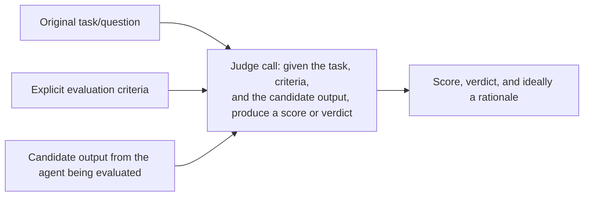
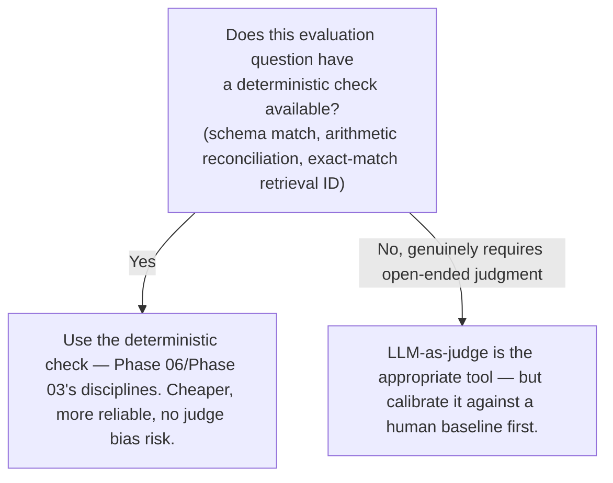

# LLM-as-Judge Evaluation

## Why this exists

Phase 03, file 5 flagged this technique explicitly and deliberately deferred it: "using a second LLM call to judge whether a generated answer is actually supported by its cited source chunk is a real, valid technique, but it's introduced properly in Phase 10." This is that introduction, and the deferral was not arbitrary — LLM-as-judge is a genuinely powerful technique with genuinely serious failure modes of its own, and covering it properly means covering both, not just presenting it as a clean solution to "how do I evaluate something a golden-set precision/recall check (Phase 03, file 5) can't capture."

## The core idea

Where Phase 03's golden-set evaluation worked by comparing retrieved chunk IDs against a known-correct set — a clean, deterministic comparison — many evaluation questions don't reduce to exact-match comparison at all. "Does this synthesized research answer actually address the original question," "is this agent's final response helpful and appropriately toned," "does this extracted summary preserve the key facts without introducing new ones" — these are judgment calls, the kind a human reviewer would normally make by reading and assessing, not questions with a single correct string to check equality against. LLM-as-judge uses a separate model call, given the original task, the criteria to judge against, and the candidate output, to render exactly that kind of judgment — at a scale no team could sustain with human review alone.



## A working implementation

```java
public record JudgeVerdict(int score, String rationale, List<String> issuesFound) {}

public class LlmJudge {

    private final LlmClient llmClient; // ideally a different model or at least a fresh, isolated call context

    public JudgeVerdict judge(String originalTask, String criteria, String candidateOutput) throws Exception {
        String judgePrompt = """
            You are evaluating an AI agent's output. Be specific and critical — do not default to a high score.

            Original task given to the agent: %s

            Evaluation criteria: %s

            Agent's output to evaluate:
            %s

            Score this output from 1 (fails the criteria badly) to 5 (fully satisfies the criteria).
            List specific issues found, if any — do not invent issues if none are genuinely present,
            but do not overlook real ones either.
            Respond as JSON: {"score": <int>, "rationale": "<string>", "issues_found": [<string>, ...]}
            """.formatted(originalTask, criteria, candidateOutput);

        ChatRequest request = new ChatRequest(
            "some-model-name", 512, 0.0, null,
            List.of(new Message("user", judgePrompt))
        );
        String rawJudgment = llmClient.send(request).content().get(0).text();

        // This is structured output like any other — Phase 06's full validation pipeline
        // applies here exactly as it would to any other schema-constrained extraction.
        return objectMapper.readValue(rawJudgment, JudgeVerdict.class);
    }
}
```

Notice the explicit instruction "be specific and critical — do not default to a high score" and "do not invent issues if none are genuinely present." These aren't incidental phrasing choices — they're direct responses to two real, opposite biases this technique is prone to, covered next.

## Bias 1: leniency bias — judges tend to over-score

A model asked to evaluate another model's output has an observed tendency toward generosity, plausibly because critical, specific evaluation is a harder generation task (Phase 01, file 4) than agreeable affirmation, and "this looks good" is a highly plausible continuation for a wide range of inputs, including genuinely mediocre ones. Left unaddressed, this produces evaluation scores that cluster near the top of your scale regardless of actual quality, which defeats the entire purpose of building an evaluation system — a metric that says "everything is a 4 or 5 out of 5" gives you no discriminating signal for the regression testing (next file) this evaluation exists to support.

**Mitigation: calibrate against a small, human-scored reference set**, exactly the golden-set discipline from Phase 03, file 5, applied here to judge calibration rather than retrieval: have a human score a small sample (10-20 examples) using the same criteria and scale, compare the judge's scores against those human scores, and adjust your judge prompt (more explicit criteria, explicit instruction to look for specific failure patterns, a forced requirement to name at least one potential weakness even in strong outputs) until the judge's scores correlate reasonably well with the human baseline.

## Bias 2: self-preference bias — a model favors its own outputs or style

A related, subtler risk: if the same model (or a closely related one) that produced the candidate output is also acting as the judge, there's a real risk of the judge favoring outputs that match its own stylistic tendencies or reasoning patterns, independent of the actual evaluation criteria — not necessarily out of any "self-interest" in a meaningful sense, but because a model's own generation patterns are, definitionally, the patterns it finds most probable and natural (Phase 01, file 4), which can bleed into judgment as well as generation.

**Mitigation: where feasible, use a genuinely different model as the judge than the one producing the candidate output** — this is one of the more concrete, practical reasons a multi-provider abstraction (Phase 02, file 7) has ongoing value beyond initial integration flexibility: it makes this specific mitigation straightforward to implement rather than requiring a whole new integration effort just to get an independent judge.

## What LLM-as-judge is good for, and what it isn't a substitute for

**Good for:** open-ended quality judgments without a clean ground-truth comparison — tone, helpfulness, whether a synthesized answer actually addresses a multi-part question, whether a summary preserves key facts. This is exactly the gap Phase 03, file 5 identified: golden-set precision/recall tells you whether retrieval found the right chunks; it says nothing about whether the generated answer used them well, and LLM-as-judge is the natural tool for that separate question.

**Not a substitute for:** deterministic checks where one is available. Recall Phase 06's semantic validation — line items summing to a stated total is a check you can and should perform with plain arithmetic, not by asking a judge model "does this total look right?" A deterministic check is cheaper, faster, and has zero risk of the leniency or self-preference biases just discussed; reach for LLM-as-judge specifically for the class of evaluation question that genuinely has no deterministic equivalent, not as a default evaluation technique applied everywhere Phase 06's checks would also work.



## Trade-offs and when this matters most

- For low-stakes, exploratory evaluation during early development, an uncalibrated judge with reasonable prompting is a fine starting point — perfect calibration isn't worth the effort yet.
- For any evaluation result that will inform a real decision — whether a prompt change actually improved quality (feeding directly into the next file's regression testing), whether a system is ready to ship — calibration against a human-scored reference set is not optional; an uncalibrated judge's leniency bias can mask a real quality regression by simply scoring the regressed output nearly as generously as the original.
- Don't use the exact same model instance/call for both generating a candidate output and judging it in the same evaluation pipeline without at least being aware of the self-preference risk — where the stakes justify it, use a genuinely different model as the judge.

## Why this matters next

You now have a way to score agent output at scale for qualities that don't reduce to exact-match comparison, with the calibration discipline needed to trust those scores. The next file is where this becomes genuinely operationally useful: building a repeatable regression test suite that uses exactly this kind of scoring — alongside Phase 06's deterministic checks where available — to catch a behavioral regression before it reaches production, adapting your existing testing instincts to a system where a test passing once doesn't mean what it used to.