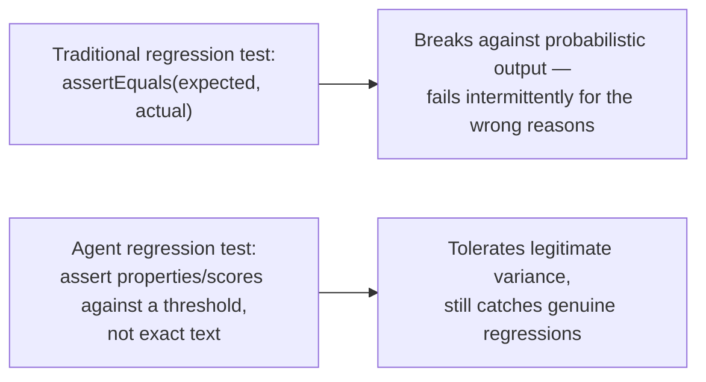

# Regression Testing for Agent Behavior

## Why this exists

You already have deep instincts about regression testing from your Java backend experience: a test suite that runs on every change, fails loudly when behavior regresses, and gives you confidence to refactor or upgrade a dependency without manually re-verifying everything by hand. This file is about adapting that exact discipline to agent behavior — and the adaptation is real, not cosmetic, because Phase 00's foundational fact (the same input can produce different output) breaks the core assumption ordinary regression testing relies on: that a test passing once, given fixed input, means it will keep passing given that same fixed input, until you change the code under test.

## Why "assertEquals" doesn't work here, and what replaces it

A traditional regression test asserts an exact expected value. Given everything from Phase 00 onward, asserting `assertEquals(expectedExactText, agent.run(task).finalAnswer())` will fail intermittently even when nothing is actually wrong — the model can phrase a correct answer differently across runs. This is not a reason to abandon regression testing for agents; it's a reason to change what a test actually asserts, replacing exact-match comparison with the evaluation techniques Phase 03 and the previous file already gave you: deterministic property checks where available, and calibrated LLM-as-judge scoring against explicit criteria where a property check isn't available.



## Building the test suite: a golden set of tasks with defined success criteria

This directly extends Phase 03, file 5's golden-set discipline from retrieval-specific precision/recall to full agent behavior — the underlying idea (a hand-curated set of realistic cases with known-correct expectations, re-run on every change) is identical; what changes is what counts as "correct" for a full agent task rather than a single retrieval.

```java
public record AgentTestCase(
    String taskDescription,
    List<PropertyCheck> deterministicChecks, // Phase 06-style checks: things you can verify with plain code
    String judgeCriteria,                     // for anything requiring the previous file's LLM-as-judge
    int minimumAcceptableJudgeScore
) {}

public interface PropertyCheck {
    boolean check(AgentResult result);
    String description();
}

List<AgentTestCase> regressionSuite = List.of(
    new AgentTestCase(
        "What's the current status of the payments-service pod in prod?",
        List.of(
            result -> result.finalAnswer().toLowerCase().contains("payments-service"),
            result -> result.toolCallCount() >= 1 // the agent must have actually checked, not guessed
        ),
        "Does the answer directly state the pod's health status, grounded in an actual tool call rather than assumption?",
        4
    )
    // ... additional realistic cases
);
```

Notice the second deterministic check: `result.toolCallCount() >= 1`. This is a genuinely important category of regression check specific to agents, with no clean analogue in ordinary application testing — it's not checking the *content* of the answer at all, it's checking the *behavior* that produced it. An agent that happens to generate a plausible-sounding but ungrounded answer without ever actually calling `get_pod_status` (a direct manifestation of Phase 01's hallucination risk) could still pass a content-only check if it guessed correctly, while genuinely failing the more important requirement that its answer be grounded in verified information rather than a plausible guess. Testing agent *behavior*, not just final output, is often where the most valuable regression checks live.

## Running the suite and aggregating results

```java
public class AgentRegressionRunner {

    private final ProductionAgentLoop agent;
    private final LlmJudge judge; // from the previous file, calibrated against a human baseline

    public RegressionReport runSuite(List<AgentTestCase> suite) {
        List<TestCaseResult> results = new ArrayList<>();

        for (AgentTestCase testCase : suite) {
            AgentResult agentResult = agent.run(testCase.taskDescription());

            List<String> failedDeterministicChecks = testCase.deterministicChecks().stream()
                .filter(check -> !check.check(agentResult))
                .map(PropertyCheck::description)
                .toList();

            JudgeVerdict verdict = judge.judge(
                testCase.taskDescription(), testCase.judgeCriteria(), agentResult.finalAnswer()
            );

            boolean passed = failedDeterministicChecks.isEmpty()
                && verdict.score() >= testCase.minimumAcceptableJudgeScore();

            results.add(new TestCaseResult(testCase, passed, failedDeterministicChecks, verdict));
        }

        return new RegressionReport(results);
    }
}
```

## The variance problem: running once is not enough

Because of Phase 00's foundational non-determinism, a single run of a single test case is weaker evidence than it would be for a deterministic system — a test that happens to pass once might fail on the next run given identical input, and vice versa. A more robust regression check runs each test case multiple times and evaluates the *pass rate*, not a single pass/fail:

```java
public class RepeatedRegressionRunner {

    private final AgentRegressionRunner runner;
    private final int repetitionsPerCase;

    public RegressionReport runWithRepetition(List<AgentTestCase> suite) {
        List<TestCaseResult> aggregated = new ArrayList<>();

        for (AgentTestCase testCase : suite) {
            List<TestCaseResult> repeatedResults = new ArrayList<>();
            for (int i = 0; i < repetitionsPerCase; i++) {
                repeatedResults.add(runner.runSingleCase(testCase));
            }

            double passRate = repeatedResults.stream()
                .mapToDouble(r -> r.passed() ? 1.0 : 0.0)
                .average()
                .orElse(0.0);

            aggregated.add(TestCaseResult.aggregated(testCase, passRate, repeatedResults));
        }

        return new RegressionReport(aggregated);
    }
}
```

This costs real money — Phase 01's cost mechanics apply directly, and running an entire suite several times per case multiplies your evaluation cost accordingly — but it's the honest engineering response to Phase 00's foundational fact, rather than pretending a single pass/fail result means what it would for a deterministic system. A test case with an 8-out-of-10 pass rate tells you something genuinely different, and more useful, than a single binary pass or fail: it tells you the task is *mostly* handled correctly, with a real, quantified failure rate worth investigating, rather than either false confidence (it passed once) or false alarm (it happened to fail once).

## Setting a threshold, not demanding perfection

Given repeated-run pass rates, the natural next question is what threshold constitutes "this still works" versus "this regressed." Demanding a 100% pass rate across all repetitions is usually unrealistic for a probabilistic system and will produce a test suite that's almost always red for reasons unrelated to actual quality. A more honest approach: establish a baseline pass rate for each test case (run the suite repeatedly against your current, accepted-as-working implementation, and record its typical pass rate), then flag a regression specifically when a change causes a *meaningful drop* from that baseline, not any deviation from 100%:

```java
public boolean isRegression(double baselinePassRate, double currentPassRate, double tolerancePercentagePoints) {
    return (baselinePassRate - currentPassRate) > tolerancePercentagePoints;
}
```

## Trade-offs and when this matters most

- For rapid early-stage iteration, running the full repeated suite on every single change is likely too slow and expensive to be practical — a smaller, single-run smoke-test subset for fast feedback, with the full repeated suite run less frequently (nightly, or before a release), is a reasonable compromise.
- For any change to a production agent's prompt, tool set, or underlying model version, the full repeated-run regression suite is exactly the safeguard that lets you make that change with actual confidence rather than hoping nothing broke — this is the direct agent-engineering equivalent of why you wouldn't ship a change to a critical service without running its test suite.
- Don't chase a 100% pass-rate threshold as a design goal — per the discussion above, this misunderstands what a probabilistic system's test results actually mean, and a suite calibrated to demand perfection will either be perpetually red for benign reasons or quietly loosened until it's not actually testing anything meaningful.

## Why this matters next

You now have a repeatable way to catch behavioral regressions, using both deterministic checks and calibrated judge scoring across repeated runs. The remaining piece of this phase's picture is the aggregate operational view — not "is this one test case still passing," but "what is this agent system actually costing and how fast is it responding, across all real production traffic, over time" — which the next file builds directly on top of Phase 01's cost mechanics and Phase 07's budget enforcement.