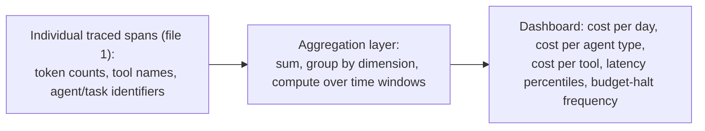
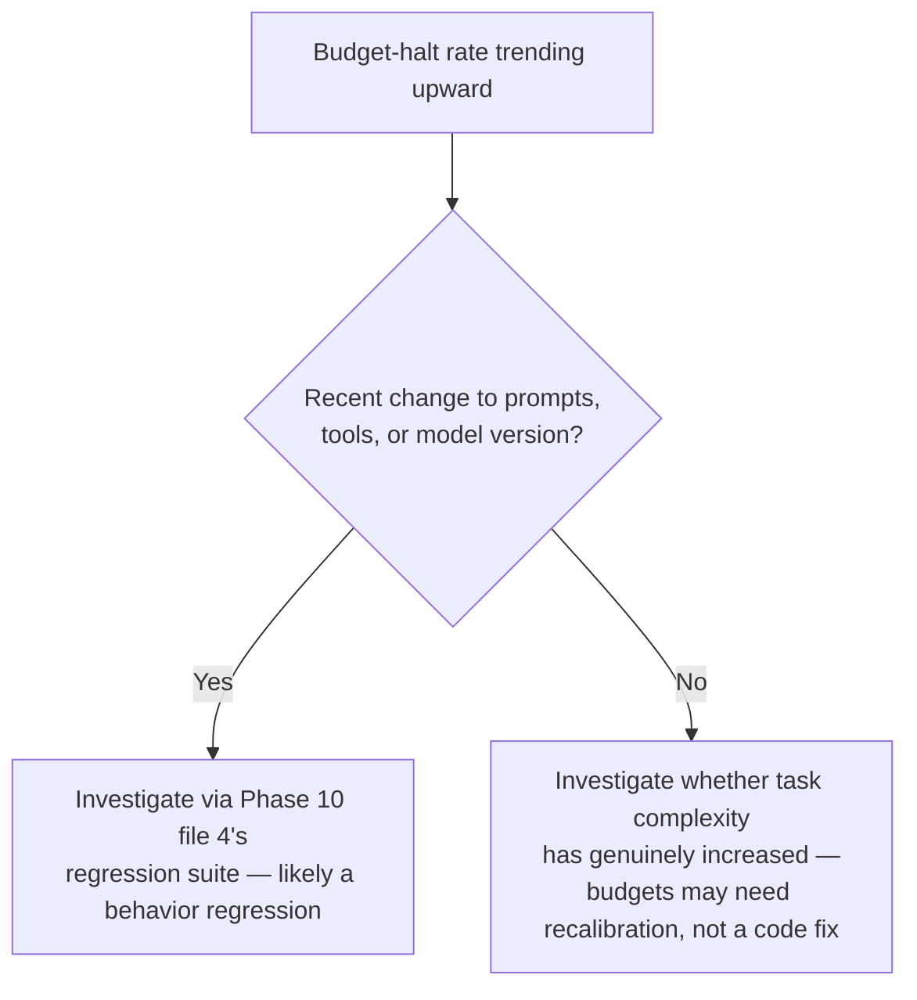

# Cost and Latency Dashboards

## Why this exists

Phase 01, file 6 taught you to estimate cost and latency for a single call, before you'd built anything. Phase 07, file 4 taught you to enforce hard budgets for a single agent run, as a safety mechanism against runaway loops. This file is the missing third piece: aggregate, ongoing, operational visibility across *all* real traffic over time — not a single call's estimate, not a single run's budget enforcement, but the dashboard-level view that lets you answer questions like "did last week's prompt change increase our average cost per request," "which specific tool or agent is responsible for our cost trend going up," and "are we seeing more budget halts than usual, and why" — the same class of operational questions you already ask about any production service's resource consumption, applied here to token-driven cost and generation-driven latency.

## Why this needs to be a distinct dashboard, not just infrastructure cost monitoring

It's tempting to assume your existing infrastructure cost dashboards (cloud spend, compute utilization) already cover this. They don't, for a specific structural reason: LLM API cost is usually a third-party billing line item, not compute you provision and can observe through your own infrastructure metrics — you don't see "this pod's CPU usage spiked," you see a vendor invoice, often with a lag, and often without per-feature or per-agent breakdown unless you've built that breakdown yourself from the tracing data in file 1. The tracing infrastructure from file 1 is exactly what makes a proper cost dashboard possible: every span you instrumented there, with its `llm.input_tokens` and `llm.output_tokens` attributes, is the raw data this file aggregates into something operationally useful.



## The dimensions worth aggregating along

**Cost over time, at the whole-system level** — the most basic view, but the one that catches the broadest class of problem: an unexpected step change in total spend, which might indicate a traffic increase (expected and fine), a prompt or model change that increased average tokens per call (worth investigating), or, in the worst case, a bug producing more agent runs or more iterations per run than intended.

**Cost broken down by agent or task type** — in a system with multiple distinct agents (Phase 09), an aggregate cost figure alone doesn't tell you *where* a cost increase originated. Breaking cost down per agent type (search agent vs. summarizer agent vs. supervisor overhead) directly answers the question Phase 09, file 1 raised about tracking nested worker costs — here, aggregated across many runs rather than one.

```java
public record CostAggregation(String dimension, double totalCostUsd, long callCount, double avgCostPerCall) {}

public List<CostAggregation> aggregateCostByAgentType(List<TracedSpan> spans, Instant since) {
    return spans.stream()
        .filter(span -> span.timestamp().isAfter(since))
        .filter(span -> span.attributes().containsKey("agent.type"))
        .collect(Collectors.groupingBy(span -> span.attributes().get("agent.type")))
        .entrySet().stream()
        .map(entry -> {
            double total = entry.getValue().stream().mapToDouble(TracedSpan::costUsd).sum();
            long count = entry.getValue().size();
            return new CostAggregation(entry.getKey(), total, count, total / count);
        })
        .toList();
}
```

**Cost broken down by tool** — a direct extension of Phase 05's tool-design discipline: if one specific tool's results tend to be unusually large (a log-fetching tool returning excessive lines, say), the cost of feeding that tool's output back into context (Phase 01's input-token cost) shows up disproportionately in a per-tool cost breakdown, giving you a concrete, evidence-based signal to revisit that specific tool's design — for instance, adding a tighter default on `log_lines` (Phase 05, file 1's schema constraint discussion) rather than guessing at which tool needs attention.

**Latency percentiles, not just averages** — exactly the discipline you already apply to any other service's latency monitoring: an average latency figure can look fine while a meaningful fraction of requests take far longer, degrading the experience for a subset of users without moving the average much. Track p50, p95, and p99 latency for agent runs specifically, and — per Phase 02, file 4's discussion of streaming — consider time-to-first-token as a distinct metric from total completion time, since these serve different purposes: time-to-first-token matters for perceived responsiveness in interactive use; total completion time matters for anything waiting on the complete result before proceeding.

**Budget-halt frequency** (Phase 07, file 4) — a genuinely important operational metric with no equivalent in ordinary service monitoring: how often are agent runs hitting their iteration, cost, or time budget without reaching a natural conclusion? A rising trend here is a direct, early warning sign of either a prompt or tool-set regression causing the agent to reason less effectively (worth investigating via file 4's regression suite) or a genuine increase in task complexity beyond what your budgets were calibrated for (worth revisiting the budget values themselves, per Phase 07, file 4's calibration guidance).



## A minimal dashboard data model

```java
public record AgentOperationalMetrics(
    Instant windowStart,
    Instant windowEnd,
    double totalCostUsd,
    long totalRuns,
    double avgCostPerRun,
    double p50LatencyMs,
    double p95LatencyMs,
    double p99LatencyMs,
    long budgetHaltCount,
    double budgetHaltRate,
    Map<String, Double> costByAgentType,
    Map<String, Double> costByToolName
) {}
```

This shape is deliberately built to answer the operational questions this file opened with directly, from a single aggregated object — the kind of summary you'd want surfaced on an actual dashboard (built with whatever visualization tooling your team already uses for other operational metrics, since nothing about this data is exotic once it's been aggregated into this shape) rather than requiring someone to query raw trace data by hand every time a cost question comes up.

## Trade-offs and when this matters most

- For a low-volume internal tool, informal periodic review of raw cost figures (a monthly check against your provider's billing dashboard) is likely sufficient — a full aggregation pipeline and dedicated dashboard is more infrastructure than the actual volume justifies.
- For anything at meaningful production scale, especially any multi-agent system (Phase 09) where cost and latency can originate from several independently-scaled components, dedicated aggregation and dashboarding is what turns "our AI costs went up" from a vague, hard-to-investigate complaint into a specific, attributable, actionable finding.
- Don't build elaborate dashboards before you have the tracing foundation from file 1 in place — aggregation is only as good as the underlying span data, and a dashboard built on incomplete or inconsistent tracing attributes will produce misleading aggregate figures that look authoritative while actually being unreliable.

## Why this matters next

You now have the complete observability and evaluation toolkit for this phase: structural tracing (file 1), safe content logging (file 2), calibrated LLM-as-judge scoring (file 3), repeatable regression testing that accounts for genuine variance (file 4), and aggregate operational cost/latency visibility (this file). The final project asks you to assemble all five into one working evaluation harness, applied to the Phase 09 multi-agent research pipeline — the most complex system this handbook has built, and exactly the kind of system where skipping any one of these five pieces would leave a real, dangerous blind spot.