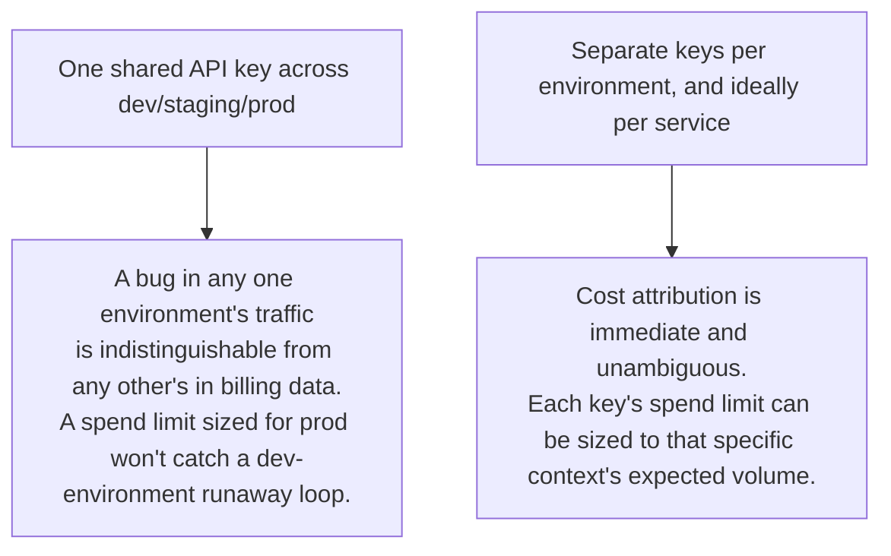
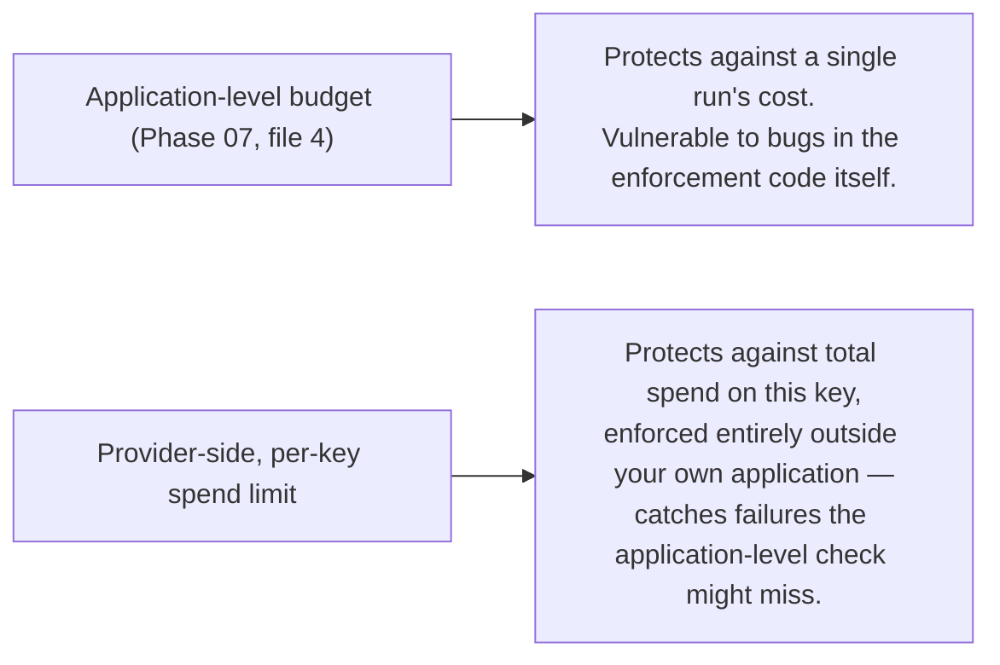

# Secrets and Config Management

## Why this exists

Phase 02, file 3 introduced the core claim this file gives full production treatment: an LLM API key's cost blast radius is unusually direct compared to most credentials, because using it *is* incurring real, billable cost with zero additional steps required, unlike a leaked database credential that typically needs further exploitation to cause financial damage. This file is about what that claim means concretely once you're operating multiple environments, multiple services, and — given Phase 07's agent loops and Phase 09's multi-agent systems — components that can call the model API far more frequently and unpredictably than a human clicking through a UI ever would.

## Per-environment, per-service key scoping — not a convenience, a containment boundary

The single most consequential secrets-management decision for an agent system is refusing to share one API key across environments or services, and it's worth being precise about why this matters more here than for, say, a shared database read-replica credential. If a single key is used across dev, staging, and production, and a bug in a dev-environment agent loop (an infinite retry, a misconfigured budget per Phase 07, file 4) starts hammering the API, you cannot distinguish that dev traffic from real production billing without deep, after-the-fact log archaeology — and worse, a per-key spend limit (discussed next) set to accommodate production volume would fail to catch a runaway dev-environment bug at all, since it's all the same key.



```java
@ConfigurationProperties(prefix = "agent.llm")
public record LlmProperties(
    String provider,
    String apiKey,      // sourced from a distinct secret per environment — never a shared default
    String environment  // "dev", "staging", "prod" — used purely for validation/logging, never to select behavior silently
) {}
```

## Spend limits as a first-class, per-key safety control

Most providers let you configure a spend limit directly on an API key, independent of anything your own application code enforces. This is worth treating as a distinct, essential layer on top of Phase 07, file 4's application-level budget enforcement, not a redundant belt-and-suspenders afterthought — the provider-side limit catches exactly the failure mode your own application-level budget *can't*: a bug in the budget-enforcement code itself, a misconfigured `max-cost-usd` value (the kind of mistake the previous file's startup validation aims to catch, but might still miss), or an entirely different, unexpected code path that bypasses your intended budget logic altogether. A provider-side spend limit is enforced by infrastructure outside your own application's control, which is precisely what makes it a genuine safety net rather than one more application-level check that shares the same blind spots as the code it's meant to guard against.



## Secret storage and rotation — reusing what you already operate

None of this requires new secrets infrastructure — the discipline is identical to any other credential you already manage via a secrets manager (AWS Secrets Manager, Vault, Kubernetes Secrets), loaded into your service via environment variables or a mounted secret, never committed to source control or baked into a container image:

```yaml
# Kubernetes Secret reference, exactly as you'd already configure for a database credential
env:
  - name: LLM_API_KEY
    valueFrom:
      secretKeyRef:
        name: agent-service-llm-key-prod
        key: api-key
```

The one genuinely different rotation consideration, versus a typical credential: rotating a database password usually requires coordinating a brief connection-pool refresh, well-understood infrastructure you already have patterns for. Rotating an LLM API key is simpler in one respect (no persistent connections to drain, since every call is a fresh, stateless HTTP request per Phase 02, file 2) but requires the same discipline of never allowing a rotation gap where the old key is invalidated before the new one is confirmed working, exactly the pattern you'd already apply to any credential rotation.

## Auditing which service and environment is actually spending what

Given multiple scoped keys (per this file's core recommendation), your Phase 10, file 5 cost dashboard should break down spend by key/environment/service as one of its standard dimensions, not just by agent type or tool — this is what lets you answer "is our staging environment's traffic unexpectedly expensive" as a direct dashboard query rather than a manual investigation:

```java
public record ScopedSpendReport(
    String environment,
    String serviceName,
    double totalCostUsd,
    double providerSpendLimitUsd,
    double percentOfLimitUsed
) {}
```

Tracking `percentOfLimitUsed` explicitly, and alerting well before it approaches 100%, gives you a proactive warning rather than discovering a spend limit was hit only when requests start failing — exactly the same operational instinct you'd already apply to any other resource approaching a hard quota (disk space, connection pool exhaustion, API rate limits on another service).

## Trade-offs and when this matters most

- For a solo prototype hitting a free or low-volume tier, a single API key with a conservative spend limit is entirely reasonable — the full per-environment, per-service scoping discipline is more structure than the actual risk justifies at that scale.
- For any team-shared or production deployment, per-environment (at minimum) key scoping with provider-side spend limits is not optional hardening — it's the direct, evidence-based response to the specific cost-blast-radius property this credential type has, which Phase 02, file 3 first flagged and which becomes materially more consequential once agent loops (Phase 07) and multi-agent systems (Phase 09) are the thing making the calls, since both can generate far more request volume, far faster, than a human-driven interface would.
- Don't rely on application-level budget enforcement (Phase 07, file 4) as your only safeguard against runaway cost — it's necessary, but the provider-side spend limit is the layer that protects you specifically against a failure in that same application-level logic.

## Why this matters next

You now have the secrets and cost-containment discipline this handbook has been building toward since Phase 02. The next file covers a different kind of cost control — reducing the number of calls you make in the first place, using a technique with no real analogue in ordinary REST service caching: semantic caching, which exploits Phase 03's embedding-similarity machinery to recognize when a new request is close enough to a previous one to reuse its answer.