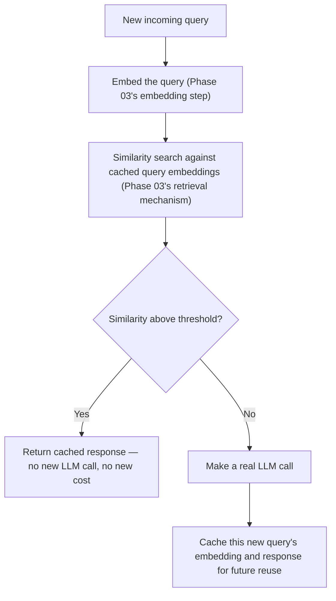
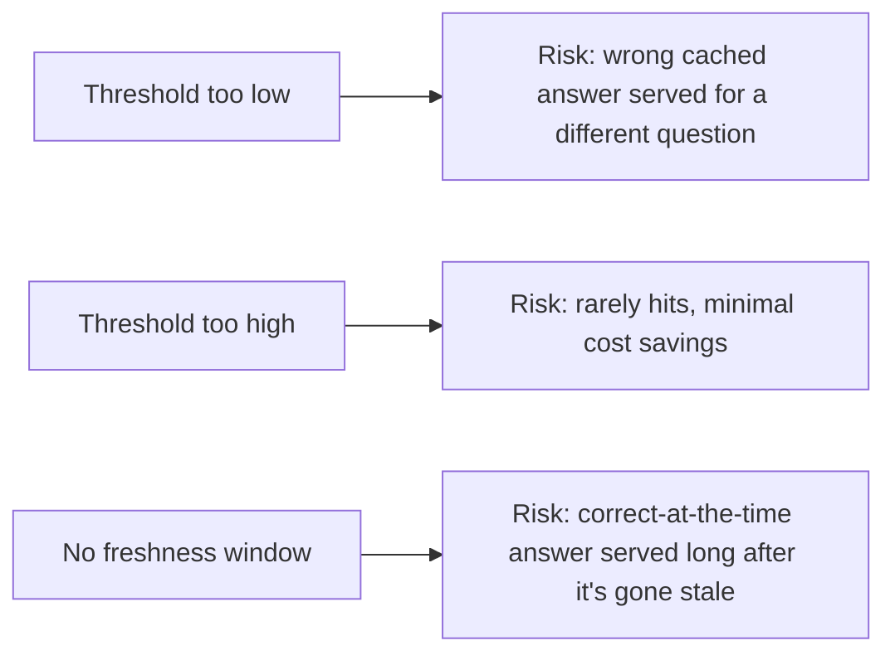
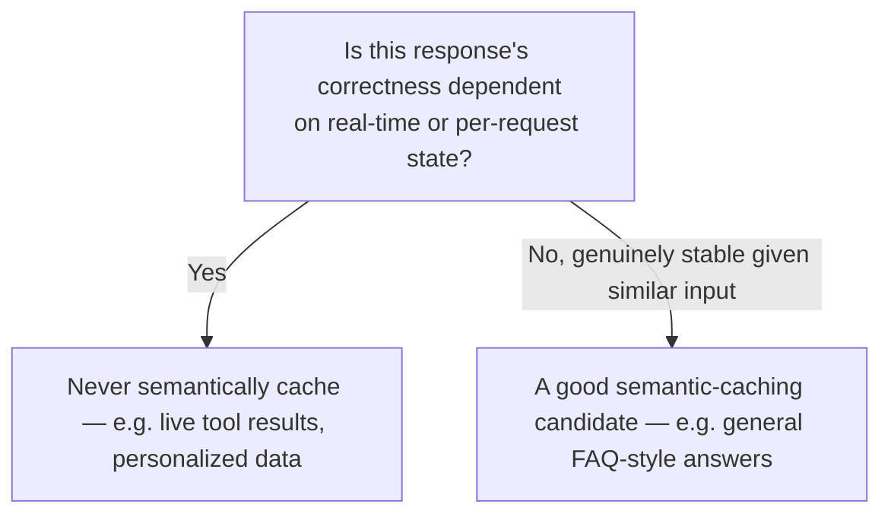

# Semantic Caching for Cost Control

## Why this exists

An ordinary cache — the kind you already use constantly in backend work — matches on an exact key: the same request produces the same cache hit, and a single differing character produces a miss. This works perfectly for deterministic systems, but it interacts oddly with an LLM-backed service for two compounding reasons you already know from earlier phases: Phase 00 established that even the *identical* input can legitimately produce different output, so an exact-match cache is caching one arbitrary sample from a distribution, not "the" answer; and, more practically useful for cost control, real user queries are rarely byte-for-byte identical even when they're asking the same underlying question — "what's our refund policy" and "how do refunds work" are different strings that would both miss an exact-match cache despite deserving the same cached answer. Semantic caching solves the second problem directly, by reusing exactly the vector-similarity machinery Phase 03 built for retrieval, applied here to requests themselves rather than documents.

## The core idea, directly reusing Phase 03's mechanics

Instead of hashing a request string for an exact-match cache key, embed the incoming query (Phase 03's embedding step, identical mechanism) and compare it via cosine similarity (Phase 03, file 2) against the embeddings of previously-cached queries. If a sufficiently similar prior query exists above a similarity threshold, return its cached response instead of making a new, real API call.



## A working implementation, built entirely from Phase 03's existing pieces

```java
public record CachedResponse(String queryText, double[] queryVector, String response, Instant cachedAt) {}

public class SemanticCache {

    private final InMemoryVectorStore cacheStore; // the exact class from Phase 03, file 4
    private final EmbeddingClient embeddingClient; // the exact class from Phase 03, file 4
    private final double similarityThreshold;
    private final Duration maxCacheAge;

    public Optional<String> lookup(String query) throws Exception {
        double[] queryVector = embeddingClient.embed(query);
        List<EmbeddedChunk> candidates = cacheStore.findTopK(queryVector, 1);

        if (candidates.isEmpty()) {
            return Optional.empty();
        }

        EmbeddedChunk topMatch = candidates.get(0);
        double similarity = CosineSimilarity.compute(queryVector, topMatch.vector()); // Phase 03, file 2

        boolean isFreshEnough = Instant.parse(topMatch.metadata().get("cachedAt"))
            .isAfter(Instant.now().minus(maxCacheAge));

        if (similarity >= similarityThreshold && isFreshEnough) {
            return Optional.of(topMatch.text()); // the cached response text
        }
        return Optional.empty();
    }

    public void store(String query, String response) throws Exception {
        double[] queryVector = embeddingClient.embed(query);
        cacheStore.add(new EmbeddedChunk(
            response, queryVector,
            Map.of("originalQuery", query, "cachedAt", Instant.now().toString())
        ));
    }
}
```

Notice how little genuinely new code this required — every piece (`InMemoryVectorStore`, `EmbeddingClient`, `CosineSimilarity`) is a direct reuse of Phase 03's retrieval infrastructure, applied to a different corpus (past queries and their responses, instead of documents). This is worth sitting with as a broader lesson about how mature engineering knowledge compounds: once you've genuinely understood vector similarity as a general mechanism (Phase 03, file 2), you can recognize and apply it to a problem — caching — that doesn't look like a "retrieval" problem on the surface, but is structurally identical underneath.

## Why the similarity threshold and freshness window both matter, and can't be set carelessly

**The similarity threshold** is a direct trade-off between cache hit rate (cost savings) and correctness risk: too low, and genuinely different queries ("what's our refund policy" versus "what's our warranty policy") could incorrectly match, serving a wrong cached answer for a real cost saving that isn't worth the correctness risk. Too high, and you'll rarely get cache hits at all, since real user phrasing varies more than a very strict threshold tolerates — this needs the same evaluation discipline Phase 03, file 5 established for retrieval quality: build a small set of query pairs you've manually judged as "should match" and "should not match," and tune the threshold against that judgment rather than picking an arbitrary number.

**The freshness window** exists because a cached response can become stale for reasons that have nothing to do with the query's semantic content — a cached answer about current pricing, refund policy, or system status can be perfectly semantically matched to a new query while being factually outdated, since the underlying facts changed even though the question didn't. This is a genuinely different staleness concern than ordinary cache invalidation, which usually invalidates on a data-change event; here, you often don't have a clean invalidation signal at all (nothing tells your cache "the refund policy changed"), so a bounded freshness window is a pragmatic, if imperfect, defense.



## What semantic caching should never be applied to

Recall Phase 05's tool-calling and Phase 06's structured extraction: caching is appropriate for relatively stable, informational responses (FAQ-style answers, general explanations) and inappropriate for anything where the response depends on real-time, per-request state — a tool call checking a live pod's current status (Phase 05's example) should never be served from a semantic cache, since the entire point of that call is to reflect the *current* state at the moment of the request, not a similar-sounding past state. Semantic caching belongs in front of the parts of an agent's behavior that are genuinely stable given similar input, not in front of anything whose correctness depends on real-time data.



## Trade-offs and when this matters most

- For a low-volume internal tool, semantic caching's engineering cost (threshold tuning, freshness management, the vector-store infrastructure itself) likely exceeds the actual cost savings it would produce — this is an optimization worth deferring until real traffic volume justifies it.
- For a high-volume, FAQ-style production agent where many users genuinely ask semantically similar questions repeatedly, semantic caching can meaningfully reduce cost (Phase 01) without a corresponding drop in answer quality, provided the threshold and freshness window are properly tuned and evaluated, not just configured with default guesses.
- Don't apply semantic caching indiscriminately across an entire agent's surface — the distinction between stable, cacheable responses and real-time, non-cacheable ones (the diagram above) needs to be a deliberate, per-capability design decision, not a blanket policy applied everywhere for uniform cost savings.

## Why this matters next

Semantic caching reduces how often you call the model at all. The next file addresses what happens when you do call it, and the call volume — whether cached or not — runs into limits imposed by the provider itself: rate limiting and backpressure, extending Phase 02, file 9's single-client resilience patterns to the scale of your entire service's aggregate traffic.