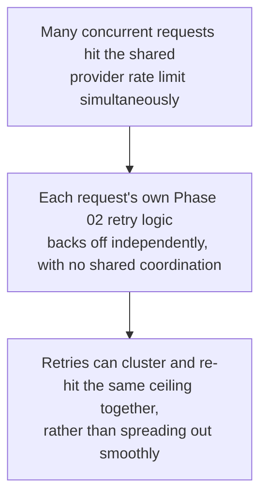
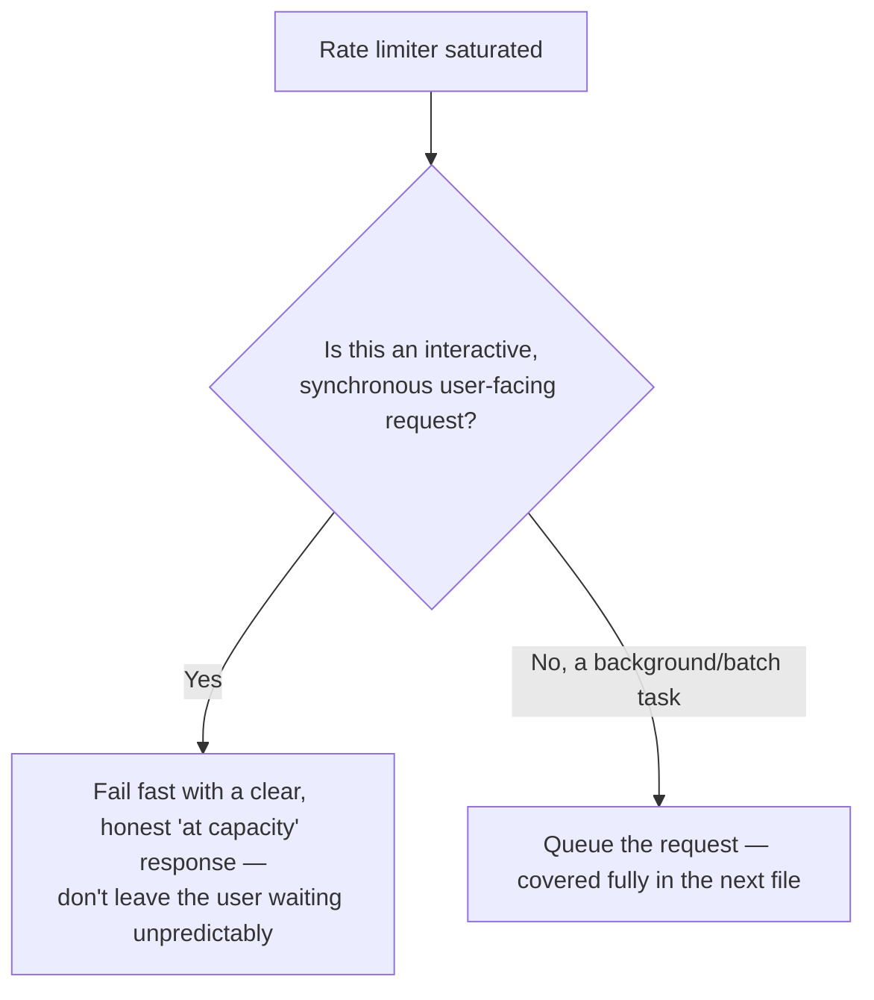

# Rate Limiting and Backpressure

## Why this exists

Phase 02, file 9 built resilience for a single client's individual calls — retry with backoff on a 429, respecting a `Retry-After` header, a circuit breaker for sustained provider degradation. That file's scope was one client hitting one endpoint. This file is about the scale problem that emerges once that client is embedded in a real production service handling real, aggregate concurrent traffic: your entire service, not just one call, can be rate-limited by the provider, and how your service behaves under that shared, external constraint — whether it degrades gracefully or falls over — is a genuinely distinct engineering problem from any single call's retry logic.

## Why this is a different problem than Phase 02's per-call resilience

Phase 02, file 9's `ResilientLlmClient` handles one call encountering a 429 by retrying that specific call with backoff. In a production service handling many concurrent requests, a provider-side rate limit is usually expressed as a ceiling on requests-per-minute or tokens-per-minute *across your entire account or API key*, not per individual call. This means many concurrent requests can all independently hit that same shared ceiling simultaneously, and if each one just runs Phase 02, file 9's retry logic independently, you get a thundering-herd problem: many requests all backing off and retrying on similar schedules, potentially re-hitting the same ceiling in near-lockstep rather than smoothly spreading out.



## The fix: a shared, service-level rate limiter in front of the provider call

Rather than relying purely on reactive, per-call retry after a 429 already occurred, a production service should proactively throttle its own outgoing call rate to stay under the provider's known limit, using a shared rate limiter every request path goes through — conceptually identical to a token-bucket rate limiter you'd already use to protect your own service from being overwhelmed by inbound traffic, applied here to your own outbound traffic toward a rate-limited dependency:

```java
@Component
public class SharedLlmRateLimiter {

    private final RateLimiter rateLimiter; // e.g. Resilience4j's RateLimiter, or Guava's

    public SharedLlmRateLimiter(@Value("${agent.llm.requests-per-minute-limit}") int requestsPerMinute) {
        RateLimiterConfig config = RateLimiterConfig.custom()
            .limitForPeriod(requestsPerMinute)
            .limitRefreshPeriod(Duration.ofMinutes(1))
            .timeoutDuration(Duration.ofSeconds(5)) // how long a caller waits for a permit before giving up
            .build();
        this.rateLimiter = RateLimiter.of("llmProvider", config);
    }

    public ChatResponse sendThrottled(ChatRequest request, LlmClient underlyingClient) throws Exception {
        return RateLimiter.decorateCheckedSupplier(rateLimiter, () -> underlyingClient.send(request))
            .get();
    }
}
```

Every call path in your service — whether from a single-agent loop (Phase 07) or from multiple concurrent agents in a multi-agent system (Phase 09) — routes through this same shared limiter, so your service proactively self-throttles to stay under the provider's known ceiling rather than discovering it reactively via 429 responses scattered across many concurrent requests. This is a direct, deliberate shift from purely reactive resilience (Phase 02, file 9) to proactive traffic shaping, layered on top of, not replacing, that earlier reactive logic — a request that somehow still gets a 429 despite proactive throttling (a limit change on the provider's side, an underestimated actual ceiling) still needs Phase 02, file 9's retry-with-backoff as a fallback.

## Backpressure: what to do when the rate limiter itself is saturated

A rate limiter with a bounded `timeoutDuration` (as configured above) means a caller waiting for a permit will eventually give up rather than queuing indefinitely — and what your service does at that point is a genuine design decision, not an afterthought. For a synchronous, interactive request (a user waiting on a chat response), the honest options are limited: return a clear "the service is currently at capacity, please try again shortly" response, rather than making the user wait indefinitely with no feedback, or silently queuing in a way that produces an unpredictably long wait with no visibility into why.

```java
public ResponseEntity<AgentResponseDto> handleChatRequest(String userMessage) {
    try {
        ChatResponse response = sharedRateLimiter.sendThrottled(request, llmClient);
        return ResponseEntity.ok(new AgentResponseDto(response.content().get(0).text()));
    } catch (RequestNotPermitted e) {
        return ResponseEntity.status(HttpStatus.SERVICE_UNAVAILABLE)
            .body(new AgentResponseDto("The service is currently at capacity. Please try again in a moment."));
    }
}
```

For an asynchronous workload — which the next file covers in depth — backpressure looks different: rather than failing the caller immediately, a request can be placed onto a queue and processed as capacity becomes available, with the caller notified when the result is ready rather than blocked waiting synchronously. Which of these two postures is appropriate depends entirely on whether the workload is interactive (favor fast, honest failure over an unpredictable wait) or batch-oriented (favor queuing, since there's no user synchronously waiting on an immediate response).



## Prioritization: not all agent traffic deserves equal treatment under pressure

A more sophisticated production posture, once basic rate limiting is in place, is prioritizing which requests get scarce capacity when the provider-side limit is genuinely constraining — a real-time, user-facing chat interaction plausibly deserves priority over a background batch job (Phase 06's invoice extraction, for instance) that has more tolerance for delay. This is the same prioritization instinct you'd already apply to any shared, constrained resource in a multi-tenant or multi-workload system, applied here to LLM API capacity specifically:

```java
public enum RequestPriority { INTERACTIVE, BATCH }

@Component
public class PriorityAwareRateLimiter {

    private final RateLimiter interactiveLimiter; // a larger share of the available capacity
    private final RateLimiter batchLimiter;        // a smaller, more constrained share

    public ChatResponse send(ChatRequest request, RequestPriority priority, LlmClient client) throws Exception {
        RateLimiter limiter = priority == RequestPriority.INTERACTIVE ? interactiveLimiter : batchLimiter;
        return RateLimiter.decorateCheckedSupplier(limiter, () -> client.send(request)).get();
    }
}
```

## Trade-offs and when this matters most

- For a low-traffic internal tool well under any provider rate limit, this file's shared rate limiter and prioritization scheme add complexity without a corresponding real risk to mitigate — Phase 02, file 9's per-call retry logic alone is likely sufficient.
- For any production service with meaningful concurrent traffic — especially one with both interactive and batch workloads sharing the same provider account — a shared, proactive rate limiter with priority-aware capacity allocation is a real, worthwhile investment, directly preventing the thundering-herd problem this file opened with and ensuring your most latency-sensitive traffic doesn't silently starve behind a large batch job.
- Don't rely purely on reactive 429 handling (Phase 02, file 9) as your only defense at production scale — proactive, service-level throttling is what prevents your own aggregate traffic from being the cause of the rate-limit errors in the first place, rather than only reacting gracefully once they occur.

## Why this matters next

You now have a service that proactively manages its own outgoing rate against a shared provider limit, with a sensible degradation posture for interactive traffic when capacity runs out. The next file covers the batch side of that degradation posture properly: how to architect an entire workload — not just a single request's fallback behavior — around asynchronous, queue-based processing, appropriate for the significant share of real agent workloads that don't need synchronous, immediate response times at all.