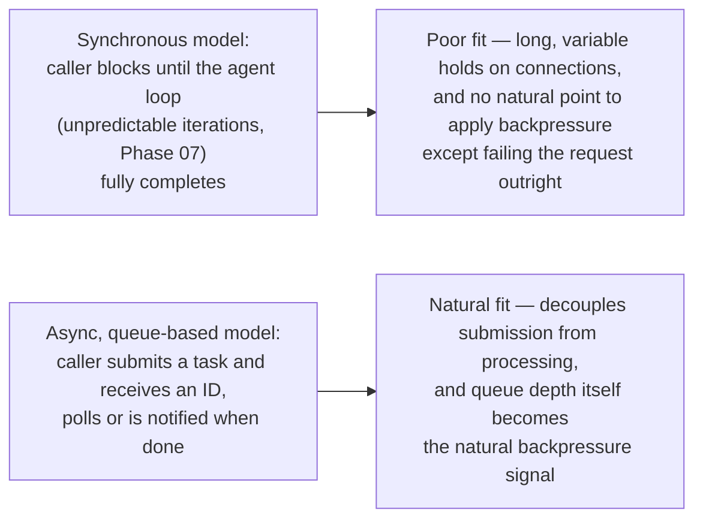
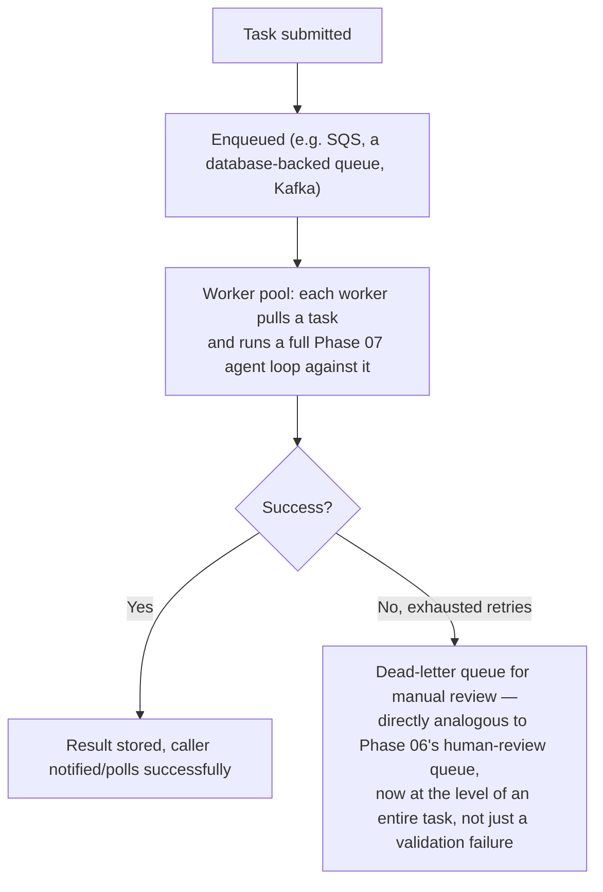

# Scaling Async Agent Workloads

## Why this exists

The previous file's backpressure discussion drew a sharp line between interactive workloads (fail fast when capacity is constrained) and batch workloads (queue instead). This file is about properly architecting that batch side — not as a fallback behavior bolted onto an otherwise-synchronous service, but as a deliberate architectural choice for the significant share of real agent work that has no synchronous user waiting on an immediate response at all: Phase 06's invoice extraction pipeline, Phase 09's research agent processing a backlog of questions, any agent task triggered by an event rather than a live user interaction.

## Why agent workloads are unusually well-suited to async, queue-based processing

You already know queue-based architectures well from ordinary backend work — decoupling request submission from processing, smoothing out load spikes, enabling independent scaling of producers and consumers. Agent workloads are a particularly strong fit for this pattern, for reasons directly traceable to Phase 01's cost and latency mechanics: LLM calls have meaningfully higher and more variable latency than a typical database query or internal service call (Phase 01, file 6's autoregressive-generation latency discussion), and Phase 07's agent loops can run for a genuinely unpredictable number of iterations before completing. A synchronous request/response model forces a caller to hold a connection open for however long an unpredictable, multi-step agent loop takes — a poor fit for exactly the kind of variable, sometimes-lengthy processing this handbook's later phases have built.



## The basic architecture



```java
@Service
public class AsyncAgentTaskProcessor {

    private final ProductionAgentLoop agentLoop; // Phase 07's complete, budgeted agent loop, unchanged
    private final TaskResultStore resultStore;

    @SqsListener("agent-task-queue") // or your queue technology of choice — the pattern is the same regardless
    public void processTask(AgentTaskMessage message) {
        AgentResult result = agentLoop.run(message.taskDescription());

        if (result.isSuccess()) {
            resultStore.storeSuccess(message.taskId(), result.finalAnswer());
        } else {
            resultStore.storeFailure(message.taskId(), result.failureReason());
            // A task that exhausted its Phase 07 budget or failed validation (Phase 06)
            // is a candidate for the dead-letter queue, not an infinite requeue-and-retry —
            // the same reasoning Phase 06, file 3 applied to a single malformed extraction
            // applies here to an entire failed task.
        }
    }
}

@RestController
public class AgentTaskController {

    private final TaskQueue taskQueue;
    private final TaskResultStore resultStore;

    @PostMapping("/agent-tasks")
    public ResponseEntity<TaskSubmissionResponse> submit(@RequestBody TaskRequest request) {
        String taskId = taskQueue.enqueue(request.taskDescription());
        return ResponseEntity.accepted().body(new TaskSubmissionResponse(taskId, "/agent-tasks/" + taskId));
    }

    @GetMapping("/agent-tasks/{taskId}")
    public ResponseEntity<TaskStatusResponse> getStatus(@PathVariable String taskId) {
        return resultStore.getStatus(taskId)
            .map(ResponseEntity::ok)
            .orElse(ResponseEntity.notFound().build());
    }
}
```

Notice that `agentLoop.run(...)` is exactly Phase 07, file 4's `ProductionAgentLoop`, completely unchanged — this file's async architecture is a *wrapper* around the same agent logic you've already built, not a different agent implementation. This is a genuinely valuable property worth naming explicitly: the same `ProductionAgentLoop` class can serve both a synchronous, interactive endpoint (guarded by the previous file's rate limiter, with fail-fast backpressure) and this asynchronous, queue-based worker path, without any duplication of the actual agent behavior — only the surrounding orchestration differs based on which latency and backpressure model the workload actually needs.

## Scaling workers independently of your interactive service

A direct benefit of this architecture, familiar from any queue-based system you've already built: the worker pool consuming `agent-task-queue` can scale independently of whatever service handles interactive traffic, using whatever autoscaling mechanism you already operate (Kubernetes HPA, based on queue depth as the scaling signal rather than CPU/memory, which is often a better fit for a workload whose bottleneck is external API latency rather than local compute):

```yaml
apiVersion: autoscaling/v2
kind: HorizontalPodAutoscaler
metadata:
  name: agent-worker-autoscaler
spec:
  scaleTargetRef:
    kind: Deployment
    name: agent-task-worker
  minReplicas: 2
  maxReplicas: 20
  metrics:
    - type: External
      external:
        metric:
          name: agent_task_queue_depth # a custom metric reflecting actual queue backlog
        target:
          type: AverageValue
          averageValue: "10" # target ~10 pending tasks per worker replica
```

Scaling on queue depth rather than CPU is worth calling out specifically: an agent worker spends most of its wall-clock time waiting on the LLM provider's response (Phase 01's latency characteristics), not consuming local CPU — a CPU-based autoscaling signal would badly under-scale this workload, since the bottleneck genuinely isn't compute-bound in the way a typical CPU-scaled service's workload is.

## Interaction with the previous file's rate limiting

Worker pool scaling and the previous file's shared rate limiter need to work together, not against each other: scaling your worker pool up to twenty replicas doesn't help if the provider's rate limit caps your effective aggregate throughput regardless of how many workers are concurrently trying to call it — the shared rate limiter from the previous file should sit in front of *all* traffic, interactive and batch alike, so worker pool scaling increases parallelism up to the rate limiter's ceiling, not beyond it, and the previous file's priority scheme (interactive traffic favored over batch) determines how that shared ceiling gets allocated when both workloads are active simultaneously.

## Trade-offs and when this matters most

- For a small, low-volume batch task (a nightly job processing a handful of invoices), a simple sequential loop without full queue infrastructure is a reasonable, proportionate choice — this file's architecture is for genuine scale, not a default for any non-interactive task.
- For any workload with meaningful, variable volume — a backlog that can spike unpredictably, or work arriving continuously from an upstream event source — the queue-based architecture directly solves the load-smoothing and independent-scaling problems this file opened with, and reuses your existing queue and autoscaling infrastructure with only the queue-depth-based scaling metric as a genuinely new consideration.
- Don't scale worker replica count without considering the shared rate limiter's ceiling from the previous file — additional worker capacity beyond what the provider's rate limit can actually sustain doesn't increase real throughput, it just increases how many workers are simultaneously waiting on the same constrained resource.

## Why this matters next

You now have both halves of a properly scaled agent service: interactive traffic with proactive rate limiting and honest fail-fast backpressure (previous file), and batch traffic on an independently-scaled, queue-based worker architecture (this file). The next file shifts from infrastructure scaling to a different, equally important production discipline: treating the prompts, tool definitions, and agent configuration themselves as versioned artifacts, with the same rigor you already apply to API versioning and database schema migrations.