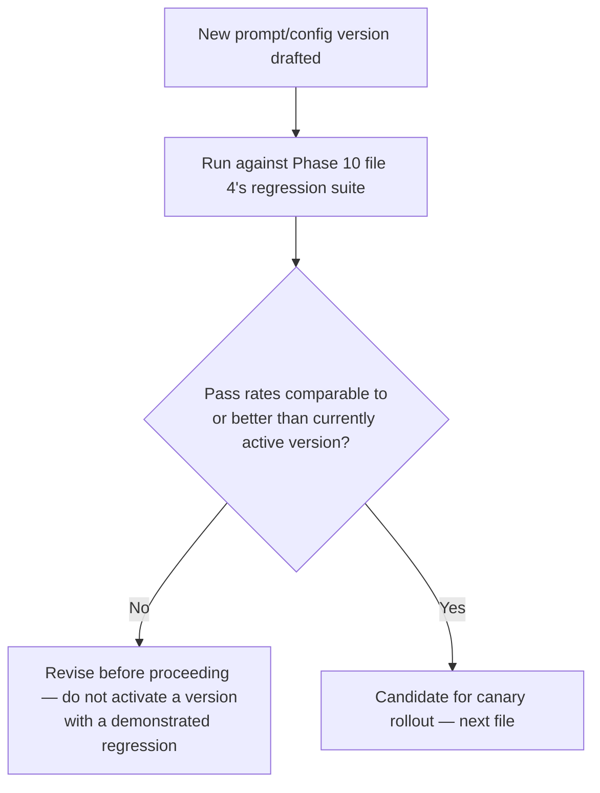

# Prompt and Agent Versioning

## Why this exists

You already version your API contracts and manage your database schema through migrations, because you know an uncontrolled, undocumented change to either can break consumers or corrupt data in ways that are hard to trace back to their actual cause. A system prompt, a tool's schema (Phase 05, file 1), a memory strategy's configuration (Phase 04), and an agent's budget values (Phase 07, file 4) are exactly the same category of artifact — they directly determine your system's behavior — and yet it's common for agent systems to treat them as loose strings edited in place, with no versioning, no change history, and no way to correlate "the agent started behaving differently" with "which specific change caused it." This file is about closing that gap using discipline you already have for other kinds of artifacts, applied here.

## Why this matters more for agents than for ordinary configuration

An ordinary configuration value change (a timeout, a feature flag) has effects you can usually reason about directly from the value itself. A system prompt change interacts with Phase 01's generation mechanics in ways that are much harder to predict from reading the diff alone — a seemingly innocuous rewording can shift the model's behavior in ways only observable by actually running it, which is precisely why Phase 10's regression testing exists. This means prompt and configuration versioning isn't just about change tracking for its own sake — it's the prerequisite for being able to correlate a Phase 10 regression-suite result with the specific version of the prompt, tools, and configuration that produced it, and for being able to roll back to a known-good version quickly when a new one underperforms.

## Treating prompts as versioned, reviewable artifacts — not inline strings

```java
// Weak: an inline string, edited directly in application code with no history beyond git blame on the whole file
private static final String SYSTEM_PROMPT = "You are a helpful assistant...";

// Stronger: a versioned artifact with explicit metadata
public record PromptVersion(
    String promptId,
    int version,
    String content,
    Instant createdAt,
    String createdBy,
    String changeDescription
) {}
```

```java
@Service
public class PromptRegistry {

    private final PromptVersionRepository repository; // backed by a real table, not just application config

    public PromptVersion getActiveVersion(String promptId) {
        return repository.findActiveVersion(promptId)
            .orElseThrow(() -> new IllegalStateException("No active version for prompt: " + promptId));
    }

    public PromptVersion publishNewVersion(String promptId, String content, String changeDescription) {
        int nextVersion = repository.findLatestVersion(promptId).map(v -> v.version() + 1).orElse(1);
        PromptVersion newVersion = new PromptVersion(
            promptId, nextVersion, content, Instant.now(), currentUser(), changeDescription
        );
        repository.save(newVersion);
        return newVersion; // note: does not automatically become "active" — that's file 8's canary decision
    }
}
```

This treats a prompt exactly the way you'd already treat a database migration: every change is a new, immutable, timestamped version with an explicit description of what changed and why, rather than an in-place edit that destroys the history of what the prompt used to say. Critically, `publishNewVersion` does not automatically make the new version active — that decision, and the process of safely rolling it out, is the subject of the next file; this file is specifically about the versioning and change-tracking discipline that makes a safe rollout process possible in the first place.

## Versioning the full agent configuration, not just the prompt in isolation

A prompt alone rarely determines behavior — Phase 07, file 4's budget values, Phase 05's tool set and their schemas, Phase 04's memory strategy, and the specific model version being called (Phase 02, file 1's `model` field) all jointly determine what an agent actually does. A meaningful version needs to capture this entire configuration as one coherent, versioned unit, not just the prompt text in isolation, since a regression could just as easily stem from a tool schema change or a model version bump as from the system prompt itself:

```java
public record AgentConfigVersion(
    String agentId,
    int version,
    String systemPromptContent,
    String modelIdentifier,
    AgentBudget budget,
    List<ToolDefinitionVersion> toolDefinitions,
    MemoryStrategyConfig memoryConfig,
    Instant createdAt,
    String changeDescription
) {}
```

Treating the entire configuration as one versioned unit — rather than versioning the prompt, tools, and budget independently with no coordination between them — is what lets you answer "exactly what configuration produced this specific traced run" (tying directly back to Phase 10, file 1's tracing) by recording the `AgentConfigVersion` identifier as a span attribute on every run, giving you a complete, reconstructable link between a production incident and the exact configuration that was active when it occurred.

```java
Span traceSpan = tracer.spanBuilder("agent.run")
    .setAttribute("agent.config_version", activeConfig.version())
    .startSpan();
```

## Change review as a real process, not just a versioning mechanism

Because a prompt or tool-schema change can meaningfully alter behavior in ways that aren't obvious from reading the diff (per this file's opening argument), the review process for a new version deserves more than an ordinary code-review glance — ideally, a proposed new version is run against Phase 10, file 4's regression suite *before* it's considered for activation, with the resulting pass-rate comparison against the currently active version attached directly to the change proposal, the same way you'd expect a database migration's effect on query performance to be validated before merging, not discovered after deployment.



## Trade-offs and when this matters most

- For a solo project or early prototype with a single, rapidly-iterating prompt, full versioning infrastructure (a dedicated table, a registry service) is likely premature — a well-commented git history on the prompt file itself is a reasonable starting discipline.
- For any team-operated production agent, especially one with more than one person able to change prompts or tool definitions, versioned, reviewable configuration with regression-suite validation before activation is what prevents an unreviewed change from silently degrading production behavior with no record of what changed or why — directly analogous to why you already require code review and CI checks before merging an ordinary code change.
- Don't version the prompt in isolation from the rest of the agent's configuration — per this file's core argument, behavior is jointly determined by prompt, tools, budget, and model version together, and a versioning scheme that only tracks the prompt leaves you unable to fully reconstruct what actually produced a given traced run.

## Why this matters next

You now have versioned, reviewable prompt and agent configuration, validated against Phase 10's regression suite before being considered for activation. The final file in this phase covers exactly how that activation happens safely in production: canary releases for agent behavior, using the regression harness and observability infrastructure from Phase 10 as the actual health check a canary rollout depends on, since an agent's canary can't rely on the ordinary error-rate or latency signals a typical code deployment's canary would use.