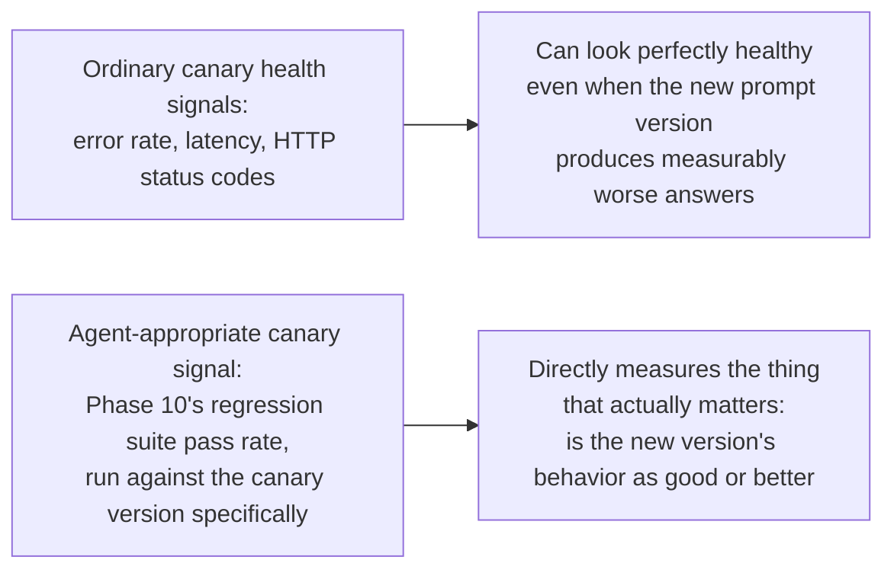
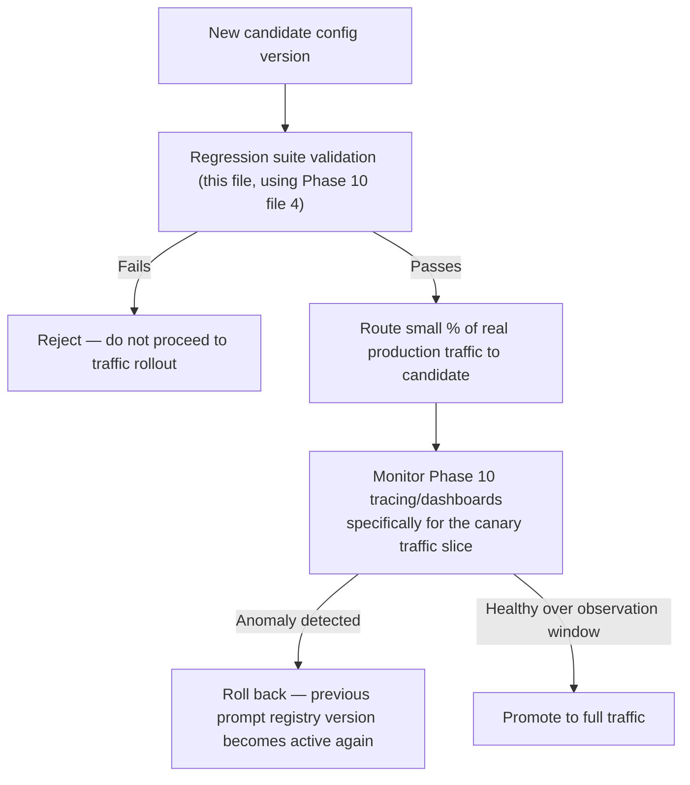

# Canary Releases for Agent Behavior

## Why this exists

You already know canary releases well: roll a new version out to a small fraction of traffic, watch its health signals, and either promote it to full traffic or roll it back based on what you observe. This file is about the one genuinely important adaptation that discipline needs for agent systems: an ordinary canary's health signals — error rate, latency, HTTP status codes — are largely orthogonal to whether an agent's new prompt or configuration (previous file) is actually producing *better or worse behavior*. A new system prompt version can produce a perfectly healthy-looking service (no errors, normal latency) while quietly giving worse, less accurate, or subtly wrong answers — exactly the "succeeded, but wrong" failure mode Phase 00 first flagged as this domain's defining risk. This file is about building a canary process whose health check is actually capable of catching that.

## Why ordinary canary signals are insufficient here, specifically



An agent's canary rollout, done properly, needs to run Phase 10, file 4's regression suite — with repetition, given Phase 00's non-determinism — against the *canary version specifically*, not just observe ordinary infrastructure health metrics on whatever fraction of production traffic happens to be routed to it. This is a meaningfully different, and more expensive (per Phase 01's cost mechanics — running a full regression suite is itself real API cost), canary validation process than you're used to, and it's worth budgeting that cost deliberately rather than treating regression-suite validation as an optional nicety on top of a "real" canary based on infrastructure metrics alone.

## A concrete canary rollout process

```java
public class AgentConfigCanaryController {

    private final AgentRegressionRunner regressionRunner; // Phase 10, file 4
    private final PromptRegistry promptRegistry;           // previous file
    private final double regressionTolerance;              // Phase 10, file 4's tolerance concept, applied here

    public CanaryDecision evaluateCanary(AgentConfigVersion candidateVersion, AgentConfigVersion currentActiveVersion) {
        RegressionReport candidateReport = regressionRunner.runSuiteAgainstConfig(candidateVersion);
        RegressionReport baselineReport = regressionRunner.runSuiteAgainstConfig(currentActiveVersion);

        List<String> regressedCases = new ArrayList<>();
        for (int i = 0; i < candidateReport.results().size(); i++) {
            double candidatePassRate = candidateReport.results().get(i).passRate();
            double baselinePassRate = baselineReport.results().get(i).passRate();
            if ((baselinePassRate - candidatePassRate) > regressionTolerance) {
                regressedCases.add(candidateReport.results().get(i).testCase().taskDescription());
            }
        }

        if (!regressedCases.isEmpty()) {
            return CanaryDecision.reject(
                "Regression detected in " + regressedCases.size() + " test case(s): " + regressedCases
            );
        }

        return CanaryDecision.approveForTrafficRollout();
    }
}
```

Notice this evaluates the *candidate* against the *current baseline*, both freshly run — not against a stale, previously-recorded baseline number, since the baseline itself can shift slightly run to run given Phase 00's non-determinism, and comparing a fresh candidate run against a stale baseline risks flagging normal variance as a false regression, or missing a real one, in either direction.

## Once regression-suite validation passes, then apply ordinary infrastructure canary practice

Passing the regression suite is necessary but not sufficient — it validates behavior against your golden set, but a golden set, however well constructed (Phase 03, file 5's original guidance on golden-set construction), can't cover every real production scenario. This is exactly where your existing infrastructure canary discipline still has real, additional value: after regression-suite approval, route a small percentage of real production traffic to the new version and monitor Phase 10, file 1's tracing and file 5's dashboards specifically for that traffic slice, watching for anomalies your golden set didn't anticipate.



```java
public class TrafficBasedCanaryRouter {

    private final PromptRegistry promptRegistry;
    private final double canaryTrafficPercentage;

    public AgentConfigVersion selectConfigForRequest() {
        boolean routeToCanary = ThreadLocalRandom.current().nextDouble() < canaryTrafficPercentage;
        return routeToCanary
            ? promptRegistry.getCanaryVersion()
            : promptRegistry.getActiveVersion();
    }
}
```

Every response produced under this routing should be tagged (per Phase 10, file 1's tracing attributes) with which config version handled it, so your dashboards can slice cost, latency, and — where feasible — sampled LLM-as-judge scores (Phase 10, file 3) specifically by canary versus baseline traffic, giving you a live, real-traffic comparison on top of the pre-rollout regression-suite comparison.

## Rollback needs to be fast and needs no code deployment

Because the prompt/config registry (previous file) treats versions as data, not code, rollback from a failed canary should be a configuration change — flipping which version is marked active — not a code redeploy. This is a meaningful operational advantage worth designing for deliberately: an agent behavior rollback that requires a full CI/CD pipeline run is meaningfully slower than one that's a single database update, and the difference matters when a canary reveals a real problem and you want it resolved as quickly as possible.

```java
public void rollback(String agentId) {
    AgentConfigVersion previousStable = promptRegistry.getPreviouslyActiveVersion(agentId);
    promptRegistry.setActiveVersion(agentId, previousStable.version());
    // No redeploy required — the next request simply reads the newly-active version from the registry.
}
```

## Trade-offs and when this matters most

- For low-stakes internal tools with infrequent prompt changes and a small user base, the full regression-suite-gated canary process in this file is more process than the actual risk justifies — a simpler review-and-deploy approach, with Phase 10's tracing available for post-hoc investigation if something does go wrong, is a reasonable, proportionate choice.
- For any production agent serving real users or driving real consequential actions (Phase 05's tool calls in particular), regression-suite-gated canary validation before any real traffic exposure, followed by monitored, gradual traffic-based rollout, is the direct, necessary adaptation of canary discipline you already trust for ordinary services — applied here with a health signal actually capable of catching the "succeeded, but wrong" failure mode this entire handbook has been built around since Phase 00.
- Don't skip the regression-suite gate in favor of infrastructure-metrics-only canary validation, however tempting given its lower cost — per this file's opening argument, an agent behavior regression can be entirely invisible to error rate and latency metrics alone, and infrastructure metrics alone is precisely the gap this file exists to close.

## Why this matters next

You've now completed this phase's full production discipline: packaging, secrets and cost containment, semantic caching, layered guardrails, rate limiting and backpressure, scaled async processing, versioned configuration, and behavior-aware canary releases. The final project in this phase asks you to apply every one of these disciplines to the Phase 09 multi-agent research pipeline, already evaluated in Phase 10 — taking a system you've proven works in testing and hardening it into something genuinely ready to run, safely and observably, in production.